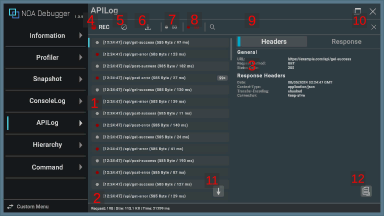

# APILog

Displays the communication log of the Web API.

To display the communication log, it is necessary to output the log within the application that has incorporated the NOA
Debugger. For how to output the communication log, please refer to Outputting Communication Logs later in the page.

## Screen Layout and Operating Instructions



### 1. Communication Logs

Displays a list of the communication logs output.

- By pressing any communication log, it will be highlighted, and the details of the selected communication are displayed
  on the right side of the screen. (It is displayed at the bottom in case of a portrait orientation.)
- By long-pressing any communication log, the contents of the communication log are copied to the clipboard.
- By pressing the selected communication log again, the details are hidden.


| Item                           | Description                                                                                                |
|--------------------------------|------------------------------------------------------------------------------------------------------------|
| a. Log Type                    | Represents the type of the log. Please refer to the information described later for what each color means. |
| b. Output Time                 | Displays the time the log was output.                                                                      |
| c. API Path                    | Displays the API path and query.                                                                           |
| d. Received Byte Number        | Displays the number of received bytes.                                                                     |
| e. Time Spent on Communication | Displays the time (in milliseconds) spent on communication.                                                |
| f. Number of Logs              | Displays the number of consecutive outputs of the same log. For more details, see the information below.   |

### 2. Communication Status

Displays the number of communications, total received bytes, and total time.

**Note:** Displayed only if there are communication logs.


| Item       | Description                                                       |
|------------|-------------------------------------------------------------------|
| a. Request | Displays the number of times the API communication was performed. |
| b. Size    | Displays the total number of received bytes.                      |
| c. Time    | Displays the total time (in milliseconds) spent on communication. |

### 3. Communication Details

Displays the details of the selected communication log. The details of the communication include the following content.


| Item        | Description                                                                  |
|-------------|------------------------------------------------------------------------------|
| a. Headers  | Displays the API details, response header, request header, and request body. |
| b. Response | Displays the response body.                                                  |

Specify whether to format and display the request body and response body in the properties of the `NoaDebugger.ApiLog` class. For more details, see the information below.

You can adjust the display area by dragging the boundary between the communication log list and the communication detail.

### 4. Communication Log Collect Button

By pressing the [●REC] button, you can toggle the collection of communication logs on and off. Communication logs are
collected when the application is started.

The [●REC] button in red means collecting, while white means stopping.

### 5. Clear Button

By pressing [] button, all retained logs will be deleted.

### 6. Download Button

By pressing the [] button, a dialog to download the retained logs will be
displayed. If there is no logs, you cannot press the [] button.

Please refer to [About Download](./Download.md) for information on the download dialog.

### 7. Success Log Toggle

Displays the number of communications that ended with a 200-series status code. You can toggle the display and
non-display of messages by pressing the [●] button.

### 8. Error Log Toggle

Displays the number of communications that ended with a status code other than the 200 series. You can toggle the
display and non-display of messages by pressing the [●] button.

### 9. Search Field

The log will be filtered and displayed based on the text you input. Logs that include the matching text will be
displayed.

**Note:** The information from the communication details is not included in the search.

### 10. Clear Search Text Button

By pressing the [×] button, the text entered in the search field will be cleared.

### 11. Scroll to Bottom Button

By pressing the [↓] button, the log list will be scrolled to the bottom.

**Note:** If the latest log is being displayed, the scroll-to-bottom button will not be displayed.

### 12. Copy Button

Pressing the [] button copies the contents of the communication log to the clipboard.

**Note:** This is the same behavior as long-pressing the log.

### Log Types

| Icon Color                                           | Log Type                                                                              |
|------------------------------------------------------|---------------------------------------------------------------------------------------|
|  | Represents the communication that ended with a 200-series status code.                |
|      | Represents the communication that ended with a status code other than the 200 series. |

### Conditions for consecutive output of the same log

When consecutive logs meet the following conditions, they are treated as the same log, and only the number of consecutive outputs is retained:

- Request destination URL matches.
- Status code matches.
- Data size matches.
- Request headers match.
- Request body matches.
- Request body is registered as a string.

## Outputting Communication Logs

By calling `NoaDebugger.ApiLogger.Log()` within an application that integrates the NOA Debugger, you can display the
communication log on the NOA Debugger.

The sample code for performing POST communication using `UnityEngine.Networking.UnityWebRequest` is shown below.

**Note:** When using the functions provided by the NOA Debugger, always use the symbol definition of `NOA_DEBUGGER`.

```csharp
using System.Collections;
using System.Collections.Generic;
using System.Diagnostics;
using System.Text;
#if NOA_DEBUGGER
using NoaDebugger;
#endif
using UnityEngine;
using UnityEngine.Networking;

public class ApiLogSample : MonoBehaviour
{
    void Start()
    {
        const string endpoint = "https://example.com/api/foo";
        const string requestBodyJson = "{ \"field1\":\"1\", \"field2\":\"2\" }";
        StartCoroutine(ApiLogSample.PostJson(endpoint, requestBodyJson));
    }

    static IEnumerator PostJson(string endpoint, string requestBodyJson)
    {
        // Create a POST request.
        using var request = new UnityWebRequest(endpoint, "POST");
        var requestHeaders = new Dictionary<string, string>
        {
            { "Content-Type", "application/json" }
        };
        byte[] rawData = Encoding.UTF8.GetBytes(requestBodyJson);
        request.uploadHandler = new UploadHandlerRaw(rawData);
        request.downloadHandler = new DownloadHandlerBuffer();
        foreach (KeyValuePair<string, string> header in requestHeaders)
        {
            request.SetRequestHeader(header.Key, header.Value);
        }

        // Perform communication, and measure the time it took.
        var stopwatch = new Stopwatch();
        stopwatch.Start();
        yield return request.SendWebRequest();
        stopwatch.Stop();

#if NOA_DEBUGGER
        // Outputs logs to the NOA Debugger. Please run this before the UnityWebRequest instance is destroyed.
        var apiLog = new ApiLog
        {
            Url = request.uri,
            Method = request.method,
            StatusCode = (int)request.responseCode,
            ContentSize = (long)request.downloadedBytes,
            ResponseTimeMilliSeconds = stopwatch.ElapsedMilliseconds,
            RequestHeaders = requestHeaders,
            RequestBody = requestBodyJson,
            ResponseHeaders = request.GetResponseHeaders(),
            ResponseBody = request.downloadHandler.text,
            PrettyPrint = true
        };
        ApiLogger.Log(apiLog);
#endif
    }
}
```

`NoaDebugger.ApiLog` has the following properties:

| Property                 | Type                                                 | Description                                                                                                                                                        | Behavior in the Absence of Settings                       |
|--------------------------|------------------------------------------------------|--------------------------------------------------------------------------------------------------------------------------------------------------------------------|-----------------------------------------------------------|
| Url                      | System.Uri                                           | Request destination URL.                                                                                                                                           | An ArgumentException occurs in `ApiLogger.Log().`         |
| Method                   | string                                               | Request method.                                                                                                                                                    | An ArgumentException occurs in `ApiLogger.Log().`         |
| StatusCode               | int                                                  | Status code.                                                                                                                                                       | Will be reflected in the log as `0`.                      |
| ContentSize              | long                                                 | Data size of the response.                                                                                                                                         | Will be reflected in the log as `0`.                      |
| ResponseTimeMilliSeconds | long                                                 | Specify the time it took for the response in milliseconds.                                                                                                         | Will be reflected in the log as `0`.                      |
| RequestHeaders           | System.Collections.Generic.Dictionary<string,string> | Request header.                                                                                                                                                    | Not displayed in communication details.                   |
| RequestBody              | string                                               | Request body.                                                                                                                                                      | Not displayed in communication details.                   |
| RequestBodyRawData       | object                                               | Request body before conversion. The conversion will be executed when displaying the API log, and the result will be assigned to `RequestBody`.                     | Applies `RequestBody` without performing the conversion.  |
| ResponseHeaders          | System.Collections.Generic.Dictionary<string,string> | Response header.                                                                                                                                                   | Not displayed in communication details.                   |
| ResponseBody             | string                                               | Response body.                                                                                                                                                     | Not displayed in communication details.                   |
| ResponseBodyRawData      | object                                               | Response body before conversion. The conversion will be executed when displaying the API log, and the result will be assigned to `ResponseBody`.                   | Applies `ResponseBody` without performing the conversion. |
| PrettyPrint              | bool                                                 | Specify whether to format the request body and response body if they are in JSON format. If false or not in JSON format, the entered text will be displayed as is. | Formatting will be executed.                              |

### If registering data before converting to a string

By registering the conversion process in `NoaDebugger.ApiLogger.OnConvertRequestBodyToString` or `NoaDebugger.ApiLogger.OnConvertResponseBodyToString`, you can register the request body and response body as RawData in types other than string.

The conversion process is executed only once, and after execution, the RawData is discarded.

The sample code for converting the request body and response body from RawData is shown below.

```csharp
using System.Collections;
using System.Collections.Generic;
using System.Diagnostics;
using System.Text;
#if NOA_DEBUGGER
using NoaDebugger;
#endif
using UnityEngine;
using UnityEngine.Networking;

public class ApiLogSample : MonoBehaviour
{
    void Start()
    {
        const string endpoint = "https://example.com/api/foo";
        const string requestBodyJson = "{ \"field1\":\"1\", \"field2\":\"2\" }";
        // Pre-register the conversion process. One-time registration is sufficient.
        // It will be executed only when the corresponding RawData has been registered.
        ApiLogger.OnConvertRequestBodyToString = rawData => Encoding.UTF8.GetString(((UploadHandlerRaw)rawData).data);
        ApiLogger.OnConvertResponseBodyToString = rawData => ((DownloadHandlerBuffer)rawData).text;
        StartCoroutine(ApiLogSample.PostJson(endpoint, requestBodyJson));
    }

    static IEnumerator PostJson(string endpoint, string requestBodyJson)
    {
        using var request = new UnityWebRequest(endpoint, "POST");
        var requestHeaders = new Dictionary<string, string>
        {
            { "Content-Type", "application/json" }
        };
        byte[] rawData = Encoding.UTF8.GetBytes(requestBodyJson);
        request.uploadHandler = new UploadHandlerRaw(rawData);
        request.downloadHandler = new DownloadHandlerBuffer();
        // Ensure that the Handler is not destroyed even if the UnityWebRequest instance is destroyed.
        request.disposeUploadHandlerOnDispose = false;
        request.disposeDownloadHandlerOnDispose = false;

        foreach (KeyValuePair<string, string> header in requestHeaders)
        {
            request.SetRequestHeader(header.Key, header.Value);
        }

        var stopwatch = new Stopwatch();
        stopwatch.Start();
        yield return request.SendWebRequest();
        stopwatch.Stop();

#if NOA_DEBUGGER
        var apiLog = new ApiLog
        {
            Url = request.uri,
            Method = request.method,
            StatusCode = (int)request.responseCode,
            ContentSize = (long)request.downloadedBytes,
            ResponseTimeMilliSeconds = stopwatch.ElapsedMilliseconds,
            RequestHeaders = requestHeaders,
            // Register the value used for the conversion in RawData.
            RequestBodyRawData = request.uploadHandler,
            ResponseHeaders = request.GetResponseHeaders(),
            ResponseBodyRawData = request.downloadHandler,
            PrettyPrint = true
        };
        ApiLogger.Log(apiLog);
#endif
    }
}
```

## APIs provided by NOA Debugger

Please refer to the [API List](./Apis.md) for the APIs provided by APILog.
