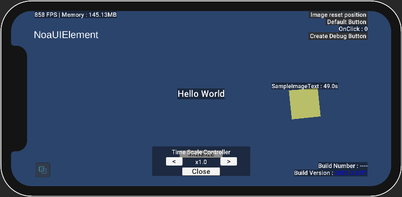

# APIs provided by NOA Debugger

Some of the functions of NOA Debugger can be accessed through the static methods and static properties of the classes
provided by NOA Debugger.

## NoaDebug

Through this class, you can control the initialization and launch of NOA Debugger from the script.

### APIs

#### Static Methods

| API                                            | Description                                                                                                                                                                                                                       |
|------------------------------------------------|-----------------------------------------------------------------------------------------------------------------------------------------------------------------------------------------------------------------------------------|
| Initialize()                                   | Initializes the tool.                                                                                                                                                                                                             |
| Show()                                         | Launches the tool and opens a last displayed menu.                                                                                                                                                                                |
| Show(index, isCustomMenu)                      | Launches the tool and opens a specified menu. If `isCustomMenu` is true, it opens the custom menu.                                                                                                                                |
| Hide()                                         | Closes the tool and display the targeted floating window.                                                                                                                                                                         |
| SetDebuggerActive(isActive)                    | Toggles the display/hide of the tool.                                                                                                                                                                                             |
| SetFloatingWindowActive(isActive)              | Toggles the display/hide of the tool's floating window.                                                                                                                                                                           |
| SetTriggerButtonActive(isActive)               | Toggles the display/hide of the tool's launch button.                                                                                                                                                                             |
| SetFont(fontAsset, fontMaterial, fontSizeRate) | Configure the fonts used for the tool. If `fontMaterial` is omitted, the default material of the specified font asset will be applied. If `fontSizeRate` is omitted, it will be treated as a 1:1 size.                            |
| EnableWorldSpaceRendering(worldCamera)         | Displays the tool on the world coordinates. If the arguments are omitted, the MainCamera is applied to the Canvas drawing. While displayed on the world coordinates, the floating window and the launch button are not displayed. |
| DisableWorldSpaceRendering()                   | Displays the tool on 2D screen coordinates.                                                                                                                                                                                       |
| Destroy()                                      | Destroys the tool.                                                                                                                                                                                                                |
| TakeScreenshot(callback)                       | Returns the image data captured from the screenshot to the specified callback function.<br> In cases where a screenshot is taken during a crash, the process may not work correctly because the rendering may not be complete.    |

#### Static Properties

| API                          | Description                                                                                                                                                                                   |
|------------------------------|-----------------------------------------------------------------------------------------------------------------------------------------------------------------------------------------------|
| OnShow                       | Callback that is fired when the tool is launched. You can get the index value of the menu when the callback is fired.                                                                         |
| OnHide                       | Callback that is fired when the tool is closed. You can get the index value of the menu when the callback is fired.                                                                           |
| OnMenuChanged                | Callback that is fired when the tool menu is switched. You can get the index value of the menu after the switch and a flag indicating whether it is a custom menu when the callback is fired. |
| RootTransform                | Returns a reference to the most top-level Transform of the tool.                                                                                                                              |
| IsInitialized                | Returns true if the tool is initialized.                                                                                                                                                      |
| IsWorldSpaceRenderingEnabled | Returns true if the tool is being displayed on the world coordinates.                                                                                                                         |
| IsDebuggerVisible            | Returns true if the tool is displayed.                                                                                                                                                        |
| IsTriggerButtonVisible       | Returns true if the tool's launch button is displayed.                                                                                                                                        |
| IsFloatingWindowVisible      | Returns true if the dedicated window is displayed.                                                                                                                                            |

#### Sample Code

```csharp
using UnityEngine;
#if NOA_DEBUGGER
using NoaDebugger;
#endif

public class Example
{
    void ExampleMethod()
    {
#if NOA_DEBUGGER
        // Initialize the tool.
        NoaDebug.Initialize();

        // Check if the tool has been initialized.
        bool isDebuggerInit = NoaDebug.IsInitialized;

        // Specify a callback to execute when the tool is launched.
        NoaDebug.OnShow = (index) => Debug.Log($"showIndex:{index}");

        // Open the last displayed menu of the tool.
        NoaDebug.Show();

        // Specify a callback to execute when the tool is closed.
        NoaDebug.OnHide = (index) => Debug.Log($"hideIndex:{index}");

        // Close the tool.
        NoaDebug.Hide();

        // Open the specified index of the tool.
        NoaDebug.Show(3);

        // Specify a callback to execute when the tool menu is switched.
        NoaDebug.OnMenuChanged = (index, isCustomMenu) => Debug.Log($"menuIndex:{index} isCustomMenu:{isCustomMenu}");

        // Hide the tool.
        NoaDebug.SetDebuggerActive(false);

        // Show the tool.
        NoaDebug.SetDebuggerActive(true);

        // Hide the tool's floating window.
        NoaDebug.SetFloatingWindowActive(false);

        // Show the tool's floating window.
        NoaDebug.SetFloatingWindowActive(true);

        // Hide the tool's launch button.
        NoaDebug.SetTriggerButtonActive(false);

        // Show the tool's launch button.
        NoaDebug.SetTriggerButtonActive(true);

        // Set the tool's font.
        var assetBundle = AssetBundle.LoadFromFile($"{Application.streamingAssetsPath}/ExampleFont");
        var fontAsset = assetBundle.LoadAsset<TMP_FontAsset>("Assets/AssetBundleResources/ExampleFont.asset");
        NoaDebug.SetFont(fontAsset, fontAsset.material, 1.0f);

        // Display the tool on the world coordinates.
        NoaDebug.EnableWorldSpaceRendering(Camera.main);

        // Get a reference to the most top-level Transform of the tool.
        Transform noaDebuggerRoot = NoaDebug.RootTransform;

        // Change the tool's coordinates, rotation angle, and scale.
        // - This is only applied when displayed on world coordinates.
        // - Please control the size change with scale.
        // - Since the canvas size of NOA Debugger is 1136x640, it will be approximately 3x1.7m in the following example.
        noaDebuggerRoot.localPosition = Vector3.zero;
        noaDebuggerRoot.localEulerAngles = Vector3.zero;
        noaDebuggerRoot.localScale = new Vector3(0.00264f, 0.00264f, 0.00264f);

        // Change the tool's layer.
        noaDebuggerRoot.gameObject.layer = 0;

        // Whether the tool is displayed on world coordinates.
        bool isWorldSpace = NoaDebug.IsWorldSpaceRenderingEnabled;

        // Display the tool on 2D screen coordinates.
        NoaDebug.DisableWorldSpaceRendering();

        // Check if the tool is displayed.
        bool IsDebuggerVisible = NoaDebug.IsDebuggerVisible;

        // Check if the tool's launch button is displayed.
        bool IsTriggerButtonVisible = NoaDebug.IsTriggerButtonVisible;

        // Check if the floating window is displayed.
        bool IsFloatingWindowVisible = NoaDebug.IsFloatingWindowVisible;

        // Execute the disposal of the tool.
        NoaDebug.Destroy();

        // Capture a screenshot
        NoaDebug.TakeScreenshot((data) => {
            if (data != null)
            {
                // Example of saving the image data to a file
                string filePath = Application.persistentDataPath + "/screenshot.png";
                System.IO.File.WriteAllBytes(filePath, data);
                Debug.Log($"Screenshot saved to: {filePath}");
            }
            else
            {
                Debug.LogError("Failed to capture screenshot.");
            }
        });
#endif
    }
}
```

## NoaInformation

Through this class, you can get the information of the Information function.

### APIs

### Static Properties

| API               | Description                                                                                                                                                                                                           |
|-------------------|-----------------------------------------------------------------------------------------------------------------------------------------------------------------------------------------------------------------------|
| SystemInformation | Returns the system information the tool retains.                                                                                                                                                                      |
| UnityInformation  | Returns the Unity information the tool retains.                                                                                                                                                                       |
| OnDownload        | This event is triggered when information is downloaded.<br>If the event handler returns true, the information will be downloaded locally. If the event handler returns false, the information will not be downloaded. |

### Sample Code

```csharp
using UnityEngine;
#if NOA_DEBUGGER
using NoaDebugger;
#endif

public class Example
{
    void ExampleMethod()
    {
#if NOA_DEBUGGER

        // Get the system information.
        SystemInformation systemInfo = NoaInformation.SystemInformation;
        ApplicationInfo appInfo = systemInfo.ApplicationInfo;
        DeviceInfo deviceInfo = systemInfo.DeviceInfo;
        CpuInfo cpuInfo = systemInfo.CpuInfo;
        GpuInfo gpuInfo = systemInfo.GpuInfo;
        SystemMemoryInfo systemMemoryInfo = systemInfo.SystemMemoryInfo;
        DisplayInfo displayInfo = systemInfo.DisplayInfo;

        // Get the Unity information.
        UnityInformation unityInfo = NoaInformation.UnityInformation;
        UnityInfo unity = unityInfo.UnityInfo;
        RuntimeInfo runtime = unityInfo.RuntimeInfo;
        FeaturesInfo features = unityInfo.FeaturesInfo;
        GraphicsInfo graphics = unityInfo.GraphicsInfo;

        // Set up the event that is triggered when information is downloaded
        NoaInformation.OnDownload += (string filename, string jsonData) =>
        {
            Debug.Log($"Information download. Filename: {filename}");
            // Return true to allow local download
            // Return false to prevent local download
            return true;
        };

#endif
    }
}
```

## NoaProfiler

Through this class, you can obtain various values from the Profiler function.

### APIs

#### Static Properties

| API                  | Description                                                                                                                                                                                                     |
|----------------------|-----------------------------------------------------------------------------------------------------------------------------------------------------------------------------------------------------------------|
| ProfilerInfo         | Returns the stored Profiler information. If it is in an unmeasured state, the initial value will be entered.                                                                                                    |
| LatestFpsInfo        | Returns the latest FPS information that was measured. If it is in an unmeasured state, the initial value will be entered.                                                                                       |
| LatestMemoryInfo     | Returns the latest Memory information that was measured. If it is in an unmeasured state or if it is in an environment where values cannot be obtained, the initial value will be entered.                      |
| LatestRenderingInfo  | Returns the latest Rendering information that was measured. If it is in an unmeasured state, the initial value will be entered.                                                                                 |
| LatestBatteryInfo    | Returns the latest Battery information that was measured. If it is in an unmeasured state or if it is in an environment where values cannot be obtained, the initial value will be entered.                     |
| LatestThermalInfo    | Returns the latest Thermal information that was measured. If it is in an unmeasured state or if it is in an environment where values cannot be obtained, the initial value will be entered.                     |
| IsFpsProfiling       | Returns the current FPS measurement status. You can change the measurement status from this property.                                                                                                           |
| IsMemoryProfiling    | Returns the current Memory measurement status. You can change the measurement status from this property.                                                                                                        |
| TotalMemoryMB        | Returns the maximum memory capacity to be measured. You can specify the maximum memory capacity to be measured from this property. If a negative value is specified, it will be the RAM capacity of the device. |
| IsRenderingProfiling | Returns the current Rendering measurement status. You can change the measurement status from this property.                                                                                                     |
| IsBatteryProfiling   | Returns the current Battery measurement status. You can change the measurement status from this property.                                                                                                       |
| IsThermalProfiling   | Returns the current Thermal measurement status. You can change the measurement status from this property.                                                                                                       |

#### Sample Code

```csharp
#if NOA_DEBUGGER
using NoaDebugger;
#endif

public class Example
{
    void ExampleMethod()
    {
#if NOA_DEBUGGER

        // Get the profiler information.
        ProfilerInfo profilerInfo = NoaProfiler.ProfilerInfo;

        // Get various measurement information.
        FpsInfo fpsInfo = NoaProfiler.LatestFpsInfo;
        MemoryInfo memoryInfo = NoaProfiler.LatestMemoryInfo;
        RenderingInfo renderingInfo = NoaProfiler.LatestRenderingInfo;
        BatteryInfo batteryInfo = NoaProfiler.LatestBatteryInfo;
        ThermalInfo thermalInfo = NoaProfiler.LatestThermalInfo;

        // Get and set the measurement status.
        bool isFpsProfiling = NoaProfiler.IsFpsProfiling;
        NoaProfiler.IsFpsProfiling = false;

        // Specify the maximum memory capacity to be measured (in MB) .
        NoaProfiler.TotalMemoryMB = 8192.0f;

#endif
    }
}
```

### NoaSnapshot

Through this class, you can execute controls from the script, such as obtaining logs held by the Snapshot function,
capturing logs, mass disposal of logs, and resetting the elapsed time.

### APIs

#### Static Methods

| API                                                                    | Description                                                                                                                                                                                     |
|------------------------------------------------------------------------|-------------------------------------------------------------------------------------------------------------------------------------------------------------------------------------------------|
| ClearLogsAndTimer()                                                    | Disposes of all logs and resets the elapsed time.                                                                                                                                               |
| CaptureLog(label, backgroundColor, hasNoaProfilerInfo, additionalInfo) | Captures the log. Specifies the label and background color to set for the log, whether or not it holds profiler information provided by NOA Debugger, and additional information as parameters. |

#### Static Properties

| API           | Description                                                                                                                                                                                       |
|---------------|---------------------------------------------------------------------------------------------------------------------------------------------------------------------------------------------------|
| LogList       | Returns a list of the log information it retains.                                                                                                                                                 |
| OnLogCopied   | This event is triggered when a log is copied to the clipboard.                                                                                                                                    |
| OnLogDownload | This event is triggered when a log is downloaded.<br>If the event handler returns true, the logs will be downloaded locally. If the event handler returns false, the logs will not be downloaded. |

#### Sample Code

```csharp
using System.Collections.Generic;
using UnityEngine;
#if NOA_DEBUGGER
using NoaDebugger;
#endif

public class Example
{
    void ExampleMethod()
    {
#if NOA_DEBUGGER

        // Get a list of log information retained by the Snapshot function.
        List<SnapshotLogRecordInformation> snapshotLogList = NoaSnapshot.LogList;

        // Dispose of all logs and reset elapsed time.
        NoaSnapshot.ClearLogsAndTimer();

        // Capture the log.
        NoaSnapshot.CaptureLog("label",  NoaSnapshot.BgColor.Blue, hasNoaProfilerInfo: true);

        // Create a Directory for additional information.
        var additionalInfo = new Dictionary<string,NoaSnapshotCategory>();

        // Set additional information without specifying a category.
        var category = new NoaSnapshotCategory();

        // Item 1 for each category.
        var categoryItem1 = new NoaSnapshotCategoryItem
        (
            key: "SampleKey",
            value: "SampleValue",
            color: NoaSnapshot.FontColor.Black
        );
        category.Add(categoryItem1);

        // Item 2 for each category.
        var categoryItem2 = new NoaSnapshotCategoryItem
        (
            key: "SampleKey",
            value: "SampleValue2",
            color: NoaSnapshot.FontColor.Black
        );

        // Overwrite the value and color when the key is duplicated.
        category.Add(categoryItem2);

        // If no key is specified, it will be managed as an item of Others.
        additionalInfo[""] = category;

        // Set additional information by specifying a category.
        // Additional information for Category 1.
        var category1 = new NoaSnapshotCategory();
        var category1Item = new NoaSnapshotCategoryItem
        (
            key: "SampleKey",
            value: "SampleValue",
            color: NoaSnapshot.FontColor.Black
        );
        category1.Add(category1Item);
        additionalInfo["Category1"] = category1;

        // Capture a log including additional information.
        NoaSnapshot.CaptureLog("label", NoaSnapshot.BgColor.Blue, hasNoaProfilerInfo: true, additionalInfo);

        // Set up the event that is triggered when a log is copied to the clipboard
        NoaSnapshot.OnLogCopied += (SnapshotLogRecordInformation log, string clipboardText) => Debug.Log($"Log copied. Clipboard: {clipboardText}");

        // Set up the event that is triggered when a log is downloaded
        NoaSnapshot.OnLogDownload += (string filename, string jsonData) =>
        {
            Debug.Log($"Logs download. Filename: {filename}");
            // Return true to allow local download
            // Return false to prevent local download
            return true;
        };

#endif
    }
}
```

### NoaConsoleLog

Through this class, you can obtain logs held by the ConsoleLog feature.

### APIs

#### Static Methods

| API                               | Description                                                                                                                 |
|-----------------------------------|-----------------------------------------------------------------------------------------------------------------------------|
| Add(LogType, message, stackTrace) | Adds a log to be output to the ConsoleLog tool. If stackTrace is not specified, it automatically retrieves the stack trace. |
| Clear()                           | Deletes all stored log information at once.                                                                                 |

#### Static Properties

| API                       | Description                                                                                                                                                                                          |
|---------------------------|------------------------------------------------------------------------------------------------------------------------------------------------------------------------------------------------------|
| LogList                   | Returns a list of the log information it retains.                                                                                                                                                    |
| OnError                   | This is an event that runs when an error is detected.                                                                                                                                                |
| OnFilterErrorNotification | This is a delegate that determines whether to display notifications when an error is detected. It will display notifications if it returns true. Please refer to the sample code for specific usage. |
| OnLogCopied               | This event is triggered when a log is copied to the clipboard.                                                                                                                 　                     |
| OnLogDownload             | This event is triggered when a log is downloaded.<br>If the event handler returns true, the logs will be downloaded locally. If the event handler returns false, the logs will not be downloaded.    |

#### Sample Code

```csharp
using System.Collections.Generic;
using UnityEngine;
#if NOA_DEBUGGER
using NoaDebugger;
#endif

public class Example
{
    void ExampleMethod()
    {
#if NOA_DEBUGGER

        // Get a list of log information retained by the ConsoleLog function.
        LinkedList<ConsoleLogEntry> consoleLogList = NoaConsoleLog.LogList;

        // Add logs to the ConsoleLog function.
        NoaConsoleLog.Add(UnityEngine.LogType.Error, "log_message", "log_stacktrace");

        // Add logs to the ConsoleLog function (without stack trace).
        NoaConsoleLog.Add(UnityEngine.LogType.Error, "log_message");

        // Set an event to be executed when an error is detected.
        NoaConsoleLog.OnError += (ConsoleLogEntry log) => Debug.Log("Error detected.");

        // Set a delegate to determine whether to display notifications when an error is detected.
        NoaConsoleLog.OnFilterErrorNotification += (ConsoleLogEntry log) => log.LogString.StartsWith("Log to notifify an error.");

        // Set up the event that is triggered when a log is copied to the clipboard
        NoaConsoleLog.OnLogCopied += (ConsoleLogEntry log, string clipboardText) => Debug.Log($"Log copied. Clipboard: {clipboardText}");

        // Set up the event that is triggered when a log is downloaded
        NoaConsoleLog.OnLogDownload += (string filename, string jsonData) =>
        {
            Debug.Log($"Logs download. Filename: {filename}");
            // Return true to allow local download
            // Return false to prevent local download
            return true;
        };

        // Delete all logs.
        NoaConsoleLog.Clear();
#endif
    }
}
```

### NoaApiLog

Through this class, you can obtain logs held by the APILog function.

### APIs

#### Static Methods

| API     | Description                                 |
|---------|---------------------------------------------|
| Clear() | Deletes all stored log information at once. |

#### Static Properties

| API           | Description                                                                                                                                                                                       |
|---------------|---------------------------------------------------------------------------------------------------------------------------------------------------------------------------------------------------|
| LogList       | Returns a list of the log information it retains.                                                                                                                                                 |
| OnError       | This is an event that runs when an error is detected. 　                                                                                                                                           |
| OnLogCopied   | This event is triggered when a log is copied to the clipboard.                                                                                                                                    |
| OnLogDownload | This event is triggered when a log is downloaded.<br>If the event handler returns true, the logs will be downloaded locally. If the event handler returns false, the logs will not be downloaded. |

#### Sample Code

```csharp
using System.Collections.Generic;
using UnityEngine;
#if NOA_DEBUGGER
using NoaDebugger;
#endif

public class Example
{
    void ExampleMethod()
    {
#if NOA_DEBUGGER

        // Get a list of log information retained by the APILog function.
        LinkedList<ApiLogEntry> apiLogList = NoaApiLog.LogList;

        // Set an event to be executed when an error is detected.
        NoaApiLog.OnError += (ApiLogEntry log) => Debug.Log("Error detected.");

        // Set up the event that is triggered when a log is copied to the clipboard
        NoaApiLog.OnLogCopied += (ApiLogEntry log, string clipboardText) => Debug.Log($"Log copied. Clipboard: {clipboardText}");

        // Set up the event that is triggered when a log is downloaded
        NoaApiLog.OnLogDownload += (string filename, string jsonData) =>
        {
            Debug.Log($"Logs download. Filename: {filename}");
            // Return true to allow local download
            // Return false to prevent local download
            return true;
        };

        // Delete all logs.
        NoaApiLog.Clear();
#endif
    }
}
```

## NoaPrefs

Through this class, you save values to NOA Debugger's unique storage area.

Values are saved to a file under `Application.persistentDataPath`. Also, the saved values are excluded from
iCloud/iTunes backups.

### APIs

#### Static Methods

| API                           | Description                                                                                  |
|-------------------------------|----------------------------------------------------------------------------------------------|
| SetString(key, value)         | Stores a value of string type.                                                               |
| SetSByte(key, value)          | Stores a value of sbyte type.                                                                |
| SetByte(key, value)           | Stores a value of byte type.                                                                 |
| SetShort(key, value)          | Stores a value of short type.                                                                |
| SetUShort(key, value)         | Stores a value of ushort type.                                                               |
| SetInt(key, value)            | Stores a value of int type.                                                                  |
| SetUInt(key, value)           | Stores a value of uint type.                                                                 |
| SetLong(key, value)           | Stores a value of long type.                                                                 |
| SetULong(key, value)          | Stores a value of ulong type.                                                                |
| SetChar(key, value)           | Stores a value of char type.                                                                 |
| SetFloat(key, value)          | Stores a value of float type.                                                                |
| SetDouble(key, value)         | Stores a value of double type.                                                               |
| SetDecimal(key, value)        | Stores a value of decimal type.                                                              |
| SetBoolean(key, value)        | Stores a value of bool type.                                                                 |
| GetString(key, defaultValue)  | Retrieves a value of string type. If the data cannot be retrieved, it returns defaultValue.  |
| GetSByte(key, defaultValue)   | Retrieves a value of sbyte type. If the data cannot be retrieved, it returns defaultValue.   |
| GetByte(key, defaultValue)    | Retrieves a value of byte type. If the data cannot be retrieved, it returns defaultValue.    |
| GetShort(key, defaultValue)   | Retrieves a value of short type. If the data cannot be retrieved, it returns defaultValue.   |
| GetUShort(key, defaultValue)  | Retrieves a value of ushort type. If the data cannot be retrieved, it returns defaultValue.  |
| GetInt(key, defaultValue)     | Retrieves a value of int type. If the data cannot be retrieved, it returns defaultValue.     |
| GetUInt(key, defaultValue)    | Retrieves a value of uint type. If the data cannot be retrieved, it returns defaultValue.    |
| GetLong(key, defaultValue)    | Retrieves a value of long type. If the data cannot be retrieved, it returns defaultValue.    |
| GetULong(key, defaultValue)   | Retrieves a value of ulong type. If the data cannot be retrieved, it returns defaultValue.   |
| GetChar(key, defaultValue)    | Retrieves a value of char type. If the data cannot be retrieved, it returns defaultValue.    |
| GetFloat(key, defaultValue)   | Retrieves a value of float type. If the data cannot be retrieved, it returns defaultValue.   |
| GetDouble(key, defaultValue)  | Retrieves a value of double type. If the data cannot be retrieved, it returns defaultValue.  |
| GetDecimal(key, defaultValue) | Retrieves a value of decimal type. If the data cannot be retrieved, it returns defaultValue. |
| GetBoolean(key, defaultValue) | Retrieves a value of bool type. If the data cannot be retrieved, it returns defaultValue.    |
| DeleteAt(key)                 | Deletes the value of the specified key.                                                      |
| DeleteAllSaveData()           | Deletes all values saved through NoaPrefs.                                                   |
| DeleteAllToolData()           | Deletes all values independently used by the NOA Debugger tool.                              |

#### Sample Code

```csharp
#if NOA_DEBUGGER
using NoaDebugger;
#endif

public class Example
{
    void ExampleMethod()
    {
#if NOA_DEBUGGER

        // Save value.
        NoaPrefs.SetString("key", "value");

        // Get value.
        string value = NoaPrefs.GetString("key", "defaultValue");

        // Delete value.
        NoaPrefs.DeleteAt("key");

        // Delete all values saved via NoaPrefs.
        NoaPrefs.DeleteAllSaveData();

        // Delete all values independently used by NOA Debugger.
        NoaPrefs.DeleteAllToolData();
#endif
    }
}
```

## NoaUIElement

NoaUIElement provides a convenient interface for dynamically registering and displaying various UI elements on the
screen using the NOA Debugger.
By using this class, developers can easily create, manage, and position UI elements.

**Note:** NoaUIElement is intended for use within the uGUI Canvas in Unity and is not supported for use in 3D space.



### API List

#### Static Methods

| API                                    | Description                                                         |
|----------------------------------------|---------------------------------------------------------------------|
| RegisterUIElement(element)             | Registers a new UI element.                                         |
| UnregisterUIElement(key)               | Unregisters a UI element based on the specified key.                |
| UnregisterAllUIElements()              | Unregisters all UI elements.                                        |
| IsUIElementRegistered(key)             | Checks if a single UI element with the specified key is registered. |
| IsUIElementRegistered()                | Checks if any UI elements are registered.                           |
| SetUIElementVisibility(key, isVisible) | Sets the visibility of a single UI element.                         |
| SetAllUIElementsVisibility(isVisible)  | Sets the visibility of all UI elements.                             |
| IsUIElementVisible(key)                | Checks if a single UI element with the specified key is visible.    |
| IsUIElementVisible()                   | Checks if all UI elements are visible.                              |

### Sample Code

```csharp
using System.Collections.Generic;
using UnityEngine;
#if NOA_DEBUGGER
using NoaDebugger;
#endif

public class Example
{
    void ExampleMethod()
    {
#if NOA_DEBUGGER

        // Register a text element (specified by anchor type)
        NoaUIElement.RegisterUIElement(
            NoaUITextElement.Create(
                key: "DebugText",                            // Unique key for the UI element
                value: () => $"Current Time: {Time.time}",   // Text content
                anchorType: AnchorType.UpperLeft,            // Anchor position
                updateInterval: 0.5f                         // Update interval (in seconds)
            )
        );

        // Register a button element (specified by parent object)
        NoaUIElement.RegisterUIElement(
            NoaUIButtonElement.Create(
                key: "ExampleButton",                        // Unique key for the UI element
                label: "Click Me",                           // Button label
                onClick: OnButtonClicked,                    // Callback for button click
                parent: parentTransform                      // Parent object's Transform
            )
        );

        // Register a custom object element (specified by anchor type)
        GameObject customPrefab = Resources.Load<GameObject>("CustomPrefab");
        NoaUIElement.RegisterUIElement(
            NoaUIObjectElement.Create(
                key: "CustomObject",                         // Unique key for the UI element
                prefab: customPrefab,                        // Custom prefab
                onObjectCreated: OnCustomObjectCreated,      // Callback for object creation
                anchorType: AnchorType.UpperCenter,          // Anchor position
                width: 200f,                                 // Width (in pixels)
                height: 100f                                 // Height (in pixels)
            )
        );

        // Unregister the UI element at any given time
        NoaUIElement.UnregisterUIElement("DebugText");

        // Unregister all UI elements
        NoaUIElement.UnregisterAllUIElements();

        // Check if a specific UI element is registered
        bool isTextRegistered = NoaUIElement.IsUIElementRegistered("DebugText");

        // Check if at least one UI element is registered
        bool hasRegisteredElements = NoaUIElement.IsUIElementRegistered();

        // Hide a single UI element
        NoaUIElement.SetUIElementVisibility("ExampleButton", false);

        // Show all UI elements
        NoaUIElement.SetAllUIElementsVisibility(true);

        // Check if a single UI element is visible
        bool isButtonVisible = NoaUIElement.IsUIElementVisible("ExampleButton");

        // Check if all UI elements are visible
        bool areAllVisible = NoaUIElement.IsUIElementVisible();
#endif
    }

    // Callback when the button is clicked
    void OnButtonClicked()
    {
        Debug.Log("Button was clicked!");
    }

    // Callback when the custom object is created
    void OnCustomObjectCreated(GameObject obj)
    {
        Debug.Log("Custom object created: " + obj.name);
    }
}
```
