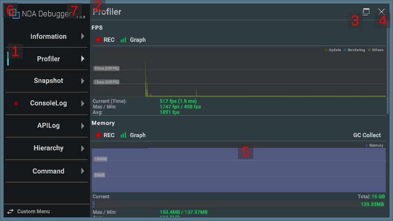
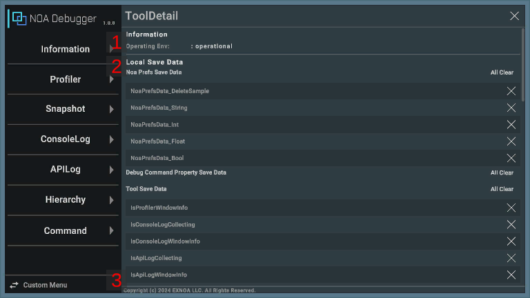

# Screen Layout and Basic Operations

This tool supports both landscape and portrait orientations.

Since the screen layout and operation methods vary depending on the screen orientation, please check the screen
configurations and operation methods described later.

## Screen UI Layout and Operation Method

Screen layout in landscape orientation: 

Screen layout in portrait orientation: 

### 1. Menu

You can see the list of available features.

In landscape orientation, you can display the feature in the main content by selecting the feature you want to use from
the left menu.

In portrait orientation, press the [≡] button to display the menu.

If you close the tool and display it again while the app is running, it will display the feature you displayed last
time.

Each item in the menu displays a badge under specific conditions.

| Feature    | Appears                                 | Disappears               |
|------------|-----------------------------------------|--------------------------|
| ConsoleLog | An error log is recorded in ConsoleLog. | ConsoleLog is displayed. |
| APILog     | An error log is recorded in APILog.     | APILog is displayed.     |

### 2. Feature Name

Displays the name of the function you have selected. In portrait orientation, you can open the menu by pressing this.

### 3. Floating Window Display Toggle Button

By pressing the [] button, you can toggle the display
flag of the floating window.

[] means to show and
[] means to hide.

In the display state, you can use the target feature by displaying the floating window on the in-game screen, even if
the tool is closed. The display flag is retained even if the app is restarted.

Please refer to [About the Floating Windows](./FloatingWindow.md) for detail of floating windows.

**Note:** The function to display the floating window on the in-game screen is only available with some features.

### 4. Close Button

The tool is closed by pressing the [×] button.

### 5. Main Content

Displays the content of the function you have selected.

### 6. Tool Details Button

By pressing the [NOA Debugger] button at the top of the menu, you can display the details of the tool.

In portrait orientation, you can only press it when the menu is open.

### 7. Version Information

Displays the version of the tool.

## Tool Details

### 1. Operating Env

Shows whether it's the tool's system requirements.

If it meets the system requirements, it will display "operational". If it does not, it will display the recommended
environment.

### 2. Local Save Data

It displays the keys of the data stored in the NOA Debugger's own storage area.

By long pressing the [×] button, you can discard the stored data individually.

You can discard all the stored data by pressing the [All Clear] button.

| Group Name                       | Contents                                                                                                                   |
|----------------------------------|----------------------------------------------------------------------------------------------------------------------------|
| Noa Prefs Save Data              | The keys of the data saved via [`NoaPrefs`](./Apis.md).                                                                    |
| Debug Command Property Save Data | The keys of the data saved with the[`SaveOnUpdateAttribute`](./DebugCommand/Reference/SaveOnUpdateAttribute.md) attribute. |
| Tool Save Data                   | The keys of the stored data that NOA Debugger is using.                                                                    |

### 3. Copyright

Displays the copyright of the tool.

## Display Font

This tool cannot display non-ASCII characters by default.

If you want to display non-ASCII characters, please set a font asset that includes characters to display by referring
to [Tool Settings](./Settings.md).

**Note:** Characters that cannot be displayed with the set font will be replaced with other characters by the fallback
process of TextMeshPro.
