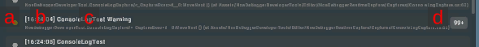
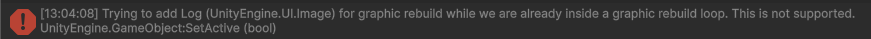

# ConsoleLog

Displays errors, warnings, and other messages output through Unity's Debug class. Also, logs added with
the [NoaConsoleLogAPI](./Apis.md) are displayed in the list.

**Note:** Characters not included in the font asset being used are replaced with "_" for display.

## Screen Layout and Operating Instructions

### 1. Logs

The obtained logs will be displayed. When selected, they are highlighted and their stack traces are displayed in the log
details.

By long-pressing Log, the log message will be copied to the clipboard. Pressing Log again while a log is selected
will hide the log details.

| Item              | Description                                                                                                                                                                                                                                                                                                                                                                           |
|-------------------|---------------------------------------------------------------------------------------------------------------------------------------------------------------------------------------------------------------------------------------------------------------------------------------------------------------------------------------------------------------------------------------|
| a. Log Type       | Represents the type of the log. Please refer to the information described later for what each color means.                                                                                                                                                                                                                                                                            |
| b. Output Time    | Displays the time when the log was output.                                                                                                                                                                                                                                                                                                                                            |
| c. Text           | Displays the log message. If Stack Trace is enabled, the source of the log is displayed on the second line. The Stack Trace of the log output through the API is displayed on the first line.   However, the source information is not displayed in the following cases: - StackTrace LogType:Full log - When the Development build is disabled in Scripting BackEnd:Mono |
| d. Number of Logs | Displays the number of consecutive outputs of the same log. For more details, see the information below.                                                                                                                                                                                                                                                                              |

### 2. Log Details

Displays the stack trace of the selected log.

#### Supported Environment

If the setting of **Project Settings > Player > Other Settings > Stack Trace** is set to "None", the stack trace cannot
be
displayed.

Also, stack traces other than exceptions cannot be displayed in the following environments:

- Browser applications
- Builds other than IL2CPP or Development

### 3. Log Collect Button

By pressing the [●REC] button, you can toggle the collection of logs on and off. Logs are collected when the application
is started.

The [●REC] button in red means collecting, while white means stopping.

### 4. Clear Button

By pressing [] button, all retained logs will be deleted.

### 5. Download Button

By pressing the [] button, a dialog to download the retained logs will be
displayed. If there is no logs, you cannot press the [] button.

Please refer to [About Download](./Download.md) for information on the download dialog.

### 6. Message Log Toggle

Displays the number of message logs. You can toggle the display and non-display of message logs by pressing the [●]
button.

### 7. Warning Log Toggle

Displays the number of warning logs. You can toggle the display and non-display of warning logs by pressing the [●]
button.

### 8. Error Log Toggle

Displays the number of error logs. You can toggle the display and non-display of error logs by pressing the [●] button.

### 9. Search Field

The log will be filtered and displayed based on the text you input. Logs that include the matching text will be
displayed.

**Note:** The information from the stack trace is not included in the search.

### 10. Clear Search Text Button

By pressing the [×] button, the text entered in the search field will be cleared.

### 11. Scroll to Bottom Button

By pressing the [↓] button, the log list will be scrolled to the bottom.

**Note:** If the latest log is being displayed, the scroll-to-bottom button will not be displayed.

### 12. Copy Button

Pressing the [] button copies the contents of the log to the clipboard.

**Note:** This is the same behavior as long-pressing the log.

### Log Types

| Icon Color                                           | Log Type                  |
|------------------------------------------------------|---------------------------|
|  | Represents a message log. |
|  | Represents a warning log. |
|      | Represents an error log.  |

### Conditions for consecutive output of the same log

When consecutive logs meet the following conditions, they are treated as the same log, and only the number of consecutive outputs is retained:

- Log message matches.
- Stack trace matches.

### Issue Regarding the Repetitive TextMesh Pro Font Substitution Logs

If a character not included in the font assets being used in the NOA Debugger is outputted in the log, there occurs an issue where font substitution logs get repeated and log checks become impossible due to rendering breakdown.

To resolve this issue, there are two methods:

1. Updating the font assets
   - You set the font asset that includes the target character from the [Tool Settings](./Settings.md).
2. Disabling warnings
   - Enable the "Disable warnings" in "Project Settings > TextMesh Pro > Settings > Dynamic Font System Settings" to prevent warnings.

## APIs provided by NOA Debugger

Please refer to the [API List](./Apis.md) for the APIs provided by ConsoleLog.
