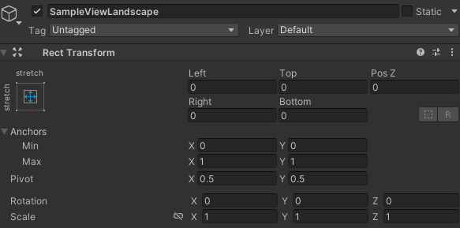
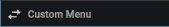

# Adding Custom Menus

Explains how to add custom menus.

## How to Add Custom Menus

To use custom menus in an application that incorporates NOA Debugger, the following steps are needed for each menu:

- Create a Prefab using uGUI.
- Implement a C# class that inherits from `NoaCustomMenuBase`.
- Register the C# class from the NOA Debugger Editor.

If you are using the features provided by NOA Debugger, please always use the `NOA_DEBUGGER` symbol definition.

The following properties need to be overridden and implemented in the inherited class:

| Property                       | Description                                                                            |
|--------------------------------|----------------------------------------------------------------------------------------|
| string ViewPrefabPath { get; } | Specifies the Prefab path of the screen to be displayed in the tool as a return value. |
| string MenuName { get; }       | Specifies the name to be displayed in the menu as a return value.                      |

Also, the following methods can be overridden as necessary:

| Method                       | Description                                                                                                                                                                                        |
|------------------------------|----------------------------------------------------------------------------------------------------------------------------------------------------------------------------------------------------|
| void OnInitialize()          | Describes the process you want to perform during initialization.<br>This is executed when the NOA Debugger is initialized.<br>This also includes when you execute the API's NoaDebug.Initialize(). |
| void OnShow(GameObject view) | Describes the process during the internal display of the tool.<br>Argument: The generated GameObject can be retrieved.                                                                             |
| void OnHide()                | Describes the process to be handled when the internal part of the tool becomes hidden.<br>This is executed when the NOA Debugger is closed or when switching the menu.                             |
| void OnDispose()             | Describes the process you want to perform when the tool is disposed.<br>This is executed when the NOA Debugger is destroyed.<br>This also includes when you execute the API's NoaDebug.Destroy().  |

To register the inherited class from the NOA Debugger Editor, please refer to the [Tool Settings](./Settings.md).

- Place the Prefab for the screen to be displayed in the tool in the `Assets/NoaDebuggerSettings/Resources/Custom`
  folder.
- Create the Transform to be placed in the Prefab with `Rect Transform`.



Since the Render Mode of NOA Debugger's Canvas is set to Overlay, if a 3D object is placed as a child element of
RootPrefab, it will be displayed behind the UI.

The Prefab you create can be excluded from compilation, just like NOA Debugger's Prefab.

For more details, please refer to the [Excluding the Tool from Compile](./ExcludingFromCompile.md).

#### Sample Code

```csharp
using UnityEngine;
#if NOA_DEBUGGER
using NoaDebugger;

public class SampleMenu : NoaCustomMenuBase
{
    protected override string ViewPrefabPath { get => "Custom/SampleView"; }

    protected override string MenuName { get => "sample"; }

    private GameObject View { get; set; }

    protected override void OnInitialize()
    {
        // Do someting.
    }

    protected override void OnShow(GameObject view)
    {
        // Get the View's GameObject.
        View = view;

        // Do something.
    }

    protected override void OnHide()
    {
        // Do something.

        // Destroy the View's GameObject as needed.
        // If you do not destroy the View's GameObject, the pre-existing GameObject will be reused at OnShow.
        Object.Destroy(View);
    }

    protected override void OnDispose()
    {
        // Do something.
    }
}
#endif
```

## How to Display Custom Menus

After launching the NOA Debugger tool, press [Custom Menu] at the bottom of the menu pane.



This will switch to a screen with only the added menus, and you can select a menu to display the details, just like the
NOA Debugger provided menu.

To return to the NOA Debugger provided menu, press [Default Menu] at the bottom of the menu column.
