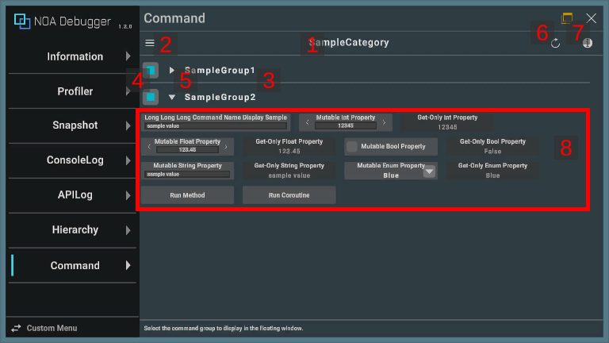
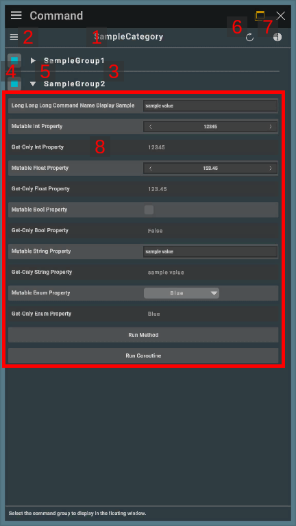
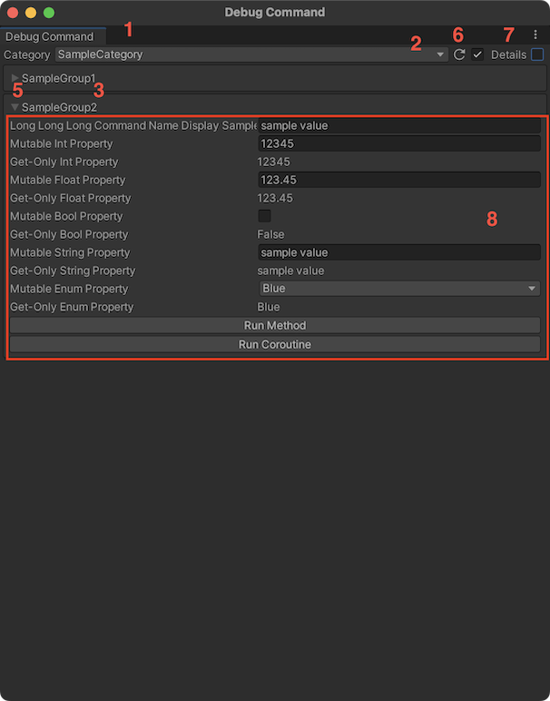
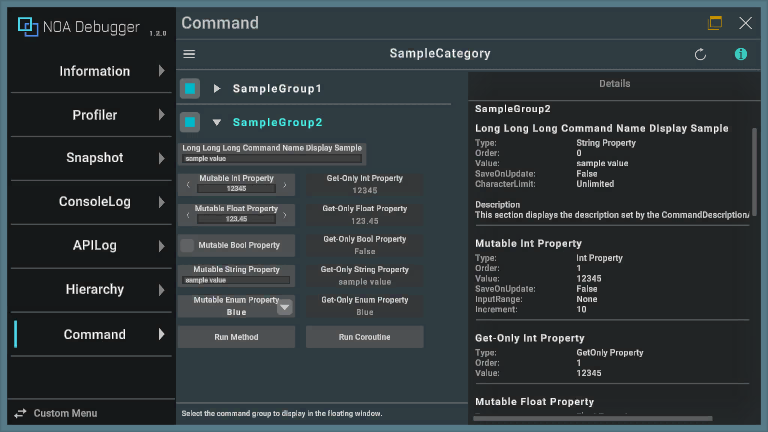
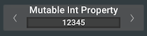
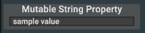
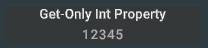
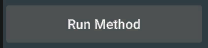
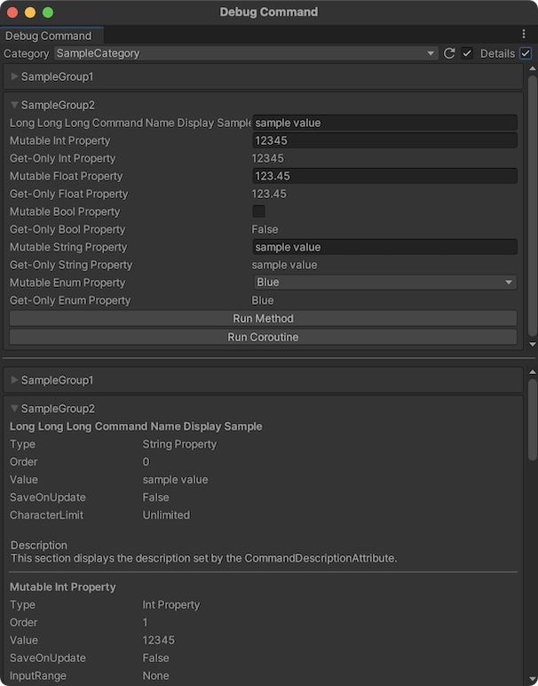

# DebugCommand

Displays the debug commands set.

Debug commands can be set and registered within an application that incorporates the NOA Debugger, allowing for the
execution of methods, display of properties, etc. For how to set up debug commands, please refer to **Setting Debug
Commands** described later.

## Screen Layout and Operating Instructions

Default screen layout in landscape orientation:<br>


Default screen layout in portrait orientation:<br>


You can change the display format of debug commands according to each screen orientation. Please refer to
the [Tool Settings](./Settings.md) for more details.

Debug commands can also be displayed on the editor window. For methods on how to display them on the editor window, please refer
to [this page](../Tools.md).



For specific behaviors unique to the editor window, please refer to the section titled **Specific Behaviors of the Editor Window** later in this document.

### 1. Category Name

Displays the category name you have selected.

### 2. Select Category Button

The category selection dialog is displayed by pressing the [≡] button.

### 3. Group Name

Displays the group name of debug commands.

### 4. Group Toggle

Select the group to be displayed in the floating window.

Commands of the group with a check will be displayed in the floating window.

### 5. Collapse Button

The commands within the group are hidden by pressing the [] button.

The commands within the group are displayed by pressing the [] button.

### 6. Refresh Button

Command's State is refreshed by press the [] button.

Command's State is auto refreshed by long press the [] button.

### 7. Display Details Button

The detailed display is switched by pressing the [i] button.

While in the detailed display, selecting a command or a group will display its settings and description.

For details on how to set explanations, please refer
to [CommandDescriptionAttribute](./Reference/CommandDescriptionAttribute.md).



### 8. Commands

Displays the debug commands set. The UI configuration of the commands to be displayed changes depending on the settings.

For details on each command, please refer to **Command UI** described later.

### Command UI

#### Numeric Type Properties

This is the command element displayed when the integer numeric type or floating-point numeric type is specified. You can
change the value by text
input or increase/decrease the value by dragging or [<][>] buttons.

The supported property types are as follows:

- `sbyte`
- `byte`
- `short`
- `ushort`
- `int`
- `uint`
- `long`
- `ulong`
- `float`
- `double`
- `decimal`



#### String/Char Property

This is the command element displayed when the `string` or `char` property is specified. You can change the value by
text input.



#### Bool Property

This is the command element displayed when the `bool` property is specified. You can change the value using the toggle.


#### Enum Property

This is the command element displayed when the `enum` property is specified. You can change the value using the
dropdown.


#### Get-Only Property

This is the command element that is displayed only when the getter of the property is public.



#### Method

This is the command element displayed when a method is specified. Pressing the button executes the specified method.

In the case of asynchronous, the button cannot be pressed until the process is completed.



### Specific Behaviors of the Editor Window

Below we explain the specific behaviors of the editor window.<br>
Descriptions of items whose behavior remains unchanged are omitted.

#### 2. Category Change Button

Select a category from the dropdown menu.

#### 4. Group Selection

There is no button since settings for the dedicated window cannot be changed from the editor window.

#### 6. Update Button

Automatic updates are enabled by default, and you can disable them with a toggle.

#### 7. Detailed View Button

You can view the details by switching the toggle to true.<br>
The details will be displayed at the bottom of the window, allowing you to see the information of all groups in the selected category.



## Setting Debug Commands

Create a class that inherits `DebugCategoryBase` within an application that incorporates the NOA Debugger.

When using the functions provided by the NOA Debugger, always use the symbol definition of `NOA_DEBUGGER`.

The properties and methods within the created class that meet the following conditions will be displayed on the
DebugCommand screen.

### Properties to Be Displayed

- Has a `public` getter.
- Possessing any of the following types:
    - `string`
    - `sbyte`
    - `byte`
    - `short`
    - `ushort`
    - `int`
    - `uint`
    - `long`
    - `ulong`
    - `char`
    - `float`
    - `double`
    - `decimal`
    - `bool`
    - `enum`

### Methods to Be Displayed

- Method is public.
- Has either `IEnumerator`, `NoaDebugger.MethodHandler`, or `void` as a return value.
- No parameters are set.

**Note:** For a description of `NoaDebugger.MethodHandler`, refer to [About MethodHandler](./MethodHandler.md).

### Sample Code of Category Class

```csharp
#if NOA_DEBUGGER
using NoaDebugger;

public class DebugCommandSample : DebugCategoryBase
{
    public void ExampleMethod()
    {
        // Do something.
    }

    // Property
    [CommandGroup("Group1"), DisplayName("Property1"), SaveOnUpdate]
    public int ExampleProperty1
    {
        get;
        set;
    }

    // GetOnlyProperty
    [CommandGroup("Group1"), DisplayName("Property2"), SaveOnUpdate]
    public int ExampleProperty2
    {
        get;
        private set;
    }
}
#endif
```

### Registering a Category Class

To display the created class on the DebugCommand screen, call `NoaDebugger.DebugCommandRegister.AddCategory() within the
application that incorporated the NOA Debugger and register the created class.

`AddCategory()` can accept the following arguments.

| Argument     | Type   | Description                                                                                                                                                                                         | Behavior if omitted                                                                                |
|--------------|--------|-----------------------------------------------------------------------------------------------------------------------------------------------------------------------------------------------------|----------------------------------------------------------------------------------------------------|
| categoryName | string | Category name. It is used to reference the registered instance described later. If you register multiple categories with the same name, suffixes such as `-1` and `-2` will be automatically added. | Applies the class name.                                                                            |
| order        | int    | Display order of the category. Categories are displayed in the list from the ones with the smallest specified value.                                                                                | They will be listed behind the categories that specified the order, in the order they were loaded. |
| displayName  | string | Display-only category name.                                                                                                                                                                         | Applies the `categoryName`.                                                                        |

```csharp
#if NOA_DEBUGGER
using NoaDebugger;
#endif

public class Example
{
    void Initialize()
    {
#if NOA_DEBUGGER
        DebugCommandRegister.AddCategory<DebugCommandSample>("CategoryName", 1, "DisplayName");

        // In the following case, it will be registered with the category name: DebugCommandSample, display order: unspecified, and display name: DisplayName.
        DebugCommandRegister.AddCategory<DebugCommandSample>(displayName:"DisplayName");
#endif
    }
}
```

### Conditions for the category classes to be displayed

The classes that can be registered on the DebugCommand screen have the following conditions:

- Able to create an instance without arguments.

### Reference to Instances of a Registered Category

To reference an instance of a category registered with `NoaDebugger.DebugCommandRegester.AddCategory()`,
call `NoaDebugger.DebugCommandRegister.GetCategoryInstance()` inside an application that has incorporated the NOA
Debugger.

```csharp
#if NOA_DEBUGGER
using NoaDebugger;
using UnityEngine;
#endif

public class Example
{
    void AccessToDebugCategoryInstance()
    {
#if NOA_DEBUGGER
        // Specify the category name you specified at the time of registration as the argument.
        // If omitted, it will search by class name.
        var instance = DebugCommandRegister.GetCategoryInstance<DebugCommandSample>("CategoryName");
        instance.ExampleMethod();
        Debug.Log($"Value: {instance.ExampleProperty}");

        // Because suffixes such as '-1' and '-2' are automatically added when registering with the same name,
        // it is necessary to reflect it in specifying the category name to retrieve, as well.
        var anotherInstance = DebugCommandRegister.GetCategoryInstance<DebugCommandSample>("CategoryName-1");
 #endif
    }
}
```

### Updating Property Values

When the value of a property is changed from a method, you cannot update the rendering unless you display the
DebugCommand function again.

If you want to update the drawing immediately, please execute `NoaDebugger.DebugCommandRegister.RefreshProperty()`
within the method.

```csharp
#if NOA_DEBUGGER
using NoaDebugger;

public class DebugCommandSample : DebugCategoryBase
{
    int _exampleProperty;
    [CommandGroup("Group1"), DisplayName("Property1")]
    public int ExampleProperty
    {
        get => _exampleProperty;
    }

    public void ExampleMethod()
    {
        _exampleProperty = 2;

        // Update displayed property value.
        DebugCommandRegister.RefreshProperty();
    }
}
#endif
```

### Save Property Values

By adding the [`SaveOnUpdateAttribute`](./Reference/SaveOnUpdateAttribute.md) attribute to the properties to be
displayed, you can save the changed values.

### Delete Saved Property Values

By calling the following API, you can delete the values of the properties you have saved:

- `NoaDebugger.DebugCommandRegister.DeleteSavedProperty(categoryName, propertyName)`
- `NoaDebugger.DebugCommandRegister.DeleteAllPropertiesInCategory(categoryName)`
- `NoaDebugger.DebugCommandRegister.DeleteAllSavedProperties()`

Specify the category name you specified when executing `NoaDebugger.DebugCommandRegister.AddCategory()`
in `categoryName`, and specify the target property name in `propertyName`.

```csharp
#if NOA_DEBUGGER
// Delete the saved value of the specified category and property name.
DebugCommandRegister.DeleteSavedProperty("CategoryName", nameof(Property));

// Delete the saved values of all properties in the specified category.
DebugCommandRegister.DeleteAllPropertiesInCategory("CategoryName");

// Deletes the saved values of all properties.
DebugCommandRegister.DeleteAllSavedProperties();
#endif
```

### Attributes That Can Be Specified in the Debug Command

The attributes that can be specified in the debug command are as follows:

| Attribute                                                                         | Description                                                                                                                                                                                                                                        |
|-----------------------------------------------------------------------------------|----------------------------------------------------------------------------------------------------------------------------------------------------------------------------------------------------------------------------------------------------|
| [`CommandGroupAttribute`](./Reference/CommandGroupAttribute.md)                   | Specifies the group of the target command. If not specified, it will be included in 'Others'.                                                                                                                                                      |
| [`DisplayNameAttribute `](./Reference/DisplayNameAttribute.md)                    | Specifies the display name of the target command. If not specified, the property name or method name will be displayed.                                                                                                                            |
| [`CommandDescriptionAttribute`](./Reference/CommandDescriptionAttribute.md)       | Specifies the description text of the target command.                                                                                                                                                                                              |
| [`CommandOrderAttribute`](./Reference/CommandOrderAttribute.md)                   | Specifies the order of the target command. They are displayed in order from the smallest specified value. If not specified, it will be arranged after the commands in the order in which they were read and the commands with the specified order. |
| [`CommandInputRangeAttribute`](./Reference/CommandInputRangeAttribute.md)         | Specifies the input range for numeric type properties.                                                                                                                                                                                             |
| [`CommandIncrementAttribute`](./Reference/CommandIncrementAttribute.md)           | Specifies the amount of increase or decrease in value by the drag operation of a numeric type property. If not specified, the value increases or decreases by 1.                                                                                   |
| [`CommandCharacterLimitAttribute`](./Reference/CommandCharacterLimitAttribute.md) | Specifies the upper limit of the number of input characters for string properties.                                                                                                                                                                 |
| [`SaveOnUpdateAttribute`](./Reference/SaveOnUpdateAttribute.md)                   | Saves the target property to the specified key.                                                                                                                                                                                                    |
| [`CommandExcludeAttribute`](./Reference/CommandExcludeAttribute.md)               | Excludes properties and methods that meet the display criteria from the display targets.                                                                                                                                                           |
| [`CommandTagAttribute`](./Reference/CommandTagAttribute.md)                       | Specifies the tag of the command. This tag is specified when performing any operations to the command.                                                                                                                                             |

### Adding Dynamic Debug Commands

By using the following APIs defined in the `NoaDebugger.DebugCommandRegister` class, you can dynamically add properties
and methods of classes that do not inherit from `DebugCategoryBase` as debug commands.

Create a command definition:

```csharp
// Creates a property command definition that has only getter.
CommandDefinition CreateGetOnlyIntProperty(string categoryName, string displayName, Func<int> getter, Attribute[] attributes = null);
CommandDefinition CreateGetOnlyFloatProperty(string categoryName, string displayName, Func<float> getter, Attribute[] attributes = null);
CommandDefinition CreateGetOnlyStringProperty(string categoryName, string displayName, Func<string> getter, Attribute[] attributes = null);
CommandDefinition CreateGetOnlyBoolProperty(string categoryName, string displayName, Func<bool> getter, Attribute[] attributes = null);
CommandDefinition CreateGetOnlyEnumProperty(string categoryName, string displayName, Func<Enum> getter, Attribute[] attributes = null);

// Creates a property command definition that has only getter and setter.
CommandDefinition CreateMutableIntProperty(string categoryName, string displayName, Func<int> getter, Action<int> setter, Attribute[] attributes = null);
CommandDefinition CreateMutableFloatProperty(string categoryName, string displayName, Func<float> getter, Action<float> setter, Attribute[] attributes = null);
CommandDefinition CreateMutableStringProperty(string categoryName, string displayName, Func<string> getter, Action<string> setter, Attribute[] attributes = null);
CommandDefinition CreateMutableBoolProperty(string categoryName, string displayName, Func<bool> getter, Action<bool> setter, Attribute[] attributes = null);
CommandDefinition CreateMutableEnumProperty<T>(string categoryName, string displayName, Func<T> getter, Action<T> setter, Attribute[] attributes = null) where T : Enum;

// Creates a method command definition.
CommandDefinition CreateMethod(string categoryName, string displayName, Action method, Attribute[] attributes = null);

// Creates a coroutine command definition.
CommandDefinition CreateCoroutine(string categoryName, string displayName, Func<IEnumerator> coroutine, Attribute[] attributes = null);

// Creates a handle-method command definition.
CommandDefinition CreateHandleMethod(string categoryName, string displayName, Func<MethodHandler> method, Attribute[] attributes = null);
```

For each API's `attributes`, you can specify attributes that can be specified in the debug command, excluding the
following attributes:

- `DisplayNameAttribute`
- `SaveOnUpdateAttribute`
- `CommandExcludeAttribute`

Adding and removing commands using the created command definition:

```csharp
// Adds a command by using created command definition.
void AddCommand(CommandDefinition commandDefinition);

// Removes a added command.
// Please use this API to remove the commands you have added when the objects related to the command are disposed.
void RemoveCommand(CommandDefinition commandDefinition);
```

The sample code to dynamically add and remove debug commands is as follows.

Properties with only a getter:

```csharp
#if NOA_DEBUGGER
using System;
using NoaDebugger;
using UnityEngine;

public class DynamicDebugCommand : MonoBehaviour
{
    readonly int constantValue = 0;
    CommandDefinition commandDefinition = null;

    // Creates and registers a command.
    void Start()
    {
        var attributes = new Attribute[]
        {
            new CommandGroupAttribute("Dynamic Command Group", 1),
            new CommandOrderAttribute(0)
        };
        commandDefinition = DebugCommandRegister.CreateGetOnlyIntProperty(
            "Dynamic Command Category",
            "Get-Only Property",
            () => constantValue,
            attributes);
        DebugCommandRegister.AddCommand(commandDefinition);
    }

    // Removes a registered command.
    void OnDestroy() => DebugCommandRegister.RemoveCommand(commandDefinition);
}
#endif
```

Properties with getter and setter:

```csharp
#if NOA_DEBUGGER
using System;
using NoaDebugger;
using UnityEngine;

public class DynamicDebugCommand : MonoBehaviour
{
    int mutableValue = 0;
    CommandDefinition commandDefinition = null;

    // Creates and registers a command.
    void Start()
    {
        var attributes = new Attribute[]
        {
            new CommandGroupAttribute("Dynamic Command Group", 1),
            new CommandOrderAttribute(0)
        };
        commandDefinition = DebugCommandRegister.CreateMutableIntProperty(
            "Dynamic Command Category",
            "Mutable Property",
            () => mutableValue,
            value => mutableValue = value,
            attributes);
        DebugCommandRegister.AddCommand(commandDefinition);
    }

    // Removes a registered command.
    void OnDestroy() => DebugCommandRegister.RemoveCommand(commandDefinition);
}
#endif
```

Methods:

```csharp
#if NOA_DEBUGGER
using System;
using NoaDebugger;
using UnityEngine;

public class DynamicDebugCommand : MonoBehaviour
{
    CommandDefinition commandDefinition = null;

    // Creates and registers a command.
    void Start()
    {
        var attributes = new Attribute[]
        {
            new CommandGroupAttribute("Dynamic Command Group", 1),
            new CommandOrderAttribute(0)
        };
        commandDefinition = DebugCommandRegister.CreateMethod(
            "Dynamic Command Category",
            "Method",
            () => Debug.Log("Executing Dynamic Command."),
            attributes);
        DebugCommandRegister.AddCommand(commandDefinition);
    }

    // Removes a registered command.
    void OnDestroy() => DebugCommandRegister.RemoveCommand(commandDefinition);
}
#endif
```

Coroutines:

```csharp
#if NOA_DEBUGGER
using System;
using System.Collections;
using NoaDebugger;
using UnityEngine;

public class DynamicDebugCommand : MonoBehaviour
{
    CommandDefinition commandDefinition = null;

    // Creates and registers a command.
    void Start()
    {
        var attributes = new Attribute[]
        {
            new CommandGroupAttribute("Dynamic Command Group", 1),
            new CommandOrderAttribute(0)
        };
        commandDefinition = DebugCommandRegister.CreateCoroutine(
            "Dynamic Command Category",
            "Coroutine",
            DebugCommandCoroutine,
            attributes);
        DebugCommandRegister.AddCommand(commandDefinition);
    }

    // Removes a registered command.
    void OnDestroy() => DebugCommandRegister.RemoveCommand(commandDefinition);

    // Coroutine called by a debug command.
    IEnumerator DebugCommandCoroutine()
    {
        yield return new WaitForSeconds(1);
    }
}
#endif
```

Handle-method:

```csharp
#if NOA_DEBUGGER
using System;
using NoaDebugger;
using UnityEngine;

public class DynamicDebugCommand : MonoBehaviour
{
    MethodHandler handler = new();
    CommandDefinition commandDefinition = null;

    // Creates and registers a command.
    void Start()
    {
        var attributes = new Attribute[]
        {
            new CommandGroupAttribute("Dynamic Command Group", 1),
            new CommandOrderAttribute(0)
        };
        commandDefinition = DebugCommandRegister.CreateHandleMethod(
            "Dynamic Command Category",
            "Handle Method",
            DebugCommandHandleMethod,
            attributes);
        DebugCommandRegister.AddCommand(commandDefinition);
    }

    // Removes a registered command.
    void OnDestroy() => DebugCommandRegister.RemoveCommand(commandDefinition);

    // Handle-method called by a debug command.
    MethodHandler DebugCommandHandleMethod()
    {
        handler.IsDone = false;
        return handler;
    }

    // Completes handle-method.
    void CompleteHandleMethod() => handler.IsDone = true;
}
#endif
```

### Toggling the Interactable State of the Command

By using the following API defined in the `NoaDebugger.DebugCommandRegister class`, you can toggle the interactable
state of the commands those have specified `CommandTagAttribute` attribute.

```csharp
void SetInteractable(string categoryName, string commandTag, bool isInteractable);
bool IsInteractable(string categoryName, string commandTag);
```

**Note:** Commands set to non-interactable are displayed in grey.

### Toggling the Visibility of the Command

By using the following API defined in the `NoaDebugger.DebugCommandRegister class`, you can toggle the visibility of the
commands those have specified `CommandTagAttribute` attribute.

```csharp
void SetVisible(string categoryName, string commandTag, bool isVisible);
bool IsVisible(string categoryName, string commandTag);
```

### Using Unity Test Runner

You can retrieve the instance of the registered category class and use it for testing only during PlayMode.

```csharp
#if NOA_DEBUGGER
using System.Collections;
using UnityEngine.TestTools;
using NoaDebugger;

public class Example
{
    [UnityTest]
    public IEnumerator Test()
    {
        NoaDebug.Initialize();
        DebugCommandRegister.AddCategory<DebugCommandSample>();

        var instance = DebugCommandRegister.GetCategoryInstance<DebugCommandSample>();
        instance.ExampleMethod();

        yield return null;
    }
}
#endif
```
