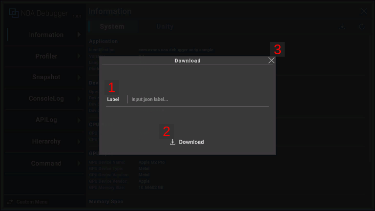

# About Download

## UI Layout and Operation Method of the Download Dialog



### 1. Label

You can give any name to the download data file. You can enter up to 20 characters. You can download even if the label
is not entered.

### 2. Download Button

Press [ Download] button to download. The downloaded data will be output in JSON
format.

### 3. Close Button

Pressing the [×] button or outside the dialog will close the dialog.

## Output Destination by Environment

### iOS

The downloaded file will be saved in the following location.

```
/var/mobile/Containers/Data/Application/<guid>/Documents
```

To access the file, follow these steps:

1. Launch the [Files] app.
2. Tap [Browse] at the bottom of the screen.
3. Opening [On My iPhone > (App's bundle ID)], you can see the output file.

### Android, Windows(exe), WebGL, UnityEditor

Displays the OS standard download dialog. You can choose the output destination arbitrarily.

### About Specifying the Download Output Destination in the Browser

Depending on your browser settings, the window to specify the output destination may not be displayed.

In that case, you can display the window by changing some browser settings according to the following procedure.

| Browser | Configuration Procedure                                                                       |
|---------|-----------------------------------------------------------------------------------------------|
| Chrome  | Open **Settings > Downloads**, and enable **Ask where to save each file before downloading**. |
