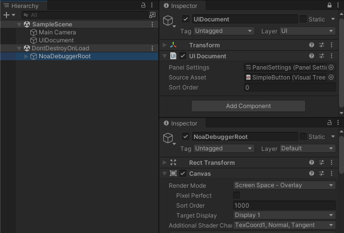
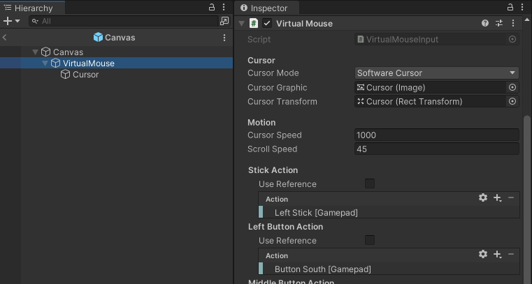

# Environment- and Device-specific Setup Guide

Due to NOA Debugger being built with uGUI, configuration may be required to operate it, depending on the environment or device used.

This document explains how to use NOA Debugger with various devices and platforms, such as the new Input System, UI Toolkit, Gamepad, and XR environments.

## Using New Input System

If the Unity's [Input System package](https://docs.unity3d.com/Packages/com.unity.inputsystem@1.8/manual/Installation.html) is installed in the project, NOA Debugger will automatically be configured to use the new Input System upon initialization.

**Note:** You can initialize NOA Debugger in NOA Debugger Editor by selecting `Window -> NOA Debugger` from the Unity menu.

If you use the new Input System, please attach `InputSystemUIInputModule` to the EventSystem on the scene to detect input events. If you are using the old Input Manager, you will need `StandaloneInputModule`.

```csharp
// Retrieve the EventSystem in the scene
var eventSystem = EventSystem.current;
if (eventSystem.GetComponent<InputSystemUIInputModule>() == null)
{
    eventSystem.gameObject.AddComponent<InputSystemUIInputModule>();
}

// Configure custom action events if any
var inputModule = eventSystem.GetComponent<InputSystemUIInputModule>();
inputModule.actionsAsset = // InputActionAsset;
```


## Using with UI Toolkit

Since NOA Debugger is built with uGUI, it can coexist with UIs created with UI Toolkit.

To ensure NOA Debugger is always displayed on top, please set the SortOrder of the UI Document to a lower value than that of NOA Debugger.

**Note:** The default SortOrder value set for NOA Debugger's Canvas is 1000.



## Using a Gamepad

NOA Debugger does not support uGUI navigation.

However, you can use the Gamepad for operation by taking advantage of the VirtualMouseInput provided by the InputSystem.

For detailed instructions on using VirtualMouseInput, please check the [Unity official documentation](https://docs.unity3d.com/Packages/com.unity.inputsystem@1.7/api/UnityEngine.InputSystem.UI.VirtualMouseInput.html).

Please note that the steps described are just an example, and if you are already using VirtualMouse, integrate it with your existing processes.

### Preparing VirtualMouse

Create a dedicated Canvas for operating the VirtualMouse with the following settings:

- Set RenderMode to Overlay
- Set SortOrder to a value higher than NOA Debugger
- Set the CanvasScaler's UI Scale Mode to Constant Pixel Size


Create a cursor operated by VirtualMouse and Stick as a child element of the Canvas.<br>
Feel free to configure the various actions for VirtualMouse.

The following settings are recommended for the actions:

- Stick Action: Left Stick [Gamepad]
  - Moving the left stick will move the cursor.
- Left Button Action: Button South [Gamepad]
  - Pressing the bottom button of the four action buttons on the right side of the Gamepad will select the uGUI UI.
- Scroll Wheel Action: Right Stick [Gamepad]
  - Operating the right stick will scroll through the uGUI scroll area.



### Operating NOA Debugger with a Gamepad

This is a sample code to display the NOA Debugger when the Select button on the Gamepad is pressed.

It is recommended to activate the VirtualMouse created earlier only when the NOA Debugger is visible.

```csharp
[SerializeField]
private GameObject _virtualMouse = null;

void Start()
{
    // Hide the trigger button
    NoaDebug.SetTriggerButtonActive(false);
}

private void Update()
{
    // When the Select button is pressed, display the NOA Debugger and enable the VirtualMouse.
    if (Gamepad.current.selectButton.wasPressedThisFrame)
    {
        NoaDebug.IsDebuggerVisible ? NoaDebug.Hide() : NoaDebug.Show();
        _virtualMouse.SetActive(NoaDebug.IsDebuggerVisible);
    }
}
```

## Using in XR Environments

In XR environments, it is recommended to handle NOA Debugger within a 3D space.

Additionally, to interact with uGUI in 3D space, please attach a TrackedDeviceGraphicRaycaster to the Canvas of NOA Debugger.

```csharp
// Display the tool in world coordinates
NoaDebug.EnableWorldSpaceRendering();

// Get a reference to the top-level Transform of the tool
Transform noaDebuggerRoot = NoaDebug.RootTransform;

// Change the tool's position, rotation angle, and scale
noaDebuggerRoot.localPosition = Vector3.zero;
noaDebuggerRoot.localEulerAngles = Vector3.zero;
noaDebuggerRoot.localScale = new Vector3(0.00264f, 0.00264f, 0.00264f);

// Change the tool's layer
noaDebuggerRoot.gameObject.layer = 0;

// Attach TrackedDeviceGraphicRaycaster to allow interaction with uGUI from XR controllers
noaDebuggerRoot.gameObject.AddComponent<TrackedDeviceGraphicRaycaster>();
```


