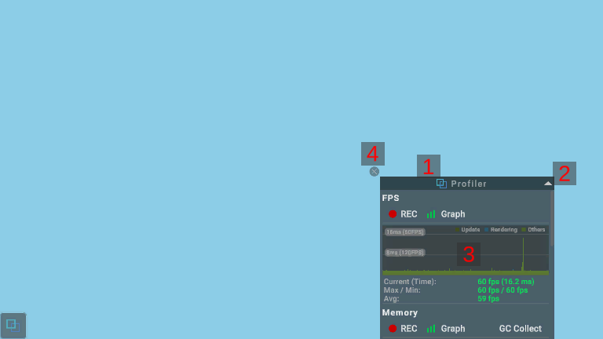

# About the Floating Windows

## Screen UI Layout and Operation Method

### 1. Feature Name

Displays the name of the target function.

By dragging the function name, you can adjust the position of the floating window.

The position of the floating window is retained even if the app is restarted.

### 2. Size Toggle Button

By pressing the [▲] button or [▼] button, you can toggle the size of the floating window between large and small.

### 3. Main Content

Displays the content of the target function.

### 4. Hide Button

Hides the floating window by pressing the [×] button.
