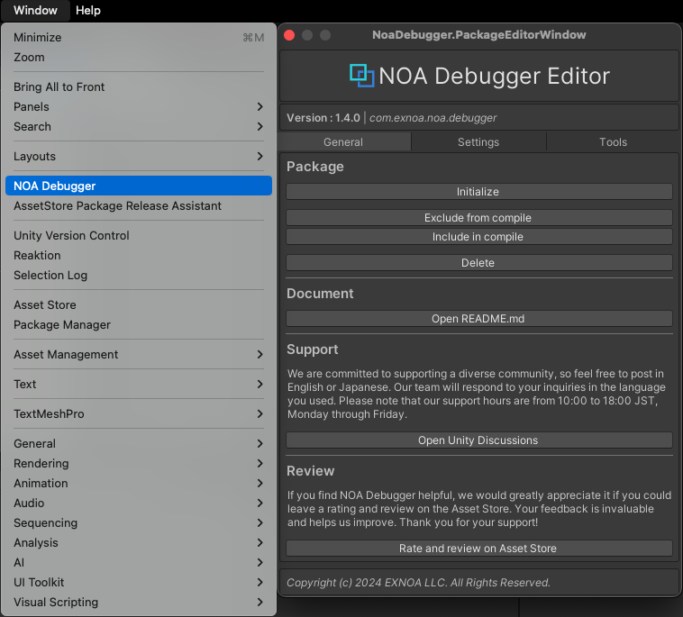
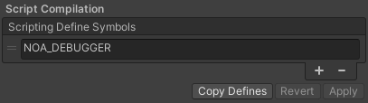
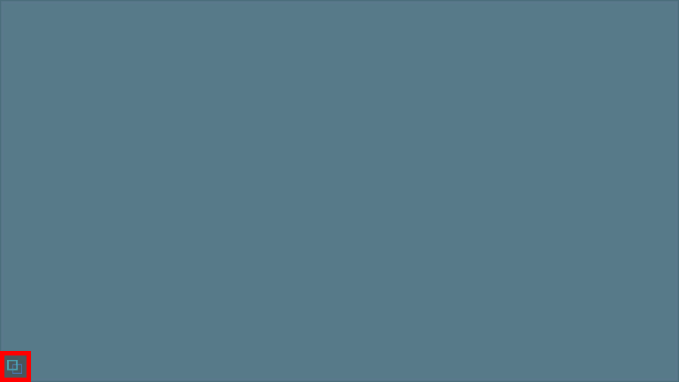

# Installing Tool

## Importing Package

Download NOA Debugger from [Unity Asset Store](https://u3d.as/3cCN) and import it into your Unity project.

**Note:** NOA Debugger is provided via UPM, so it will be imported under the Packages folder.

## Initializing Package

Initialization of the package is done using the NOA Debugger Editor.

You can launch the NOA Debugger Editor by selecting `Window -> NOA Debugger` from the Unity menu.

Once the NOA Debugger Editor is up and running, execute Initialize in the Package item.

You can confirm that initialization is complete if NOA_DEBUGGER has been added to the
Scripting Define Symbols in the PlayerSettings settings items.

**Note:** For BuildProfiles that override the PlayerSettings within the project, symbols will be added to the `ScriptingDefines`.

Please play UnityEditor and confirm that the NOA Debugger launch button is displayed.

If it does not work properly even after initialization, please execute Delete in the Package item of NOA Debugger Editor
and start over from the package import.

## Updating Package

When updating the package to the latest version, please go through the import and initialization procedures mentioned
above again.
