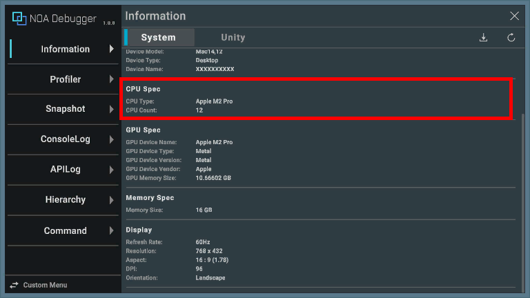

# Information

Displays information about the operating environment.

**Note:** Values that cannot be retrieved depending on the operating environment of the application will show "Not
Supported".

### Common Function

#### 1. Tab Button

Switching between the [System] and [Unity] tabs will change the screen display. The default display is [System].

#### 2. Refresh Button

Pressing [] button will refresh the information displayed.

#### 3. Download Button

By pressing [] button, you can save the information of each tab locally.

Please refer to [About Download](./Download.md) for information on the download dialog.

## System

Explains the information when the [System] tab is displayed.

### Application

| Item            | Description                                                                                                  |
|-----------------|--------------------------------------------------------------------------------------------------------------|
| Identification  | Displays the product name of the running application.                                                        |
| Version         | Displays the version number of the running application. This is information set in Unity's Project Settings. |
| System Language | Displays the language information of the running OS.                                                         |
| Platform        | Displays what platform the running application is operating on.                                              |

### Device

| Item             | Description                                                                                                                        |
|------------------|------------------------------------------------------------------------------------------------------------------------------------|
| Operating System | Displays the OS name and version of the device.                                                                                    |
| Device Model     | Displays the model name of the device.For devices where the model name is not available, a general name such as "PC" is displayed. |
| Device Type      | Displays the type of device. Please refer to [here](https://docs.unity3d.com/ScriptReference/DeviceType.html) for device type.     |
| Device Name      | Displays the device name of the device.                                                                                            |

### CPU Spec

| Item      | Description                                                                                                    |
|-----------|----------------------------------------------------------------------------------------------------------------|
| CPU Type  | Displays the CPU of the device.                                                                                |
| CPU Count | Displays the number of CPU cores in the device. This is the number of "logical processors" reported by the OS. |

### GPU Spec

| Item               | Description                                                                                  |
|--------------------|----------------------------------------------------------------------------------------------|
| GPU Device Name    | Displays the GPU name of the device.                                                         |
| GPU Device Type    | Displays the type of graphics API supported by the GPU of the device.                        |
| GPU Device Version | Displays the type of graphics API and the driver version supported by the GPU of the device. |
| GPU Device Vendor  | Displays the vendor of the GPU of the device.                                                |
| GPU Memory Size    | Displays the memory capacity of the GPU of the device.                                       |

### Memory Spec

| Item               | Description                                 |
|--------------------|---------------------------------------------|
| System Memory Size | Displays the memory capacity of the device. |

### Display

| Item        | Description                                                                                                                                                                |
|-------------|----------------------------------------------------------------------------------------------------------------------------------------------------------------------------|
| RefreshRate | Displays the refresh rate of the device.                                                                                                                                   |
| Resolution  | Displays the screen size of the device.                                                                                                                                    |
| Aspect      | Displays the aspect ratio of the device screen.                                                                                                                            |
| DPI         | Displays the DPI of the device.                                                                                                                                            |
| Orientation | Displays the screen orientation of the device. Please refer to [here](https://docs.unity3d.com/ScriptReference/ScreenOrientation.html) for the type of screen orientation. |

## Unity

Explains the information when the [Unity] tab is displayed.

### UnityInfo

| Item            | Description                                                                                                                                        |
|-----------------|----------------------------------------------------------------------------------------------------------------------------------------------------|
| Version         | Displays the application version of Unity.                                                                                                         |
| Debug           | Indicates whether it is built in debug mode. Displayed as "" for on, and "" for off. |
| IL2CPP          | Indicates whether it is built with IL2CPP. Displayed as "" for on, and "" for off.   |
| VSyncCount      | Displays the number of vertical sync waits between rendering frames. If it's 0, rendering is performed without waiting for vertical sync.          |
| TargetFrameRate | Displays the target frame rate. If it's -1, it falls back to the default value specified per platform by Unity.                                    |

### Runtime

| Item            | Description                                                                                                                     |
|-----------------|---------------------------------------------------------------------------------------------------------------------------------|
| Play Time       | Displays the elapsed time since the application started. The elapsed time is displayed as "hours:minutes:seconds.milliseconds". |
| Level Play Time | Displays the time since scene transition. The elapsed time is displayed as "seconds.milliseconds".                              |
| Current Level   | Displays the current scene and index.                                                                                           |
| Quality Level   | Displays the quality level of graphics.                                                                                         |

### Features

| Item          | Description                                                  |
|---------------|--------------------------------------------------------------|
| Location      | Indicates whether GPS can be used.                           |
| Accelerometer | Indicates whether the accelerometer can be used.             |
| Gyroscope     | Indicates whether the gyroscope can be used.                 |
| Vibration     | Indicates whether haptic feedback via vibration can be used. |

### Graphics

| Item            | Description                                                                           |
|-----------------|---------------------------------------------------------------------------------------|
| Max Tex Size    | Displays the maximum size of the texture supported by the device's graphics hardware. |
| NPOT Support    | Displays how the device's GPU supports NPOT (non-power of two) textures.              |
| Compute Shaders | Displays whether the device's GPU supports compute shaders.                           |
| Shadows         | Displays whether the device's GPU supports built-in shadows.                          |
| Sparse Textures | Displays whether the device's GPU supports sparse textures.                           |
