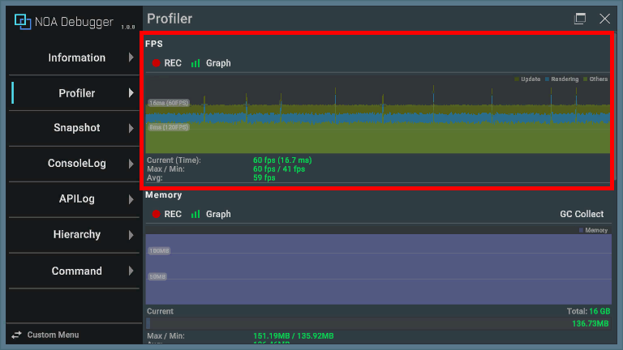
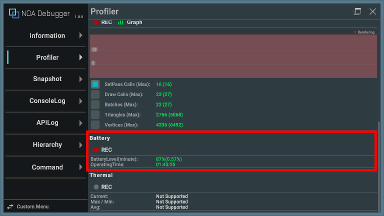
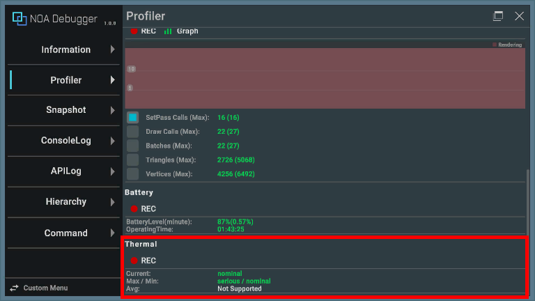
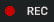
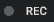
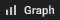

# Profiler

Profiler displays operations and measurement information for Runtime performance measurement.

# Display Items

Explains the information when the Profiler is displayed.

**Note:** Values that cannot be retrieved depending on the operating environment of the application will show "Not
Supported". If no measurement has been made since the application started, the value will be displayed as "-".

## FPS



The graph represents the time taken for each frame to process.

| Item      | Description                                 |
|-----------|---------------------------------------------|
| Update    | The time it took for Update and LateUpdate. |
| Rendering | The time it took for rendering.             |
| Others    | Time excluding the above.                   |

**Note:** It does not have the same precision as the Profiler in the Unity editor. Please use it to identify CPU and GPU
bottlenecks.

The content displayed below the graph is as follows.

| Item          | Description                                                                  |
|---------------|------------------------------------------------------------------------------|
| Current(Time) | Displays the current FPS value and the time elapsed from the previous frame. |
| Max/Min       | Displays the maximum/minimum FPS value during the measurement period.        |
| Avg           | Displays the average FPS value during the measurement period.                |

## Memory


The graph represents the history of measured values over a certain period of time. Also, pressing the [GC Collect]
button executes `System.GC.Collect()`.

**Note:** The [GC Collect] button cannot be pressed if garbage collection is disabled
by [GarbageCollector.GCMode](https://docs.unity3d.com/ScriptReference/Scripting.GarbageCollector.GCMode.html).

The content displayed below the graph is as follows.

| Item    | Description                                                                                                                                                             |
|---------|-------------------------------------------------------------------------------------------------------------------------------------------------------------------------|
| Total   | Displays the maximum memory capacity to be measured. It can be changed from [NoaProfiler.TotalMemoryMB](Apis.md), and by default, it is the RAM capacity of the device. |
| Current | Displays the current memory capacity.                                                                                                                                   |
| Max/Min | Displays the maximum/minimum memory capacity during the measurement period.                                                                                             |
| Avg     | Displays the average memory capacity during the measurement period.                                                                                                     |

### Supported Environment

- The function does not work in browser applications.
- On Android devices with OS version 10 and above, memory measurement results are reflected on the screen every 5
  minutes due to the OS specifications.

### Changing Memory Measurement Time on Android Devices with OS Version 10 and Above

On Android devices with OS version 10 and above, the last obtained value is reflected every 5 minutes by default due to
processing costs. The interval of memory measurement time can be changed with an ADB command.

```shell
adb shell settings put global activity_manager_constants memory_info_throttle_time=1000
```

The trailing 1000 refers to milliseconds, so with this setting, it can be acquired at 1-second intervals.

The current settings can be checked with the following ADB command.

```shell
adb shell dumpsys activity settings | grep memory
```

## Rendering


The graph represents the history of measured values per frame for any of the following items.

| Item               | Description                                                                                                                                                                    |
|--------------------|--------------------------------------------------------------------------------------------------------------------------------------------------------------------------------|
| SetPass Calls(Max) | Displays the number of times Unity has switched shader paths used for rendering game objects in the current frame, as well as the maximum value during the measurement period. |
| Draw Calls(Max)    | Displays the total number of draw calls sent in the current frame, as well as the maximum value during the measurement period.                                                 |
| Batches(Max)       | Displays the number of batches processed in the current frame, as well as the maximum value during the measurement period.                                                     |
| Triangles(Max)     | Displays the number of triangles processed in the current frame, as well as the maximum value during the measurement period.                                                   |
| Vertices(Max)      | Displays the number of vertices processed in the current frame, as well as the maximum value during the measurement period.                                                    |

## Battery



| Item                 | Description                                                                                                                                                                                                                             |
|----------------------|-----------------------------------------------------------------------------------------------------------------------------------------------------------------------------------------------------------------------------------------|
| BatteryLevel(minute) | Displays the current battery level and battery consumption per minute. If measurement data is not available, it displays "85%(InProgress...)". If the device is charging and cannot be measured correctly, it displays "85%(Charging)". |
| Operating Time       | Displays the predicted operating time if continuous play is performed.                                                                                                                                                                  |

## Thermal


| Item    | Description                                                                        |
|---------|------------------------------------------------------------------------------------|
| Current | Displays the current device temperature.                                           |
| Max/Min | Displays the maximum and minimum device temperature during the measurement period. |
| Avg     | Displays the average device temperature during the measurement period.             |

### Displaying Device Temperature on iOS

On iOS devices, it displays the temperature status instead of the device temperature. Please refer
to [here](https://developer.apple.com/documentation/foundation/processinfo/thermalstate) for the temperature status.



## Measurement Button

You can switch the measurement on and off by pressing the [● REC] button. The app starts in measurement mode.

The [● REC] button in red means it's measuring, while white means it's stopped.

**Note:** The measurement button will be grayed out in environments where values cannot be obtained.




When you stop the measurement during the measurement, it keeps the last measured value. Also, the measurement status
will be kept even if you restart the app.

## Graph Display Button

You can switch the graph display on and off by pressing the [Graph] button. The app starts in a graph display state.

The [Graph] button in green means it's displaying the graph, while white means it's hidden.




The graph display state will be kept even if you restart the app.
