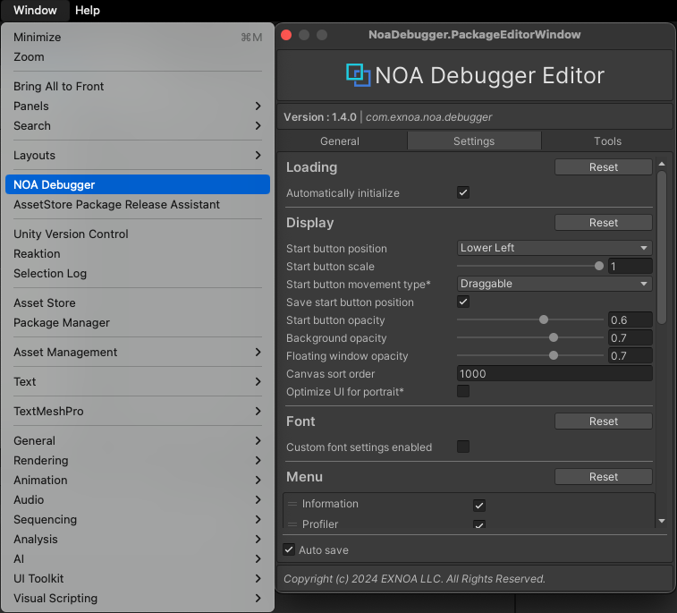
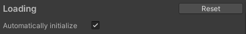
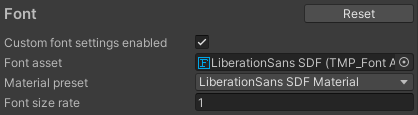
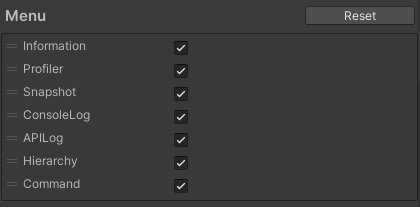
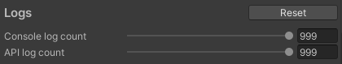
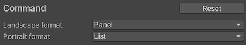
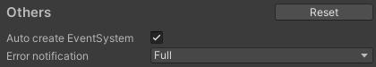
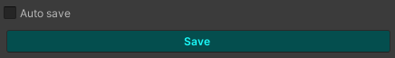

# Tool Settings

NOA Debugger provides a method to change the tool settings.

You can make the following settings:

- Set whether to automatically initialize the tool
- Change the display settings of NOA Debugger
- Change the font asset in use
- Change the display order and visibility of the menu
- Add/remove custom menus
- Change the number of logs retained
- Change the number of display levels of Object details in Hierarchy
- Set the display format of debug command

Tool setting changes are made using the NOA Debugger Editor. The NOA Debugger Editor can be launched by
selecting `Window -> NOA Debugger` in the Unity menu.

Various settings can be changed in the [Settings] tab in EditorWindow. For how to save settings, please refer to **Save
NOA Debugger Settings** described later.

## Common Functions

### [Reset] Button

In some functions, you can reset the settings to the default values specified by NOA Debugger by pressing the [Reset]
button.

## Set Whether to Automatically Initialize the Tool

Sets whether to automatically initialize the tool.

By operating the checkbox, you can change whether to initialize automatically.

**Note:** If the box is unchecked, the initialization will not be performed.

If you do not automatically initialize, please initialize using the API.

Please refer to [this document](./Apis.md) for the API.

## Change the Display Settings of NOA Debugger

You can change the settings related to the display of NOA Debugger.

| Item                       | Description                                                                                                                                                                                                                                                                                             |
|----------------------------|---------------------------------------------------------------------------------------------------------------------------------------------------------------------------------------------------------------------------------------------------------------------------------------------------------|
| Start button position      | Specifies the position of the NOA Debugger start button. Options include: Upper Right, Upper Left, Upper Center, Middle Right, Middle Left, Lower Right, Lower Left, Lower Center.                                                                                                                   |
| Start button scale         | Specifies the scale of the NOA Debugger start button in the range of 0.5 to 1.                                                                                                                                                                                                                          |
| Start button movement type | Specifies whether the NOA Debugger start button is draggable or fixed. Options include: Draggable, Fixed.                                                                                                                                                                                            |
| Save start button position | Specifies whether to remember the position of the NOA Debugger start button when it is moved by dragging. If enabled, the button's position will be retained on the next startup.                                                                                                                       |
| Start button opacity       | Specifies the opacity of the NOA Debugger start button in the range of 0 to 1.                                                                                                                                                                                                                          |
| Background opacity         | Specifies the opacity of the NOA Debugger background in the range of 0.1 to 1.                                                                                                                                                                                                                          |
| Floating window opacity    | Specifies the opacity of the floating window in the range of 0.1 to 1. The recommended value is 0.2 to 0.7.                                                                                                                                                                                             |
| Canvas sort order          | Specifies the SortOrder of the NOA Debugger Canvas.                                                                                                                                                                                                                                                     |
| Optimize UI for portrait   | Optimizes the display order of the NOA Debugger's UI elements for mobile devices when displayed in portrait orientation. If this setting is enabled, some UI elements are arranged in reverse order from the bottom to the top of the screen, allowing for easier access from the bottom of the screen. |

## Change the Font Asset in Use

You can set the font asset to be used by the tool.

| Item                         | Description                                                                                                           |
|------------------------------|-----------------------------------------------------------------------------------------------------------------------|
| Custom font settings enabled | Specify whether to change the font asset to be used. Other font settings will be displayed only when this flag is on. |
| Font asset                   | Specify the font asset to be used by the tool. **Note:** Specify the font included within the application.            |
| Material preset              | Specify the material to be used.                                                                                      |
| Font size rate               | Specify the font size multiplier.                                                                                     |

If a "Font asset" is specified, the font asset included with NOA Debugger is excluded at build time.

If the character size changes due to the font asset and the layout is disrupted, please adjust the value of "Font size
rate".

If you want to use a font that is not included within the application, you can apply the font at runtime.

For how to apply fonts at runtime, refer to the "SetFontSetting" in the [APIs](./Apis.md).

## Change the Display Order and Visibility of the Menu

You can set the order and display of the menu to be shown after the tool is launched.

By manipulating the drag handle on the left of the menu element, you can change the display order of the menu.

**Note:** Elements are displayed in the order from the top. The first element is the menu to display first when the tool
is launched.

By operating the checkbox on the menu element, you can change the display/hide of the menu.

**Note:** If it is not checked, it is hidden.

## Add/Remove Custom Menus

For more details on the custom menu, please refer to [Adding Custom Menus](./CustomMenu.md).

Custom menus are added using the following steps:

1. Press the [+] button to add a list.
2. In the Script field, set the class you created by inheriting `NoaCustomMenuBase`.

By manipulating the drag handle on the left of the menu element, you can change the display order of the menu.

**Note:** Elements are displayed in the order from the top. The first element is the menu to display first when
displaying the custom menu.

To remove the added menu, you can follow these steps:

1. Select the menu you want to delete.
2. Confirm that the selected list is highlighted, and press the [-] button.

## Change the Number of Logs Retained

You can change the number of logs to keep by dragging the slider left or right or by directly entering a number in the
input field.

| Item              | Description                                                                                                                                |
|-------------------|--------------------------------------------------------------------------------------------------------------------------------------------|
| Console log count | Specify the number of logs to be retained in ConsoleLog in the range of 99 to 999. Note: The logs to be retained are for each log type. |
| API log count     | Specify the number of logs to be retained in APILog in the range of 99 to 999. Note: The logs to be retained are for each log type.     |

## Change the Number of Display Levels of Object Details in Hierarchy

You can change the number of display levels of Object details by dragging the slider left or right or by directly
entering a number in the input field.

| Item             | Description                                                                                                                                                        |
|------------------|--------------------------------------------------------------------------------------------------------------------------------------------------------------------|
| Hierarchy levels | Specify the number of levels to display in the range of 1 to 10. Please note that the deeper the levels, the more processing load will occur during the search. |

## Set the display format of debug command

You can setting the display format of debug command for each screen orientation.

| Item             | Description                                           |
|------------------|-------------------------------------------------------|
| Landscape format | Specify the display format for landscape orientation. |
| Portrait format  | Specify the display format for portrait orientation.  |

| Format | Description                                                                                                        |
|--------|--------------------------------------------------------------------------------------------------------------------|
| Panel  | This is a format that displays commands based on screen width and the length of values and names used in commands. |
| List   | This is a format that displays commands vertically.                                                                |

## Other Settings

You can change some other settings of NOA Debugger.

| Item                    | Description                                                                                                                                                                                                                                                                                                                                                                                    |
|-------------------------|------------------------------------------------------------------------------------------------------------------------------------------------------------------------------------------------------------------------------------------------------------------------------------------------------------------------------------------------------------------------------------------------|
| Auto create EventSystem | Specify whether to automatically create an EventSystem if it does not exist at runtime. Turning off this option will not automatically create an EventSystem. If EventSystem does not exist, NOA Debugger's UI will not work.                                                                                                                                                                  |
| Error notification      | You can select the error notification display format from the following options:  - **Full**: The start button blinks and then stays lit in case of an error. This is the default setting.  - **Flashing**: The start button only blinks in case of an error, it does not stay lit.  - **None**: Error notifications are disabled, and the start button neither blinks nor stays lit. |

## Save NOA Debugger Settings

You can configure whether to automatically save various settings of the NOA Debugger.

| Element Name | Display Information                                                                                                                                         |
|--------------|-------------------------------------------------------------------------------------------------------------------------------------------------------------|
| Auto save    | Specifies whether to automatically save settings when they are changed.   By default, this is enabled, so settings are automatically saved when changed. |
| Save         | Displays the [Save] button when settings are changed and Auto save is off.   Clicking the [Save] button will save the settings.                          |
