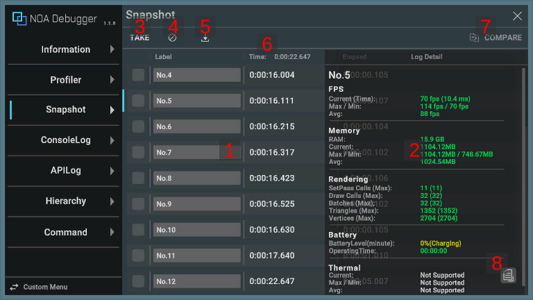
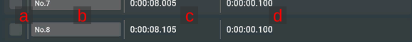
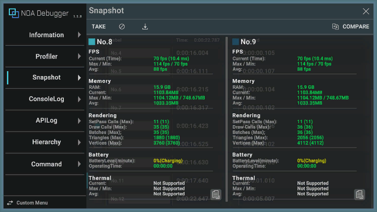

# Snapshot

Retains the logs captured at a specific point.

## Screen UI Layout and Operating Instructions

### 1. Logs

Pressing the [TAKE] button keeps the information at the timing of the press.

- By tapping any log, it will be highlighted and the details of the selected log will be displayed on the right side of
  the screen. (In case of a vertical screen, it is displayed at the bottom.)
- By tapping the selected log again, the details will be hidden.
- By long-pressing any log, the contents of the log are copied to the clipboard.

| Item                               | Description                                                                                |
|------------------------------------|--------------------------------------------------------------------------------------------|
| a. Comparison Target Selection Box | Allows you to select the target to compare logs with.                                      |
| b. Label                           | Allows you to assign any name to the corresponding log. You can enter up to 30 characters. |
| c. Elapsed Time                    | Displays the elapsed time when the log was added.                                          |
| d. Time Elapsed from Last Log      | Displays the elapsed time since the last log was added.                                    |

### 2. Measurement Information

Displays the Profiler information and additional information added via API for the selected log.

If there is no information for both, it will be displayed in an empty state. For details on the information, please
refer to [Profiler](./Profiler.md).

### 3. Capture Button

The log will be retained at the timing of pressing the [TAKE] button.

### 4. Clear Button

By pressing [] button, all retained logs will be deleted and the elapsed time
will be reset.

### 5. Download Button

By pressing the [] button, a dialog to download the retained information will be
displayed. If there is no capture information, you cannot press the [] button.

Please refer to [About Download](./Download.md) for information on the download dialog.

### 6. Elapse Time

Displays the elapsed time since the app was launched.

### 7. Log Comparison Button

You can compare the two logs selected in the Comparison Target Selection Box.

### 8. Log Copy Button

Pressing the [] button copies the contents of the log to the clipboard.

**Note:** It behaves the same way as when you long-press the log.

## APIs provided by NOA Debugger

Please refer to the [API List](./Apis.md) for the APIs provided by Snapshot.
