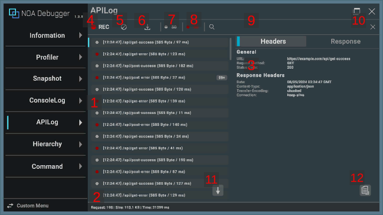
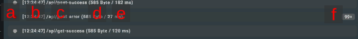
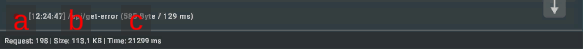
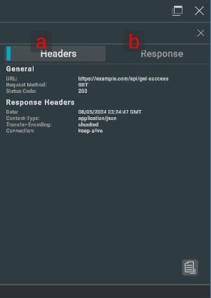

# APILogについて

Web APIの通信ログを表示します。

通信ログを表示するには、NOA Debuggerを組み込んだアプリケーション内でログの出力を行う必要があります。<br>
通信ログを出力する方法は、ページ後半の **通信ログの出力** を参照してください。

## 画面のUI構成と操作方法



### 1.通信ログ

出力した通信ログの一覧を表示します。

- 任意の通信ログを押下することでハイライト表示を行い、画面右側に選択された通信の詳細を表示します。<br>※縦画面の場合は下部に表示します。
- 任意の通信ログを長押しすることで、クリップボードに通信ログの内容をコピーします。
- 選択した通信ログを再度押下することで、詳細を非表示にします。



| 要素名         | 表示情報                                    |
|-------------|-----------------------------------------|
| a.ログタイプ     | ログのタイプを表します。各色の意味については後述の情報を参照してください。   |
| b.出力時間      | ログを出力した時間を表示します。                        |
| c.APIパス     | APIパスとクエリを表示します。                        |
| d.受信バイト数    | 受信バイト数を表示します。                           |
| e.通信にかかった時間 | 通信にかかった時間 (ミリ秒) を表示します。                 |
| f.ログ件数      | 同一ログの連続出力回数を表示します。詳しい内容は後述の情報を参照してください。 |

### 2.通信ステータス

通信の数・合計受信バイト数・合計時間を表示します。<br>
※通信ログがある場合にのみ表示します。



| 要素名       | 表示情報                       |
|-----------|----------------------------|
| a.Request | API通信を実行した回数を表示します。        |
| b.Size    | 合計の受信バイト数を表示します。           |
| c.Time    | 合計の通信にかかった時間 (ミリ秒) を表示します。 |

### 3.通信詳細

選択した通信ログの詳細を表示します。通信の詳細は以下の内容を含みます。



| 要素名        | 表示情報                                    |
|------------|-----------------------------------------|
| a.Headers  | API詳細・レスポンスヘッダ・リクエストヘッダ・リクエストボディを表示します。 |
| b.Response | レスポンスボディを表示します。                         |

`NoaDebugger.ApiLog`クラスのプロパティでリクエストボディ・レスポンスボディを整形して表示するかどうかを指定します。<br>
詳しい内容は後述の情報を参照してください。

通信ログ一覧と通信詳細の境界をドラッグすることで、表示領域を調整することができます。

### 4.通信ログ収集ボタン

[●REC]ボタンを押下することで通信ログ収集のオン・オフを切り替えることができます。アプリ起動時は通信ログの収集を行います。<br>
[●REC]ボタンが赤色の状態は収集中、白色は停止中を意味します。

### 5.一括削除ボタン

[]ボタンを押下することで保持しているログを全て削除します。

### 6.ダウンロードボタン

[]ボタンを押下することでログ情報をダウンロードするダイアログを表示します。<br>
ログ情報がない場合は、[]ボタンを押下できません。

ダウンロードダイアログについては[データのダウンロードについて](./Download.md)を参照してください。

### 7.成功スイッチ

200番台のステータスコードで終了した通信の数を表示します。[●]ボタンを押下しメッセージの表示・非表示を切り替えることができます。

### 8.エラースイッチ

200番台以外のステータスコードで終了した通信の数を表示します。[●]ボタンを押下しエラーの表示・非表示を切り替えることができます。

### 9.検索フィールド

入力したテキストでログをフィルタリングします。<br>
一致するテキストを含むログを表示します。<br>
※通信詳細の情報は検索の対象外です。

### 10.検索破棄ボタン

[×]ボタンを押下することで、検索フィールドに入力したテキストを破棄します。

### 11.ショートカットボタン

[↓]ボタンを押下することで、ログの一覧を一番下までスクロールします。<br>
※最新のログを表示している場合は、ショートカットボタンを表示しません。

### 12.コピーボタン

[]ボタンを押下することで、クリップボードに通信ログの内容をコピーします。<br>
※ログ長押しと同じ挙動です。

### ログタイプ一覧

| 出力色                                                  | ログタイプ                         |
|------------------------------------------------------|-------------------------------|
|  | 200番台のステータスコードで終了した通信を表します。   |
|      | 200番台以外のステータスコードで終了した通信を表します。 |

### 同一のログを連続して出力する条件

連続するログが以下の条件を満たす場合、同一のログとして扱い、連続出力回数のみ保持します。

- リクエスト先URLが一致している
- ステータスコードが一致している
- データサイズが一致している
- リクエストヘッダが一致している
- リクエストボディが一致している
- リクエストボディをstringで登録している

## 通信ログの出力

NOA Debuggerを組み込んだアプリケーション内で `NoaDebugger.ApiLogger.Log()` を呼ぶことで、NOA Debugger上で通信ログを表示します。

`UnityEngine.Networking.UnityWebRequest` を用いてPOST通信を行う場合のサンプルコードを以下に示します。<br>
※ NOA Debuggerが提供する機能を利用する場合は、必ず`NOA_DEBUGGER`のシンボル定義を利用してください。

```csharp
using System.Collections;
using System.Collections.Generic;
using System.Diagnostics;
using System.Text;
#if NOA_DEBUGGER
using NoaDebugger;
#endif
using UnityEngine;
using UnityEngine.Networking;

public class ApiLogSample : MonoBehaviour
{
    void Start()
    {
        const string endpoint = "https://example.com/api/foo";
        const string requestBodyJson = "{ \"field1\":\"1\", \"field2\":\"2\" }";
        StartCoroutine(ApiLogSample.PostJson(endpoint, requestBodyJson));
    }

    static IEnumerator PostJson(string endpoint, string requestBodyJson)
    {
        // POSTリクエストを作成します。
        using var request = new UnityWebRequest(endpoint, "POST");
        var requestHeaders = new Dictionary<string, string>
        {
            { "Content-Type", "application/json" }
        };
        byte[] rawData = Encoding.UTF8.GetBytes(requestBodyJson);
        request.uploadHandler = new UploadHandlerRaw(rawData);
        request.downloadHandler = new DownloadHandlerBuffer();
        foreach (KeyValuePair<string, string> header in requestHeaders)
        {
            request.SetRequestHeader(header.Key, header.Value);
        }

        // 通信を行い、かかった時間を計測します。
        var stopwatch = new Stopwatch();
        stopwatch.Start();
        yield return request.SendWebRequest();
        stopwatch.Stop();

#if NOA_DEBUGGER
        // NOA Debuggerにログを出力します。UnityWebRequestインスタンスが破棄される前に実行してください。
        var apiLog = new ApiLog
        {
            Url = request.uri,
            Method = request.method,
            StatusCode = (int)request.responseCode,
            ContentSize = (long)request.downloadedBytes,
            ResponseTimeMilliSeconds = stopwatch.ElapsedMilliseconds,
            RequestHeaders = requestHeaders,
            RequestBody = requestBodyJson,
            ResponseHeaders = request.GetResponseHeaders(),
            ResponseBody = request.downloadHandler.text,
            PrettyPrint = true
        };
        ApiLogger.Log(apiLog);
#endif
    }
}
```

`NoaDebugger.ApiLog` は以下のプロパティを持ちます。

| プロパティ名                   | 型                                                    | 説明                                                                                         | 設定がない場合の動作                                       |
|--------------------------|------------------------------------------------------|--------------------------------------------------------------------------------------------|--------------------------------------------------|
| Url                      | System.Uri                                           | リクエスト先URLです。                                                                               | `ApiLogger.Log()` にて `ArgumentException` が発生します。 |
| Method                   | string                                               | リクエストメソッドです。                                                                               | `ApiLogger.Log()` にて `ArgumentException` が発生します。 |
| StatusCode               | int                                                  | ステータスコードです。                                                                                | `0` としてログに反映します。                                 |
| ContentSize              | long                                                 | レスポンスのデータサイズです。                                                                            | `0` としてログに反映します。                                 |
| ResponseTimeMilliSeconds | long                                                 | レスポンスにかかった時間をミリ秒で指定します。                                                                    | `0` としてログに反映します。                                 |
| RequestHeaders           | System.Collections.Generic.Dictionary<string,string> | リクエストヘッダです。                                                                                | 通信詳細で表示しません。                                     |
| RequestBody              | string                                               | リクエストボディです。                                                                                | 通信詳細で表示しません。                                     |
| RequestBodyRawData       | object                                               | 変換前のリクエストボディです。<br>APIログを表示するタイミングで変換を実行し、結果の値をRequestBodyに代入します。                          | 変換を行わずRequestBodyを適用します。                         |
| ResponseHeaders          | System.Collections.Generic.Dictionary<string,string> | レスポンスヘッダです。                                                                                | 通信詳細で表示しません。                                     |
| ResponseBody             | string                                               | レスポンスボディです。                                                                                | 通信詳細で表示しません。                                     |
| ResponseBodyRawData      | object                                               | 変換前のレスポンスボディです。<br>APIログを表示するタイミングで変換を実行し、結果の値をResponseBodyに代入します。                         | 変換を行わずResponseBodyを適用します。                        |
| PrettyPrint              | bool                                                 | リクエストボディとレスポンスボディがJSON形式だった場合に整形するかどうかを指定します。<br>falseの場合やJSON形式でない場合は入力されたテキストをそのまま表示します。 | 整形処理を実行します。                                      |

### stringに変換する前のデータを登録する場合

`NoaDebugger.ApiLogger.OnConvertRequestBodyToString` または `NoaDebugger.ApiLogger.OnConvertResponseBodyToString` に変換処理を登録することでリクエストボディ、レスポンスボディをRawDataとしてstring以外の型で登録することができます。<br>
変換処理は1回だけ実行し、実行後RawDataを破棄します。

リクエストボディ、レスポンスボディをRawDataから変換する場合のサンプルコードを以下に示します。

```csharp
using System.Collections;
using System.Collections.Generic;
using System.Diagnostics;
using System.Text;
#if NOA_DEBUGGER
using NoaDebugger;
#endif
using UnityEngine;
using UnityEngine.Networking;

public class ApiLogSample : MonoBehaviour
{
    void Start()
    {
        const string endpoint = "https://example.com/api/foo";
        const string requestBodyJson = "{ \"field1\":\"1\", \"field2\":\"2\" }";
        // 事前に変換処理を登録します。登録は1回だけで問題ありません。
        // 対応するRawDataに値を登録した時のみ実行します。
        ApiLogger.OnConvertRequestBodyToString = rawData => Encoding.UTF8.GetString(((UploadHandlerRaw)rawData).data);
        ApiLogger.OnConvertResponseBodyToString = rawData => ((DownloadHandlerBuffer)rawData).text;
        StartCoroutine(ApiLogSample.PostJson(endpoint, requestBodyJson));
    }

    static IEnumerator PostJson(string endpoint, string requestBodyJson)
    {
        using var request = new UnityWebRequest(endpoint, "POST");
        var requestHeaders = new Dictionary<string, string>
        {
            { "Content-Type", "application/json" }
        };
        byte[] rawData = Encoding.UTF8.GetBytes(requestBodyJson);
        request.uploadHandler = new UploadHandlerRaw(rawData);
        request.downloadHandler = new DownloadHandlerBuffer();
        // UnityWebRequestインスタンスが破棄されてもHandlerが破棄されないようにします。
        request.disposeUploadHandlerOnDispose = false;
        request.disposeDownloadHandlerOnDispose = false;

        foreach (KeyValuePair<string, string> header in requestHeaders)
        {
            request.SetRequestHeader(header.Key, header.Value);
        }

        var stopwatch = new Stopwatch();
        stopwatch.Start();
        yield return request.SendWebRequest();
        stopwatch.Stop();

#if NOA_DEBUGGER
        var apiLog = new ApiLog
        {
            Url = request.uri,
            Method = request.method,
            StatusCode = (int)request.responseCode,
            ContentSize = (long)request.downloadedBytes,
            ResponseTimeMilliSeconds = stopwatch.ElapsedMilliseconds,
            RequestHeaders = requestHeaders,
            // 変換に使用する値をRawDataに登録します。
            RequestBodyRawData = request.uploadHandler,
            ResponseHeaders = request.GetResponseHeaders(),
            ResponseBodyRawData = request.downloadHandler,
            PrettyPrint = true
        };
        ApiLogger.Log(apiLog);
#endif
    }
}
```

## 提供APIについて

APILogが提供するAPIについては[API一覧](./Apis.md)を参照してください。
