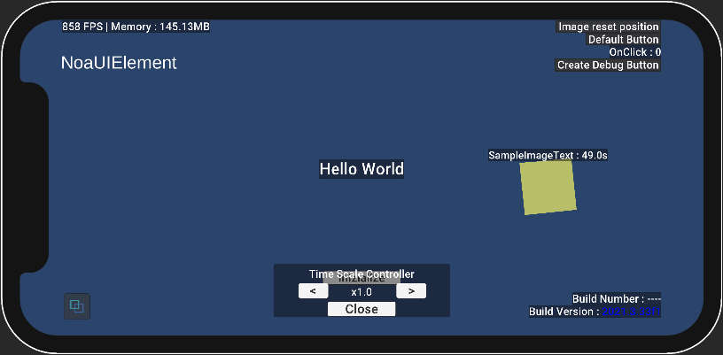

# 提供APIについて

NOA Debuggerの処理の一部は、NOA Debugger提供クラスの静的メソッドや静的プロパティを介してアクセスすることができます。

## NoaDebug

このクラスを介して、NOA Debuggerの初期化や起動などの制御をスクリプトから実行できます。

### API一覧

#### Static Methods

| API                                            | 説明                                                                                                                |
|------------------------------------------------|-------------------------------------------------------------------------------------------------------------------|
| Initialize()                                   | ツールを初期化します。                                                                                                       |
| Show()                                         | ツールを起動して最後に表示したメニューを開きます。                                                                                         |
| Show(index, isCustomMenu)                      | ツールを起動して指定のメニューを開きます。<br>isCustomMenuがtrueの場合は独自のメニューを開きます。                                                       |
| Hide()                                         | ツールを閉じ、表示対象の専用ウィンドウを表示します。                                                                                        |
| SetDebuggerActive(isActive)                    | ツールの表示/非表示を行います。                                                                                                  |
| SetFloatingWindowActive(isActive)              | ツールの専用ウィンドウの表示/非表示を行います。                                                                                          |
| SetTriggerButtonActive(isActive)               | ツールの起動ボタンの表示/非表示を行います。                                                                                            |
| SetFont(fontAsset, fontMaterial, fontSizeRate) | ツールに使用するフォントの設定を行います。<br>fontMaterialを省略した場合は指定したフォントアセットのデフォルトのマテリアルを適用します。<br>fontSizeRateを省略した場合は等倍サイズとして扱います。 |
| EnableWorldSpaceRendering(worldCamera)         | ツールをワールド座標上に表示します。<br>引数を省略した場合は、Canvasの描画にMainCameraを適用します。<br>ワールド座標上に表示している間は、専用ウィンドウと起動ボタンは表示しません。            |
| DisableWorldSpaceRendering()                   | ツールを2Dスクリーン座標上に表示します。                                                                                             |
| Destroy()                                      | ツールを破棄します。                                                                                                        |
| TakeScreenshot(callback)                       | スクリーンショットで撮影した画像データを、引数に指定したコールバックに返します。<br>クラッシュ時にスクリーンショットを撮影する場合、レンダリングが完了していないために正常に動作しないことがあります。             |

#### Static Properties

| API                          | 説明                                                                                     |
|------------------------------|----------------------------------------------------------------------------------------|
| OnShow                       | ツールの起動時に発火するコールバックです。<br>コールバック発火時にメニューのindex値を取得できます。                                 |
| OnHide                       | ツールが閉じた時に発火するコールバックです。<br>コールバック発火時にメニューのindex値を取得できます。                                |
| OnMenuChanged                | ツールのメニューが切り替わった時に発火するコールバックです。<br>コールバック発火時に切り替わった後のメニューのindex値と独自メニューかどうかのフラグを取得できます。 |
| RootTransform                | ツールの最上位階層のTransformへの参照を返します。                                                          |
| IsInitialized                | ツールを初期化されている場合、trueを返します。                                                              |
| IsWorldSpaceRenderingEnabled | ツールをワールド座標上に表示している場合、trueを返します。                                                        |
| IsDebuggerVisible            | ツールを表示している場合、trueを返します。                                                                |
| IsTriggerButtonVisible       | ツールの起動ボタンを表示している場合、trueを返します。                                                          |
| IsFloatingWindowVisible      | 専用ウィンドウを表示している場合、trueを返します。                                                            |

#### サンプルコード

```csharp
using UnityEngine;
#if NOA_DEBUGGER
using NoaDebugger;
#endif

public class Example
{
    void ExampleMethod()
    {
#if NOA_DEBUGGER
        // ツールの初期化を実行
        NoaDebug.Initialize();

        // NoaDebuggerの初期化が完了しているかどうか
        bool isDebuggerInit = NoaDebug.IsInitialized;

        // ツール起動時に実行したいコールバックを指定する
        NoaDebug.OnShow = (index) => Debug.Log($"showIndex:{index}");

        // ツールの最後に表示したメニューを開く
        NoaDebug.Show();

        // ツールを閉じた時に実行したいコールバックを指定する
        NoaDebug.OnHide = (index) => Debug.Log($"hideIndex:{index}");

        // ツールを閉じる
        NoaDebug.Hide();

        // ツールの指定したindexを開く
        NoaDebug.Show(3);

        // ツールのメニュー切り替わり時に実行したいコールバックを指定する
        NoaDebug.OnMenuChanged = (index, isCustomMenu) => Debug.Log($"menuIndex:{index} isCustomMenu:{isCustomMenu}");

        // ツールを非表示にする
        NoaDebug.SetDebuggerActive(false);

        // ツールを表示する
        NoaDebug.SetDebuggerActive(true);

        // ツールの専用ウィンドウを非表示にする
        NoaDebug.SetFloatingWindowActive(false);

        // ツールの専用ウィンドウを表示する
        NoaDebug.SetFloatingWindowActive(true);

        // ツールの起動ボタンを非表示にする
        NoaDebug.SetTriggerButtonActive(false);

        // ツールの起動ボタンを表示する
        NoaDebug.SetTriggerButtonActive(true);

        // ツールに使用するフォントを設定する
        var assetBundle = AssetBundle.LoadFromFile(Application.streamingAssetsPath + "/ExampleFont");
        var fontAsset = assetBundle.LoadAsset<TMP_FontAsset>("Assets/AssetBundleResources/ExampleFont.asset");
        NoaDebug.SetFont(fontAsset, fontAsset.material, 1.0f);

        // ツールをワールド座標上に表示する
        NoaDebug.EnableWorldSpaceRendering(Camera.main);

        // ツールの最上位階層のTransformへの参照を取得する
        Transform noaDebuggerRoot = NoaDebug.RootTransform;

        // ツールの座標・回転角・スケールを変更する
        // - ワールド座標上に表示している場合のみ適用されます。
        // - サイズの変更はスケールで制御してください。
        // - NOA Debuggerのキャンバスサイズは1136x640となっているため、以下の例ではおよそ3x1.7mの大きさとなります。
        noaDebuggerRoot.localPosition = Vector3.zero;
        noaDebuggerRoot.localEulerAngles = Vector3.zero;
        noaDebuggerRoot.localScale = new Vector3(0.00264f, 0.00264f, 0.00264f);

        // ツールのレイヤーを変更する
        noaDebuggerRoot.gameObject.layer = 0;

        // ツールをワールド座標上に表示しているか
        bool isWorldSpace = NoaDebug.IsWorldSpaceRenderingEnabled;

        // ツールを2Dスクリーン座標上に表示する
        NoaDebug.DisableWorldSpaceRendering();

        // ツールを表示しているか
        bool IsDebuggerVisible = NoaDebug.IsDebuggerVisible;

        // ツールの起動ボタンを表示しているか
        bool IsTriggerButtonVisible = NoaDebug.IsTriggerButtonVisible;

        // 専用ウィンドウを表示しているか
        bool IsFloatingWindowVisible = NoaDebug.IsFloatingWindowVisible;

        // ツールの破棄を実行
        NoaDebug.Destroy();

        // スクリーンショットを撮影
        NoaDebug.TakeScreenshot((data) => {
            if (data != null)
            {
                // 画像データをファイルに保存する例
                string filePath = Application.persistentDataPath + "/screenshot.png";
                System.IO.File.WriteAllBytes(filePath, data);
                Debug.Log($"Screenshot saved to: {filePath}");
            }
            else
            {
                Debug.LogError("Failed to capture screenshot.");
            }
        });
#endif
    }
}
```

## NoaInformation

このクラスを介して、Information機能の情報を取得できます。

### API一覧

### Static Properties

| API               | 説明                                                                             |
|-------------------|--------------------------------------------------------------------------------|
| SystemInformation | 保持しているシステム情報を返します。                                                             |
| UnityInformation  | 保持しているUnity情報を返します。                                                            |
| OnDownload        | ダウンロードする時に実行するイベントです。<br>イベントハンドラが true を返すとダウンロードを許可し、false を返すとダウンロードを拒否します。 |

### サンプルコード

```csharp
using UnityEngine;
#if NOA_DEBUGGER
using NoaDebugger;
#endif

public class Example
{
    void ExampleMethod()
    {
#if NOA_DEBUGGER

        // システム情報を取得
        SystemInformation systemInfo = NoaInformation.SystemInformation;
        ApplicationInfo appInfo = systemInfo.ApplicationInfo;
        DeviceInfo deviceInfo = systemInfo.DeviceInfo;
        CpuInfo cpuInfo = systemInfo.CpuInfo;
        GpuInfo gpuInfo = systemInfo.GpuInfo;
        SystemMemoryInfo systemMemoryInfo = systemInfo.SystemMemoryInfo;
        DisplayInfo displayInfo = systemInfo.DisplayInfo;

        // Unity情報を取得
        UnityInformation unityInfo = NoaInformation.UnityInformation;
        UnityInfo unity = unityInfo.UnityInfo;
        RuntimeInfo runtime = unityInfo.RuntimeInfo;
        FeaturesInfo features = unityInfo.FeaturesInfo;
        GraphicsInfo graphics = unityInfo.GraphicsInfo;

        // ダウンロードする時に実行するイベントを設定
        NoaInformation.OnDownload += (string filename, string jsonData) =>
        {
            Debug.Log($"Information download. Filename: {filename}");
            // ローカルにダウンロードを許可する場合はtrueを返す
            // ローカルにダウンロードを拒否する場合はfalseを返す
            return true;
        };

#endif
    }
}
```

## NoaProfiler

このクラスを介して、Profiler機能の各種数値を取得できます。

### API一覧

#### Static Properties

| API                  | 説明                                                                     |
|----------------------|------------------------------------------------------------------------|
| ProfilerInfo         | 保持しているProfiler情報を返します。未計測状態の場合は初期値が入ります。                               |
| LatestFpsInfo        | 計測した最新のFPS情報を返します。未計測状態の場合は初期値が入ります。                                   |
| LatestMemoryInfo     | 計測した最新のMemory情報を返します。未計測状態の場合や数値を取得できない環境では初期値が入ります。                   |
| LatestRenderingInfo  | 計測した最新のRendering情報を返します。未計測状態の場合は初期値が入ります。                             |
| LatestBatteryInfo    | 計測した最新のBattery情報を返します。未計測状態の場合や数値を取得できない環境では初期値が入ります。                  |
| LatestThermalInfo    | 計測した最新のThermal情報を返します。未計測状態の場合や数値を取得できない環境では初期値が入ります。                  |
| IsFpsProfiling       | 現在のFPS計測状態を返します。このプロパティから計測状態の変更ができます。                                 |
| IsMemoryProfiling    | 現在のMemory計測状態を返します。このプロパティから計測状態の変更ができます。                              |
| TotalMemoryMB        | 計測する最大メモリ容量を返します。このプロパティから計測する最大メモリ容量を指定できます。負の値を指定した場合は端末のRAM容量となります。 |
| IsRenderingProfiling | 現在のRendering計測状態を返します。このプロパティから計測状態の変更ができます。                           |
| IsBatteryProfiling   | 現在のBattery計測状態を返します。このプロパティから計測状態の変更ができます。                             |
| IsThermalProfiling   | 現在のThermal計測状態を返します。このプロパティから計測状態の変更ができます。                             |

#### サンプルコード

```csharp
#if NOA_DEBUGGER
using NoaDebugger;
#endif

public class Example
{
    void ExampleMethod()
    {
#if NOA_DEBUGGER

        // Profiler情報を取得
        ProfilerInfo profilerInfo = NoaProfiler.ProfilerInfo;

        // 各種計測情報を取得
        FpsInfo fpsInfo = NoaProfiler.LatestFpsInfo;
        MemoryInfo memoryInfo = NoaProfiler.LatestMemoryInfo;
        RenderingInfo renderingInfo = NoaProfiler.LatestRenderingInfo;
        BatteryInfo batteryInfo = NoaProfiler.LatestBatteryInfo;
        ThermalInfo thermalInfo = NoaProfiler.LatestThermalInfo;

        // 計測状態の取得と変更
        bool isFpsProfiling = NoaProfiler.IsFpsProfiling;
        NoaProfiler.IsFpsProfiling = false;

        // 計測する最大のメモリ容量を指定 (MB単位)
        NoaProfiler.TotalMemoryMB = 8192.0f;

#endif
    }
}
```

### NoaSnapshot

このクラスを介して、Snapshot機能が保持しているログを取得やログのキャプチャ、ログの一括削除と経過時間リセットなどの制御をスクリプトから実行できます。

### API一覧

#### Static Methods

| API                                                                    | 説明                                                                                  |
|------------------------------------------------------------------------|-------------------------------------------------------------------------------------|
| ClearLogsAndTimer()                                                    | ログを一括削除し経過時間をリセットします。                                                               |
| CaptureLog(label, backgroundColor, hasNoaProfilerInfo, additionalInfo) | ログをキャプチャします。<br>ログに設定するラベルや背景色、NOA Debuggerが提供しているプロファイラ情報保持の有無、追加情報をパラメータとして指定します。 |

#### Static Properties

| API           | 説明                                                                                 |
|---------------|------------------------------------------------------------------------------------|
| LogList　      | 保持しているログ情報の一覧を返します。 　                                                              |
| OnLogCopied   | ログをクリップボードにコピーした時に実行するイベントです。 　                                                    |
| OnLogDownload | ログをダウンロードする時に実行するイベントです。<br>イベントハンドラが true を返すとダウンロードを許可し、false を返すとダウンロードを拒否します。  |

#### サンプルコード

```csharp
using System.Collections.Generic;
using UnityEngine;
#if NOA_DEBUGGER
using NoaDebugger;
#endif

public class Example
{
    void ExampleMethod()
    {
#if NOA_DEBUGGER

        // Snapshot機能が保持しているログ情報の一覧を取得
        List<SnapshotLogRecordInformation> snapshotLogList = NoaSnapshot.LogList;

        // ログの一括削除と経過時間をリセット
        NoaSnapshot.ClearLogsAndTimer();

        // ログをキャプチャ
        NoaSnapshot.CaptureLog("label",  NoaSnapshot.BgColor.Blue, hasNoaProfilerInfo: true);

        // 追加情報のDictionary作成
        var additionalInfo = new Dictionary<string,NoaSnapshotCategory>();

        // カテゴリを指定しないで追加情報を設定
        var category = new NoaSnapshotCategory();
        // カテゴリ毎の要素1
        var categoryItem1 = new NoaSnapshotCategoryItem
        (
            key: "SampleKey",
            value: "SampleValue",
            color: NoaSnapshot.FontColor.Black
        );
        category.Add(categoryItem1);

        // カテゴリ毎の要素2
        var categoryItem2 = new NoaSnapshotCategoryItem
        (
            key: "SampleKey",
            value: "SampleValue2",
            color: NoaSnapshot.FontColor.Black
        );
        // キー重複時は値と色を上書き
        category.Add(categoryItem2);

        // キーの指定がない場合は、Othersの項目として管理します
        additionalInfo[""] = category;

        // カテゴリを指定して追加情報を設定
        // カテゴリ1の追加情報
        var category1 = new NoaSnapshotCategory();
        var category1Item = new NoaSnapshotCategoryItem
        (
            key: "SampleKey",
            value: "SampleValue",
            color: NoaSnapshot.FontColor.Black
        );
        category1.Add(category1Item);
        additionalInfo["Category1"] = category1;

        // 追加情報を含めてログをキャプチャ
        NoaSnapshot.CaptureLog("label", NoaSnapshot.BgColor.Blue, hasNoaProfilerInfo: true, additionalInfo);

        // ログをクリップボードにコピーした時に実行するイベントを設定
        NoaSnapshot.OnLogCopied += (SnapshotLogRecordInformation log, string clipboardText) => Debug.Log($"Log copied. Clipboard: {clipboardText}");

        // ログをダウンロードする時に実行するイベントを設定
        NoaSnapshot.OnLogDownload += (string filename, string jsonData) =>
        {
            Debug.Log($"Logs download. Filename: {filename}");
            // ローカルにダウンロードを許可する場合はtrueを返す
            // ローカルにダウンロードを拒否する場合はfalseを返す
            return true;
        };

#endif
    }
}
```

### NoaConsoleLog

このクラスを介して、ConsoleLog機能が保持しているログを取得できます。

### API一覧

#### Static Methods

| API                               | 説明                                                                     |
|-----------------------------------|------------------------------------------------------------------------|
| Add(LogType, message, stackTrace) | ConsoleLogツールに出力するログを追加します。<br> stackTraceの指定がない場合、自動的にスタックトレースを取得します。 |
| Clear()                           | 保持しているログ情報を一括削除します。                                                    |

#### Static Properties

| API                       | 説明                                                                                                              |
|---------------------------|-----------------------------------------------------------------------------------------------------------------|
| LogList                   | 保持しているログ情報の一覧を返します。                                                                                             |
| OnError                   | エラー検出時に実行するイベントです。                                                                                              |
| OnFilterErrorNotification | エラー検出時に通知を表示するかを判定するデリゲートです。trueを返すと通知を表示します。<br>具体的な使用方法はサンプルコードを参照してください。                                     |
| OnLogCopied               | ログをクリップボードにコピーした時に実行するイベントです。                           　                                                       |
| OnLogDownload             | ログをダウンロードする時に実行するイベントです。<br>イベントハンドラが true を返すとダウンロードを許可し、false を返すとダウンロードを拒否します。                             　 |

#### サンプルコード

```csharp
using System.Collections.Generic;
using UnityEngine;
#if NOA_DEBUGGER
using NoaDebugger;
#endif

public class Example
{
    void ExampleMethod()
    {
#if NOA_DEBUGGER

        // ConsoleLog機能が保持しているログ情報の一覧を取得
        LinkedList<ConsoleLogEntry> consoleLogList = NoaConsoleLog.LogList;

        // ConsoleLog機能にログを追加
        NoaConsoleLog.Add(UnityEngine.LogType.Error, "log_message", "log_stacktrace");

        // ConsoleLog機能にログを追加（スタックトレースを指定しない場合）
        NoaConsoleLog.Add(UnityEngine.LogType.Error, "log_message");

        // エラー検出時に実行するイベントを設定
        NoaConsoleLog.OnError += (ConsoleLogEntry log) => Debug.Log("Error detected.");

        // エラー検出時に通知を表示するかを判定するデリゲートを設定
        NoaConsoleLog.OnFilterErrorNotification += (ConsoleLogEntry log) => log.LogString.StartsWith("Log to notifify an error.");

        // ログをクリップボードにコピーした時に実行するイベントを設定
        NoaConsoleLog.OnLogCopied += (ConsoleLogEntry log, string clipboardText) => Debug.Log($"Log copied. Clipboard: {clipboardText}");

        // ログをダウンロードする時に実行するイベントを設定
        NoaConsoleLog.OnLogDownload += (string filename, string jsonData) =>
        {
            Debug.Log($"Logs download. Filename: {filename}");
            // ローカルにダウンロードを許可する場合はtrueを返す
            // ローカルにダウンロードを拒否する場合はfalseを返す
            return true;
        };

        // ログを一括削除します
        NoaConsoleLog.Clear();
#endif
    }
}
```

### NoaApiLog

このクラスを介して、APILog機能が保持しているログを取得できます。

### API一覧

#### Static Methods

| API     | 説明                  |
|---------|---------------------|
| Clear() | 保持しているログ情報を一括削除します。 |

#### Static Properties

| API           | 説明                                                                                  |
|---------------|-------------------------------------------------------------------------------------|
| LogList       | 保持しているログ情報の一覧を返します。                                                                 |
| OnError　      | エラー検出時に実行するイベントです。                                                                  |
| OnLogCopied   | ログをクリップボードにコピーした時に実行するイベントです。 　                                                     |
| OnLogDownload | ログをダウンロードする時に実行するイベントです。<br>イベントハンドラが true を返すとダウンロードを許可し、false を返すとダウンロードを拒否します。   |

#### サンプルコード

```csharp
using System.Collections.Generic;
using UnityEngine;
#if NOA_DEBUGGER
using NoaDebugger;
#endif

public class Example
{
    void ExampleMethod()
    {
#if NOA_DEBUGGER

        // APILog機能が保持しているログ情報の一覧を取得
        LinkedList<ApiLogEntry> apiLogList = NoaApiLog.LogList;

        // エラー検出時に実行するイベントを設定
        NoaApiLog.OnError += (ApiLogEntry log) => Debug.Log("Error detected.");

        // ログをクリップボードにコピーした時に実行するイベントを設定
        NoaApiLog.OnLogCopied += (ConsoleLogEntry log, string clipboardText) => Debug.Log($"Log copied. Clipboard: {clipboardText}");

        // ログをダウンロードする時に実行するイベントを設定
        NoaApiLog.OnLogDownload += (string filename, string jsonData) =>
        {
            Debug.Log($"Logs download. Filename: {filename}");
            // ローカルにダウンロードを許可する場合はtrueを返す
            // ローカルにダウンロードを拒否する場合はfalseを返す
            return true;
        };

        // ログを一括削除します
        NoaApiLog.Clear();
#endif
    }
}
```

## NoaPrefs

このクラスを介して、NOA Debugger独自の保存領域に値を保存します。<br>
値は`Application.persistentDataPath`配下のファイルに保存します。<br>
また、保存した値はiCloud/iTunesのバックアップ対象から除外しています。

### API一覧

#### Static Methods

| API                           | 説明                                                    |
|-------------------------------|-------------------------------------------------------|
| SetString(key, value)         | stringの型で値を保存します。                                     |
| SetSByte(key, value)          | sbyteの型で値を保存します。                                      |
| SetByte(key, value)           | byteの型で値を保存します。                                       |
| SetShort(key, value)          | shortの型で値を保存します。                                      |
| SetUShort(key, value)         | ushortの型で値を保存します。                                     |
| SetInt(key, value)            | intの型で値を保存します。                                        |
| SetUInt(key, value)           | uintの型で値を保存します。                                       |
| SetLong(key, value)           | longの型で値を保存します。                                       |
| SetULong(key, value)          | ulongの型で値を保存します。                                      |
| SetChar(key, value)           | charの型で値を保存します。                                       |
| SetFloat(key, value)          | floatの型で値を保存します。                                      |
| SetDouble(key, value)         | doubleの型で値を保存します。                                     |
| SetDecimal(key, value)        | decimalの型で値を保存します。                                    |
| SetBoolean(key, value)        | boolの型で値を保存します。                                       |
| GetString(key, defaultValue)  | stringの型で値を取得します。データが取得できなかった場合は defaultValueを返します。   |
| GetSByte(key, defaultValue)   | sbyteの型で値を取得します。データが取得できなかった場合は defaultValueを返します。    |
| GetByte(key, defaultValue)    | byteの型で値を取得します。データが取得できなかった場合は defaultValueを返します。     |
| GetShort(key, defaultValue)   | shortの型で値を取得します。データが取得できなかった場合は defaultValueを返します。    |
| GetUShort(key, defaultValue)  | ushortの型で値を取得します。データが取得できなかった場合は defaultValueを返します。   |
| GetInt(key, defaultValue)     | intの型で値を取得します。データが取得できなかった場合は defaultValueを返します。      |
| GetUInt(key, defaultValue)    | uintの型で値を取得します。データが取得できなかった場合は defaultValueを返します。     |
| GetLong(key, defaultValue)    | longの型で値を取得します。データが取得できなかった場合は defaultValueを返します。     |
| GetULong(key, defaultValue)   | ulongの型で値を取得します。データが取得できなかった場合は defaultValueを返します。    |
| GetChar(key, defaultValue)    | charの型で値を取得します。データが取得できなかった場合は defaultValueを返します。     |
| GetFloat(key, defaultValue)   | floatの型で値を取得します。データが取得できなかった場合は defaultValue を返します。   |
| GetDouble(key, defaultValue)  | doubleの型で値を取得します。データが取得できなかった場合は defaultValueを返します。   |
| GetDecimal(key, defaultValue) | decimalの型で値を取得します。データが取得できなかった場合は defaultValue を返します。 |
| GetBoolean(key, defaultValue) | boolの型で値を取得します。データが取得できなかった場合は defaultValue を返します。    |
| DeleteAt(key)                 | 指定したキーの値を削除します。                                       |
| DeleteAllSaveData()           | NoaPrefs を介して保存した全ての値を削除します。                          |
| DeleteAllToolData()           | NOA Debugger ツールが独自で使用している全ての値を削除します。                 |

#### サンプルコード

```csharp
#if NOA_DEBUGGER
using NoaDebugger;
#endif

public class Example
{
    void ExampleMethod()
    {
#if NOA_DEBUGGER

        // 値の保存
        NoaPrefs.SetString("key", "value");

        // 値の取得
        string value = NoaPrefs.GetString("key", "defaultValue");

        // 値の削除
        NoaPrefs.DeleteAt("key");

        // NoaPrefs経由で保存した値を全て削除
        NoaPrefs.DeleteAllSaveData();

        // NOA Debuggerが独自で使用している値を全て削除
        NoaPrefs.DeleteAllToolData();
#endif
    }
}
```

## NoaUIElement

NoaUIElementは、NOA Debuggerを使用して画面上にさまざまなUI要素を動的に登録および表示するための便利なインターフェースを提供します。<br>
このクラスを使用することで、開発者はUI要素の生成、管理、および位置調整を簡単に行うことができます。

**注意**：NoaUIElementはuGUIのCanvas内での使用を想定しており、3D空間上での利用はサポートしていません。



### API一覧

#### Static Methods

| API                                    | 説明                                             |
|----------------------------------------|------------------------------------------------|
| RegisterUIElement(element)             | 新しいUI要素を登録します。                                 |
| UnregisterUIElement(key)               | 指定されたキーに基づいてUI要素の登録を解除します。                     |
| UnregisterAllUIElements()              | すべてのUI要素の登録を解除します。                             |
| IsUIElementRegistered(key)             | 指定されたキーで単一のUI要素が登録されているか確認します。                 |
| IsUIElementRegistered()                | いずれかのUI要素が登録されているか確認します。                       |
| SetUIElementVisibility(key, isVisible) | 単一のUI要素の表示・非表示を設定します。                          |
| SetAllUIElementsVisibility(isVisible)  | すべてのUI要素の表示・非表示を設定します。                         |
| IsUIElementVisible(key)                | 指定されたキーで単一のUI要素が表示されているか確認します。                 |
| IsUIElementVisible()                   | すべてのUI要素が表示されているか確認します。                        |

### サンプルコード

```csharp
using System.Collections.Generic;
using UnityEngine;
#if NOA_DEBUGGER
using NoaDebugger;
#endif

public class Example
{
    void ExampleMethod()
    {
#if NOA_DEBUGGER

        // テキスト要素を登録（アンカータイプで指定）
        NoaUIElement.RegisterUIElement(
            NoaUITextElement.Create(
                key: "DebugText",                            // UI要素のユニークなキー
                value: () => $"Current Time: {Time.time}",   // テキスト表示内容
                anchorType: AnchorType.UpperLeft,            // アンカーの位置
                updateInterval: 0.5f                         // 更新間隔（秒単位）
            )
        );

        // ボタン要素を登録（親オブジェクトで指定）
        NoaUIElement.RegisterUIElement(
            NoaUIButtonElement.Create(
                key: "ExampleButton",                        // UI要素のユニークなキー
                label: "Click Me",                           // ボタンのラベル
                onClick: OnButtonClicked,                    // ボタンクリック時のコールバック
                parent: parentTransform                      // 親オブジェクトのTransform
            )
        );

        // カスタムオブジェクト要素を登録（アンカータイプで指定）
        GameObject customPrefab = Resources.Load<GameObject>("CustomPrefab");
        NoaUIElement.RegisterUIElement(
            NoaUIObjectElement.Create(
                key: "CustomObject",                         // UI要素のユニークなキー
                prefab: customPrefab,                        // カスタムプレハブ
                onObjectCreated: OnCustomObjectCreated,      // オブジェクト生成時のコールバック
                anchorType: AnchorType.UpperCenter,          // アンカーの位置
                width: 200f,                                 // 幅（ピクセル単位）
                height: 100f                                 // 高さ（ピクセル単位）
            )
        );

        // 任意のタイミングでUI要素を解除
        NoaUIElement.UnregisterUIElement("DebugText");

        // 全てのUI要素を解除
        NoaUIElement.UnregisterAllUIElements();

        // 単一のUI要素が登録されているか確認
        bool isTextRegistered = NoaUIElement.IsUIElementRegistered("DebugText");

        // 少なくとも1つのUI要素が登録されているか確認
        bool hasRegisteredElements = NoaUIElement.IsUIElementRegistered();

        // 単一のUI要素を非表示に設定
        NoaUIElement.SetUIElementVisibility("ExampleButton", false);

        // すべてのUI要素を表示に設定
        NoaUIElement.SetAllUIElementsVisibility(true);

        // 単一のUI要素が表示されているか確認
        bool isButtonVisible = NoaUIElement.IsUIElementVisible("ExampleButton");

        // すべてのUI要素が表示されているか確認
        bool areAllVisible = NoaUIElement.IsUIElementVisible();
#endif
    }

    // ボタンがクリックされた時のコールバック
    void OnButtonClicked()
    {
        Debug.Log("Button was clicked!");
    }

    // カスタムオブジェクトが生成された時のコールバック
    void OnCustomObjectCreated(GameObject obj)
    {
        Debug.Log("Custom object created: " + obj.name);
    }
}
```
