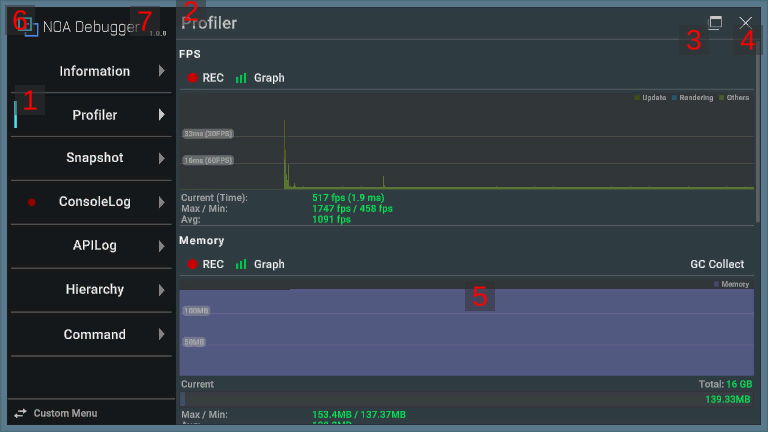
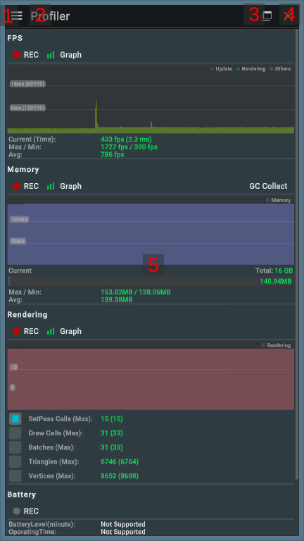
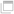
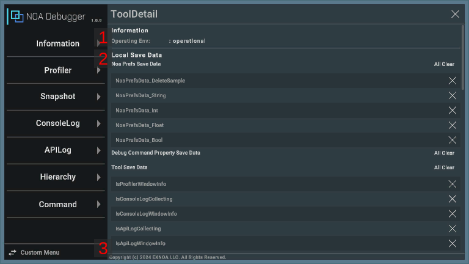

# ツールの画面構成と操作方法について

本ツールは横画面と縦画面に対応しています。 
画面の向きにより一部画面の構成と操作方法が異なるため、後述の画面構成と操作方法をご確認ください。

## 画面のUI構成と操作方法

横画面の画面構成： 

縦画面の画面構成： 

### 1.メニュー

利用できる機能の一覧が確認できます。 
横画面では、左メニューから利用したい機能を選択する事で、メインコンテンツに機能を表示します。 
縦画面では、[≡]ボタン押下でメニューを表示します。 
アプリ起動中にツールを閉じて再度表示した場合は、前回表示した機能を表示します。

メニューの各項目は特定の条件でバッジを表示します。

| 機能         | 表示条件                   | 非表示条件           |
|------------|------------------------|-----------------|
| ConsoleLog | ConsoleLogでエラーログが記録される | ConsoleLogを表示する |
| APILog     | APILogでエラーログが記録される     | APILogを表示する     |

### 2.機能名

選択している機能の名称を表示します。 
縦画面で押下するとメニューを開きます。

### 3.専用ウィンドウの表示切り替えボタン

[]
ボタン押下で専用ウィンドウの表示フラグを切り替えます。 
[]は表示、
[]は非表示を意味します。 
表示状態では、ツールを閉じていてもゲーム内画面に専用ウィンドウを表示して対象の機能を利用できます。 
表示フラグはアプリを再起動しても保持します。

専用ウィンドウについては[専用ウィンドウの構成と操作方法について](./FloatingWindow.md)をご確認ください。 
※ゲーム内画面に専用ウィンドウを表示する機能は、一部の機能でのみ利用できます。

### 4.閉じるボタン

[×]ボタン押下でツールを閉じます。

### 5.メインコンテンツ

選択している機能の画面を表示します。

### 6.ツール詳細ボタン

メニュー上部の[NOA Debugger]ボタンを押下する事でツールの詳細を表示します。 
縦画面ではメニューを開いている時のみ押下できます。

### 7.バージョン情報

ツールのバージョンを表示します。

## ツール詳細

### 1.Operating Env

ツールの動作保証環境かどうかを表示します。 
動作保証環境の場合「operational」を表示します。 
動作保証環境ではない場合は、推奨環境を表示します。

### 2.Local Save Data

NOA Debugger独自の保存領域に保存しているデータのキーを表示します。 
[×]ボタンを長押しすることで個別に保持データを破棄します。 
[All Clear]ボタンから全ての保持データを破棄します。

| 要素名                              | 表示情報                                                                                             |
|----------------------------------|--------------------------------------------------------------------------------------------------|
| Noa Prefs Save Data              | [`NoaPrefs`](./Apis.md)を経由して保存したデータのキーを表示します。                                                    |
| Debug Command Property Save Data | [`SaveOnUpdateAttribute`](./DebugCommand/Reference/SaveOnUpdateAttribute.md)属性で保存したデータのキーを表示します。 |
| Tool Save Data                   | NOA Debuggerが使用している保存データのキーを表示します。                                                               |

### 3.Copyright

ツールの著作権を表示します。

## 表示フォントについて

本ツールはデフォルトでは日本語表示に対応していません。 
日本語表示を行う場合は[ツールの設定方法](./Settings.md)から日本語を含むフォントアセットを設定してください。 
※設定されているフォントで表示できない文字はTextMeshProのFallback処理によって別の文字に置換されます。
