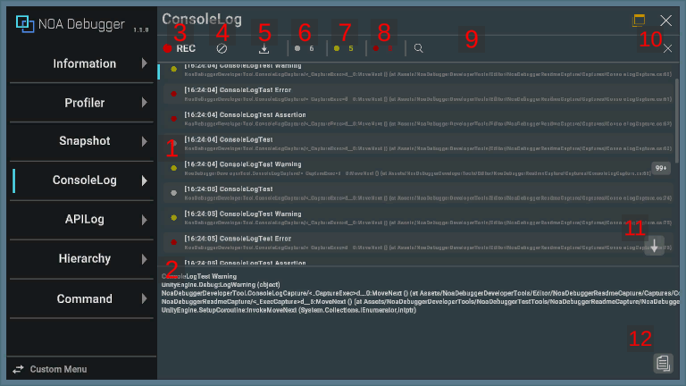
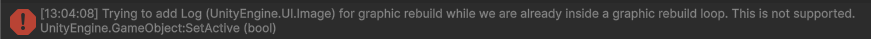

# ConsoleLogについて

UnityのDebugクラスを通して出力されたエラー、警告、その他のメッセージを表示します。 
また、[NoaConsoleLogAPI](./Apis.md)で追加したログも一覧に表示します。 
※使用しているフォントアセットに含まれていない文字は「_」に置換して表示します。

## 画面のUI構成と操作方法

### 1.ログ

取得したログを表示します。 
選択中の場合はハイライトし、ログ詳細にスタックトレースを表示します。

ログを長押しすることで、クリップボードにログのメッセージをコピーします。 
ログ選択中に再度ログを押下することで、ログ詳細を非表示にします。

| 要素名     | 表示情報                                                                                                                                                                                                     |
|---------|----------------------------------------------------------------------------------------------------------------------------------------------------------------------------------------------------------|
| a.ログタイプ | ログのタイプを表します。各色の意味については後述の情報を参照してください。                                                                                                                                                                    |
| b.出力時間  | ログが出力された時間を表示します。                                                                                                                                                                                        |
| c.テキスト  | ログのメッセージを表示します。Stack Traceが有効な場合は二行目にログの出力元の情報を表示します。 APIを通して出力したログのStack Traceは１行目が表示されます。 但し、以下の場合は出力元の情報を表示しません。   StackTrace LogType:Fullのログ Scripting BackEnd:MonoでDevelopmentビルドが無効の場合 |
| d.ログ件数  | 同一ログの連続出力回数を表示します。詳しい内容は後述の情報を参照してください。                                                                                                                                                                  |

### 2.ログ詳細

選択したログのスタックトレースを表示します。

#### 動作環境について

**Project Settings > Player > Other Settings > Stack Trace**
の設定を「None」にしていた場合、スタックトレースは表示できません。 
また、Exception以外のスタックトレースについて、以下の環境では表示できません。

- ブラウザアプリケーション
- IL2CPPやDevelopment以外のビルド

### 3.ログ収集ボタン

[●REC]ボタンを押下することでログ収集のオン・オフを切り替えることができます。アプリ起動時はログの収集を行います。 
[●REC]ボタンが赤色の状態は収集中、白色は停止中を意味します。

### 4.一括削除ボタン

[]ボタンを押下することで保持しているログを全て削除します。

### 5.ダウンロードボタン

[]ボタンを押下することでログ情報をダウンロードするダイアログを表示します。 
ログ情報がない場合は、[]ボタンを押下できません。

ダウンロードダイアログについては[データのダウンロードについて](./Download.md)を参照してください。

### 6.メッセージスイッチ

コンソールのメッセージ数を表示します。[●]ボタンを押下しメッセージの表示・非表示を切り替えることができます。

### 7.警告スイッチ

コンソールの警告数を表示します。[●]ボタンを押下し警告の表示・非表示を切り替えることができます。

### 8.エラースイッチ

コンソールのエラー数を表示します。[●]ボタンを押下しエラーの表示・非表示を切り替えることができます。

### 9.検索フィールド

入力したテキストでログをフィルタリングします。 
一致するテキストを含むログを表示します。 
※スタックトレースの情報は検索の対象外です。

### 10.検索破棄ボタン

[×]ボタンを押下することで、検索フィールドに入力したテキストを破棄します。

### 11.ショートカットボタン

[↓]ボタンを押下することで、ログの一覧を一番下までスクロールします。 
※最新のログを表示している場合は、ショートカットボタンを表示しません。

### 12.コピーボタン

[]ボタンを押下することで、クリップボードにログの内容をコピーします。 
※ログ長押しと同じ挙動です。

### ログタイプ一覧

| 出力色                                                  | ログタイプ         |
|------------------------------------------------------|---------------|
|  | メッセージログを表します。 |
|  | 警告ログを表します。    |
|      | エラーログを表します。   |

### 同一のログを連続して出力する条件

連続するログが以下の条件を満たす場合、同一のログとして扱い、連続出力回数のみ保持します。

- ログメッセージが一致している
- スタックトレースが一致している

### TextMesh Proのフォント置換ログが繰り返される不具合について

NOA Debuggerで使用しているフォントアセットに含まれていない文字をログで出力した場合、フォント置換ログが繰り返され、描画崩れによってログの確認ができない不具合が発生します。 

この不具合を解消するには、次の2つの方法があります。

1. フォントアセットの更新
   - [ツールの設定方法](./Settings.md)から対象の文字を含むフォントアセットを設定します。
2. 警告の無効化
   - Project Settings > TextMesh Pro > Settings > Dynamic Font System Settings > Disable warnings を有効化し警告が発生しないようにします。

## 提供APIについて

ConsoleLogが提供するAPIについては[API一覧](./Apis.md)を参照してください。
