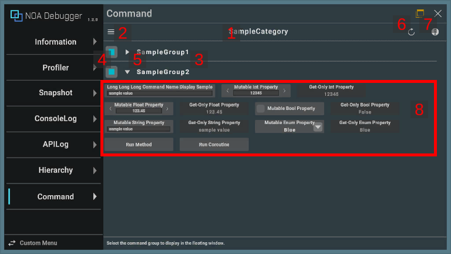
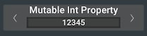
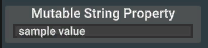
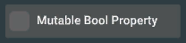
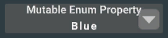
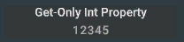
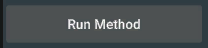
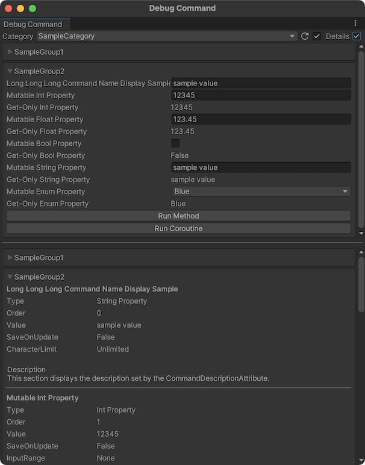

# DebugCommandについて

設定したデバッグコマンドを表示します。

デバッグコマンドはNOA Debuggerを組み込んだアプリケーション内で設定と登録を行うことで、<br>
メソッドの実行やプロパティの表示などができます。<br>
デバッグコマンドの設定方法は後述の**デバッグコマンドの設定**を参照してください。

## 画面のUI構成と操作方法

横画面のデフォルト表示：<br>


縦画面のデフォルト表示：<br>


各画面の向きによりデバッグコマンドの表示形式を変更することができます。
詳しくは[ツールの設定方法](../Settings.md)を参照してください。

デバッグコマンドはエディタウィンドウでも表示することができます。エディタウィンドウで表示する方法は[こちら](../Tools.md)を参照してください。<br>


エディタウィンドウ特有の挙動については、後述の**エディタウィンドウ特有の挙動について**を参照してください。

### 1.カテゴリ名

選択しているカテゴリ名を表示します。

### 2.カテゴリ変更ボタン

[≡]ボタン押下でカテゴリ選択ダイアログを表示します。

### 3.グループ名

デバッグコマンドのグループ名を表示します。

### 4.グループ選択

専用ウィンドウ内に表示するグループを選択します。<br>
チェックが入ったグループのコマンドを専用ウィンドウに表示します。

### 5.折りたたみボタン

[]ボタン押下でグループ内のコマンドを非表示にします。<br>
[]ボタン押下でグループ内のコマンドを表示します。

### 6.更新ボタン

[]ボタン押下でコマンドの状態を更新します。<br>
ボタンを長押しする事でコマンドの状態を自動更新します。<br>

### 7.詳細表示ボタン

[i]ボタン押下で詳細表示に切り替えます。<br>
詳細表示中はコマンド、またはグループを選択することでそのコマンドの設定と説明を表示します。

説明の設定方法については、[CommandDescriptionAttribute](./Reference/CommandDescriptionAttribute.md)を参照してください。


### 8.コマンド要素

設定したデバッグコマンドを表示します。<br>
設定内容ごとに表示するコマンドのUI構成が変わります。<br>
各コマンド要素の説明については、後述の**コマンドUI構成**を参照してください。

### コマンドUI構成

#### 数値型プロパティ

整数数値型または浮動小数点数値型のプロパティを指定した際に表示するコマンド要素です。<br>
テキスト入力による値の変更、またはドラッグや[<][>]ボタンによる値の増減を行うことができます。<br>
対応しているプロパティの型は以下になります。

- `sbyte`
- `byte`
- `short`
- `ushort`
- `int`
- `uint`
- `long`
- `ulong`
- `float`
- `double`
- `decimal`



#### String・Char型プロパティ

`string`または`char`のプロパティを指定した際に表示するコマンド要素です。<br>
テキスト入力による値の変更を行うことができます。



#### Bool型プロパティ

`bool`のプロパティを指定した際に表示するコマンド要素です。<br>
トグルによる値の変更を行うことができます。



#### 列挙型プロパティ

`enum`のプロパティを指定した際に表示するコマンド要素です。<br>
ドロップダウンによる値の変更を行うことができます。



#### Get-Onlyプロパティ

プロパティのgetterのみがpublicである場合に表示するコマンド要素です。



#### メソッド

メソッドを指定した際に表示するコマンド要素です。<br>
ボタン押下で指定したメソッドを実行します。<br>
非同期の場合は、処理が完了するまでボタンは押下できません。



### エディタウィンドウ特有の挙動について

エディタウィンドウ特有の挙動について以下で解説します。<br>
挙動が変わらない項目の記載は割愛しています。

#### 2.カテゴリ変更ボタン

ドロップダウンからカテゴリを選択します。

#### 4.グループ選択

エディタウィンドウから専用ウィンドウの設定を変更できないため、ボタンは存在しません。

#### 6.更新ボタン

自動更新が標準になっており、トグルで自動更新を解除できます。

#### 7.詳細表示ボタン

トグルをtrueに切り替えることで詳細を確認できます。<br>
詳細をウィンドウ下部に表示し、選択中カテゴリの全てのグループの情報が確認できます。



## デバッグコマンドの設定

NOA Debuggerを組み込んだアプリケーション内で`DebugCategoryBase`を継承したクラスを作成します。<br>
NOA Debuggerが提供する機能を利用する場合は、必ず`NOA_DEBUGGER`のシンボル定義を利用してください。<br>
作成したクラス内の以下条件に当てはまるプロパティ、メソッドをDebugCommandの画面に表示します。

### 表示するプロパティの条件

- `public`なgetterが存在する
- 以下のいずれかの型を持っている
  - `string`
  - `sbyte`
  - `byte`
  - `short`
  - `ushort`
  - `int`
  - `uint`
  - `long`
  - `ulong`
  - `char`
  - `float`
  - `double`
  - `decimal`
  - `bool`
  - `enum`

### 表示するメソッドの条件

- `public`である
- `IEnumerator`,`NoaDebugger.MethodHandler`,`void`いずれかの返り値を持っている
- パラメータが設定されていない

補足：`NoaDebugger.MethodHandler`の説明は[MethodHandlerについて](./MethodHandler.md)を参照してください。

### カテゴリクラスのサンプルコード

```csharp
#if NOA_DEBUGGER
using NoaDebugger;

public class DebugCommandSample : DebugCategoryBase
{
    public void ExampleMethod()
    {
        // 何らかの処理
    }

    [CommandGroup("Group1"), DisplayName("Property1"), SaveOnUpdate]
    public int ExampleProperty1
    {
        get;
        set;
    }

    // GetOnlyPropertyとして扱われる例
    [CommandGroup("Group1"), DisplayName("Property2"), SaveOnUpdate]
    public int ExampleProperty2
    {
        get;
        private set;
    }
}
#endif
```

### カテゴリクラスの登録

作成したクラスをDebugCommandの画面に表示するためには、<br>
NOA Debuggerを組み込んだアプリケーション内で `NoaDebugger.DebugCommandRegister.AddCategory()` を呼び出し、作成したクラスを登録します。

`AddCategory()`は以下の引数を指定できます。

| 引数名          | 型      | 説明                                                                                        | 省略した場合の動作                      |
|--------------|--------|-------------------------------------------------------------------------------------------|--------------------------------|
| categoryName | string | カテゴリ名です。<br>後述の登録済みインスタンスの参照で使用します。<br>同じ名前で複数のカテゴリを登録した場合、自動的に `-1` ・ `-2` という接尾辞を追加します。 | クラス名を適用します。                    |
| order        | int    | カテゴリの並び順です。<br>指定した値が小さいものから順にカテゴリの一覧に表示します。                                              | 読み込み順かつ並び順を指定したカテゴリよりも後ろに並びます。 |
| displayName  | string | 表示専用のカテゴリ名です。                                                                             | カテゴリ名を適用します。                   |

```csharp
#if NOA_DEBUGGER
using NoaDebugger;
#endif

public class Example
{
    void Initialize()
    {
#if NOA_DEBUGGER
        DebugCommandRegister.AddCategory<DebugCommandSample>("CategoryName", 1, "DisplayName");

        // 下記の場合はカテゴリ名:DebugCommandSample、表示順:未指定、表示名:DisplayNameとして登録されます。
        DebugCommandRegister.AddCategory<DebugCommandSample>(displayName:"DisplayName");
#endif
    }
}
```

### 表示するカテゴリクラスの条件

DebugCommandの画面に登録できるクラスには以下の条件があります。

* 引数なしでインスタンスを生成できる

### 登録済みカテゴリのインスタンスの参照

`NoaDebugger.DebugCommandRegister.AddCategory()` で登録したカテゴリのインスタンスを参照するためには、<br>
NOA Debuggerを組み込んだアプリケーション内で `NoaDebugger.DebugCommandRegister.GetCategoryInstance()` を呼び出します。

```csharp
#if NOA_DEBUGGER
using NoaDebugger;
using UnityEngine;
#endif

public class Example
{
    void AccessToDebugCategoryInstance()
    {
#if NOA_DEBUGGER
        // 引数に登録時に指定したカテゴリ名を指定します。
        // 省略した場合はクラス名で検索します。
        var instance = DebugCommandRegister.GetCategoryInstance<DebugCommandSample>("CategoryName");
        instance.ExampleMethod();
        Debug.Log($"Value: {instance.ExampleProperty}");

        // 同じ名前で登録すると自動的に '-1' ・ '-2' という接尾辞を追加するため、取得するカテゴリ名の指定にも反映する必要があります。
        var anotherInstance = DebugCommandRegister.GetCategoryInstance<DebugCommandSample>("CategoryName-1");
 #endif
    }
}
```

### プロパティの更新処理について

メソッドからプロパティの値を変更した際、DebugCommand機能を再度表示しないと描画の更新ができません。<br>
すぐに描画の更新を行いたい場合は `NoaDebugger.DebugCommandRegister.RefreshProperty()` をメソッド内で実行してください。

```csharp
#if NOA_DEBUGGER
using NoaDebugger;

public class DebugCommandSample : DebugCategoryBase
{
    int _exampleProperty;
    [CommandGroup("Group1"), DisplayName("Property1")]
    public int ExampleProperty
    {
        get => _exampleProperty;
    }

    public void ExampleMethod()
    {
        _exampleProperty = 2;

        // プロパティの描画更新
        DebugCommandRegister.RefreshProperty();
    }
}
#endif
```

### プロパティの値の保存

表示対象となるプロパティに [`SaveOnUpdateAttribute`](./Reference/SaveOnUpdateAttribute.md) 属性を追加することで、変更した値を保存することができます。

### 保存したプロパティの値の削除

以下のAPIを呼び出すことで保存したプロパティの値を削除することができます。

- `NoaDebugger.DebugCommandRegister.DeleteSavedProperty(categoryName, propertyName)`
- `NoaDebugger.DebugCommandRegister.DeleteAllPropertiesInCategory(categoryName)`
- `NoaDebugger.DebugCommandRegister.DeleteAllSavedProperties()`

`categoryName` には `NoaDebugger.DebugCommandRegister.AddCategory()` を実行した時に指定したカテゴリ名を、<br>
`propertyName` には対象のプロパティ名を指定します。

```csharp
#if NOA_DEBUGGER
// 指定カテゴリ・プロパティ名の保存した値を削除します。
DebugCommandRegister.DeleteSavedProperty("CategoryName", nameof(Property));

// 指定カテゴリのすべてのプロパティの保存した値を削除します。
DebugCommandRegister.DeleteAllPropertiesInCategory("CategoryName");

// すべてのプロパティの保存した値を削除します。
DebugCommandRegister.DeleteAllSavedProperties();
#endif
```

### デバッグコマンドに指定できる属性

デバッグコマンドに指定できる属性は以下のとおりです。

| 属性                                                                                | 説明                                                                                |
|-----------------------------------------------------------------------------------|-----------------------------------------------------------------------------------|
| [`CommandGroupAttribute`](./Reference/CommandGroupAttribute.md)                   | 対象コマンドのグループを指定します。<br>指定がない場合は「Others」に内包します。                                     |
| [`DisplayNameAttribute `](./Reference/DisplayNameAttribute.md)                    | 対象コマンドの表示名を指定します。<br>指定がない場合はプロパティ名またはメソッド名を表示します。                                |
| [`CommandDescriptionAttribute`](./Reference/CommandDescriptionAttribute.md)       | 対象コマンドの説明文を指定します。                                                                 |
| [`CommandOrderAttribute`](./Reference/CommandOrderAttribute.md)                   | 対象コマンドの並び順を指定します。指定された値の小さいものから順に表示します。<br>指定がない場合は読み込み順かつ並び順を指定したコマンドよりも後ろに並びます。 |
| [`CommandInputRangeAttribute`](./Reference/CommandInputRangeAttribute.md)         | 数値型プロパティの入力できる範囲を指定します。                                                           |
| [`CommandIncrementAttribute`](./Reference/CommandIncrementAttribute.md)           | 数値型プロパティのドラッグ操作で増減する値の量を指定します。<br>指定がない場合は1ずつ増減します。                               |
| [`CommandCharacterLimitAttribute`](./Reference/CommandCharacterLimitAttribute.md) | stringプロパティの入力文字数の上限を指定します。                                                       |
| [`SaveOnUpdateAttribute`](./Reference/SaveOnUpdateAttribute.md)                   | 対象のプロパティを指定のキーに保存します。                                                             |
| [`CommandExcludeAttribute`](./Reference/CommandExcludeAttribute.md)               | 表示する条件を満たすプロパティ・メソッドを表示対象から除外します。                                                 |
| [`CommandTagAttribute`](./Reference/CommandTagAttribute.md)                       | コマンドのタグを指定します。コマンドに対して何らかの操作を行う際にこのタグを指定します。                                      |

### 動的なデバッグコマンドの追加

`NoaDebugger.DebugCommandRegister` クラスで定義している以下のAPIを使用することで、<br>
動的に `DebugCategoryBase` を継承しないクラスのプロパティ・メソッドをデバッグコマンドとして追加することができます。

コマンド定義の生成:

```csharp
// getterのみを持つプロパティコマンドの定義を生成します。
CommandDefinition CreateGetOnlyIntProperty(string categoryName, string displayName, Func<int> getter, Attribute[] attributes = null);
CommandDefinition CreateGetOnlyFloatProperty(string categoryName, string displayName, Func<float> getter, Attribute[] attributes = null);
CommandDefinition CreateGetOnlyStringProperty(string categoryName, string displayName, Func<string> getter, Attribute[] attributes = null);
CommandDefinition CreateGetOnlyBoolProperty(string categoryName, string displayName, Func<bool> getter, Attribute[] attributes = null);
CommandDefinition CreateGetOnlyEnumProperty(string categoryName, string displayName, Func<Enum> getter, Attribute[] attributes = null);

// getterとsetterを持つプロパティコマンドの定義を生成します。
CommandDefinition CreateMutableIntProperty(string categoryName, string displayName, Func<int> getter, Action<int> setter, Attribute[] attributes = null);
CommandDefinition CreateMutableFloatProperty(string categoryName, string displayName, Func<float> getter, Action<float> setter, Attribute[] attributes = null);
CommandDefinition CreateMutableStringProperty(string categoryName, string displayName, Func<string> getter, Action<string> setter, Attribute[] attributes = null);
CommandDefinition CreateMutableBoolProperty(string categoryName, string displayName, Func<bool> getter, Action<bool> setter, Attribute[] attributes = null);
CommandDefinition CreateMutableEnumProperty<T>(string categoryName, string displayName, Func<T> getter, Action<T> setter, Attribute[] attributes = null) where T : Enum;

// メソッドコマンドの定義を生成します。
CommandDefinition CreateMethod(string categoryName, string displayName, Action method, Attribute[] attributes = null);

// コルーチンコマンドの定義を生成します。
CommandDefinition CreateCoroutine(string categoryName, string displayName, Func<IEnumerator> coroutine, Attribute[] attributes = null);

// ハンドルメソッドコマンドの定義を生成します。
CommandDefinition CreateHandleMethod(string categoryName, string displayName, Func<MethodHandler> method, Attribute[] attributes = null);
```

各APIの `attributes` には、以下の属性を除くデバッグコマンドに指定できる属性を指定できます。

- `DisplayNameAttribute`
- `SaveOnUpdateAttribute`
- `CommandExcludeAttribute`

生成したコマンド定義を用いたコマンドの追加・削除:

```csharp
// 生成したコマンド定義によるコマンドを追加します。
void AddCommand(CommandDefinition commandDefinition);

// 追加したコマンドを削除します。
// コマンドに関係するオブジェクトが破棄されるタイミングで、このAPIを用いて追加したコマンドを削除してください。
void RemoveCommand(CommandDefinition commandDefinition);
```

デバッグコマンドを動的に追加・削除するサンプルコードは以下のとおりです。

getterのみを持つプロパティ:

```csharp
#if NOA_DEBUGGER
using System;
using NoaDebugger;
using UnityEngine;

public class DynamicDebugCommand : MonoBehaviour
{
    readonly int constantValue = 0;
    CommandDefinition commandDefinition = null;

    // コマンドを生成して登録します。
    void Start()
    {
        var attributes = new Attribute[]
        {
            new CommandGroupAttribute("Dynamic Command Group", 1),
            new CommandOrderAttribute(0)
        };
        commandDefinition = DebugCommandRegister.CreateGetOnlyIntProperty(
            "Dynamic Command Category",
            "Get-Only Property",
            () => constantValue,
            attributes);
        DebugCommandRegister.AddCommand(commandDefinition);
    }

    // 生成したコマンドを削除します。
    void OnDestroy() => DebugCommandRegister.RemoveCommand(commandDefinition);
}
#endif
```

getterとsetterを持つプロパティ:

```csharp
#if NOA_DEBUGGER
using System;
using NoaDebugger;
using UnityEngine;

public class DynamicDebugCommand : MonoBehaviour
{
    int mutableValue = 0;
    CommandDefinition commandDefinition = null;

    // コマンドを生成して登録します。
    void Start()
    {
        var attributes = new Attribute[]
        {
            new CommandGroupAttribute("Dynamic Command Group", 1),
            new CommandOrderAttribute(0)
        };
        commandDefinition = DebugCommandRegister.CreateMutableIntProperty(
            "Dynamic Command Category",
            "Mutable Property",
            () => mutableValue,
            value => mutableValue = value,
            attributes);
        DebugCommandRegister.AddCommand(commandDefinition);
    }

    // 生成したコマンドを削除します。
    void OnDestroy() => DebugCommandRegister.RemoveCommand(commandDefinition);
}
#endif
```

メソッド:

```csharp
#if NOA_DEBUGGER
using System;
using NoaDebugger;
using UnityEngine;

public class DynamicDebugCommand : MonoBehaviour
{
    CommandDefinition commandDefinition = null;

    // コマンドを生成して登録します。
    void Start()
    {
        var attributes = new Attribute[]
        {
            new CommandGroupAttribute("Dynamic Command Group", 1),
            new CommandOrderAttribute(0)
        };
        commandDefinition = DebugCommandRegister.CreateMethod(
            "Dynamic Command Category",
            "Method",
            () => Debug.Log("Executing Dynamic Command."),
            attributes);
        DebugCommandRegister.AddCommand(commandDefinition);
    }

    // 生成したコマンドを削除します。
    void OnDestroy() => DebugCommandRegister.RemoveCommand(commandDefinition);
}
#endif
```

コルーチン:

```csharp
#if NOA_DEBUGGER
using System;
using System.Collections;
using NoaDebugger;
using UnityEngine;

public class DynamicDebugCommand : MonoBehaviour
{
    CommandDefinition commandDefinition = null;

    // コマンドを生成して登録します。
    void Start()
    {
        var attributes = new Attribute[]
        {
            new CommandGroupAttribute("Dynamic Command Group", 1),
            new CommandOrderAttribute(0)
        };
        commandDefinition = DebugCommandRegister.CreateCoroutine(
            "Dynamic Command Category",
            "Coroutine",
            DebugCommandCoroutine,
            attributes);
        DebugCommandRegister.AddCommand(commandDefinition);
    }

    // 生成したコマンドを削除します。
    void OnDestroy() => DebugCommandRegister.RemoveCommand(commandDefinition);

    // デバッグコマンドで呼び出されるコルーチンです。
    IEnumerator DebugCommandCoroutine()
    {
        yield return new WaitForSeconds(1);
    }
}
#endif
```

ハンドルメソッド:

```csharp
#if NOA_DEBUGGER
using System;
using NoaDebugger;
using UnityEngine;

public class DynamicDebugCommand : MonoBehaviour
{
    MethodHandler handler = new();
    CommandDefinition commandDefinition = null;

    // コマンドを生成して登録します。
    void Start()
    {
        var attributes = new Attribute[]
        {
            new CommandGroupAttribute("Dynamic Command Group", 1),
            new CommandOrderAttribute(0)
        };
        commandDefinition = DebugCommandRegister.CreateHandleMethod(
            "Dynamic Command Category",
            "Handle Method",
            DebugCommandHandleMethod,
            attributes);
        DebugCommandRegister.AddCommand(commandDefinition);
    }

    // 生成したコマンドを削除します。
    void OnDestroy() => DebugCommandRegister.RemoveCommand(commandDefinition);

    // デバッグコマンドで呼び出されるハンドルメソッドです。
    MethodHandler DebugCommandHandleMethod()
    {
        handler.IsDone = false;
        return handler;
    }

    // ハンドルメソッドを完了します。
    void CompleteHandleMethod() => handler.IsDone = true;
}
#endif
```

### コマンド操作可否の切り替え

`NoaDebugger.DebugCommandRegister` クラスで定義している以下のAPIを使用することで、<br>
指定の `CommandTagAttribute` 属性を付与したコマンドの操作可否を切り替えることができます。

```csharp
void SetInteractable(string categoryName, string commandTag, bool isInteractable);
bool IsInteractable(string categoryName, string commandTag);
```

※ 操作不可に設定したコマンドはグレーアウト表示となります。

### コマンド表示・非表示の切り替え

`NoaDebugger.DebugCommandRegister` クラスで定義している以下のAPIを使用することで、<br>
指定の `CommandTagAttribute` 属性を付与したコマンドの表示・非表示を切り替えることができます。

```csharp
void SetVisible(string categoryName, string commandTag, bool isVisible);
bool IsVisible(string categoryName, string commandTag);
```

### Unity Test Runnerでの利用について

PlayMode時のみ、登録したカテゴリクラスのインスタンスを取得し、テストに利用できます。

```csharp
#if NOA_DEBUGGER
using System.Collections;
using UnityEngine.TestTools;
using NoaDebugger;

public class Example
{
    [UnityTest]
    public IEnumerator Test()
    {
        NoaDebug.Initialize();
        DebugCommandRegister.AddCategory<DebugCommandSample>();

        var instance = DebugCommandRegister.GetCategoryInstance<DebugCommandSample>();
        instance.ExampleMethod();

        yield return null;
    }
}
#endif
```
