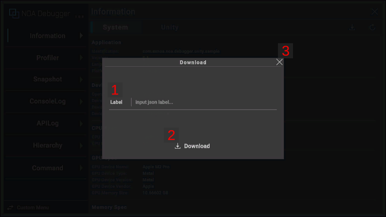

# データのダウンロードについて

## ダウンロードダイアログのUI構成と操作方法



### 1.ラベル

ダウンロードデータファイルに対して任意の名前を付けることができます。最大20文字まで入力できます。<br>
ラベルが未入力でもダウンロードできます。

### 2.ダウンロードボタン

[ Download]ボタンを押下することでダウンロードします。<br>
ダウンロードデータはJSON形式で出力します。

### 3.閉じるボタン

[×]ボタンまたは[ダイアログ外]を押下することでダイアログを閉じます。

## 環境毎の出力先

### iOS

ダウンロードしたファイルは以下の場所に保存します。

```
/var/mobile/Containers/Data/Application/<guid>/Documents
```

ファイルへのアクセスは以下の手順で行います。

1. [ファイル] アプリを起動します。
2. 画面下部にある [ブラウズ] をタップします。
3. [このiPhone内 > (AppのバンドルID)] を開くと、出力したファイルを確認できます。

### Android・Windows(exe)・WebGL・UnityEditor

OS標準のダウンロードダイアログを表示します。出力先は任意で選ぶことができます。

### ブラウザでのダウンロード出力先指定について

ブラウザの設定により出力先を指定するウィンドウが表示されない場合があります。<br>
その際は以下の手順を参考に、ブラウザの設定を一部変更することで、ウィンドウを表示することができます。

| ブラウザ   | 設定手順                                                                                 |
|:-------|:-------------------------------------------------------------------------------------|
| Chrome | Chromeの設定から**ダウンロード設定**を表示します。<br/>[ダウンロード前に各ファイルの保存場所を確認する]のトグルが確認できるので、こちらを有効にします。 |
