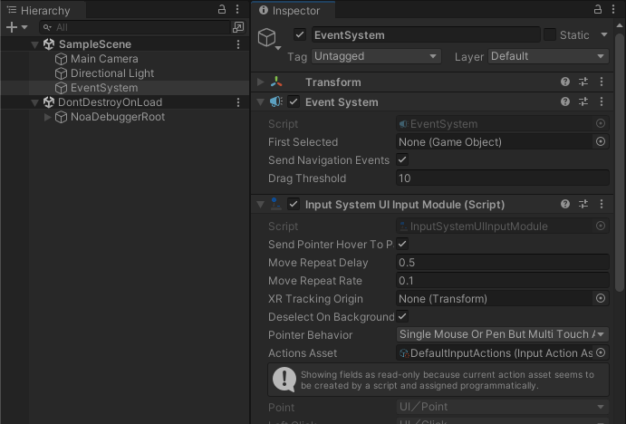
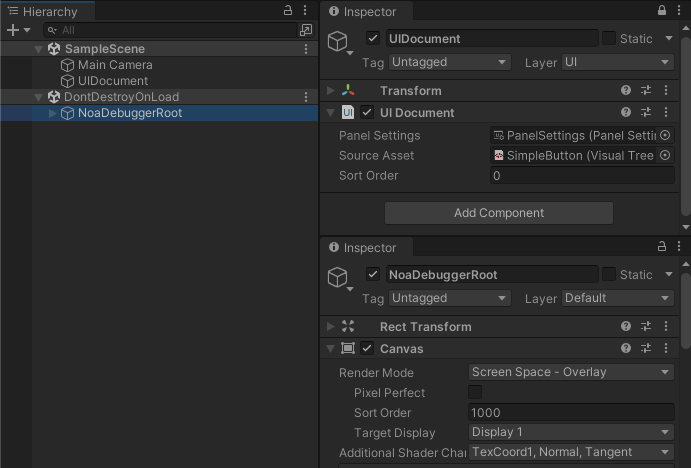
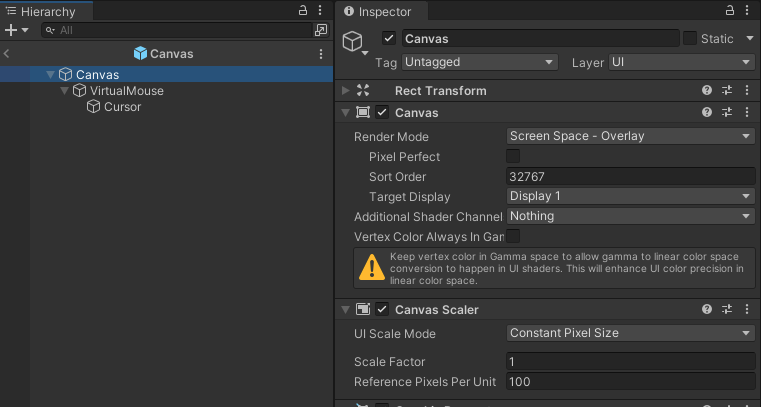
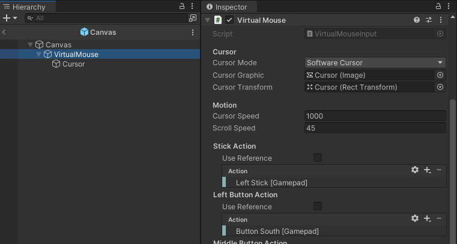
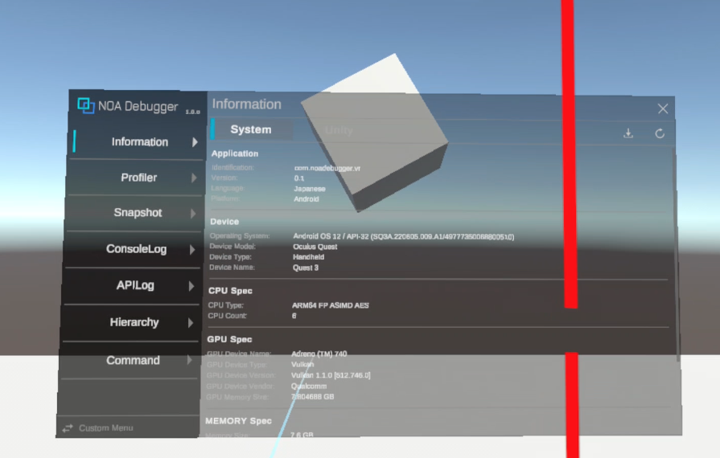

# 環境別・デバイス別セットアップガイド

NOA DebuggerはuGUIで構成されていることから、利用する環境やデバイスによっては動作させるための設定が必要となります。<br>
このドキュメントでは、新しいInput System、UI Toolkit、Gamepad、XR環境など、さまざまなデバイスやプラットフォームでNOA Debuggerを利用する方法を解説します。

## 新しいInput Systemを利用するケース

プロジェクトにUnityの [Input Systemパッケージ](https://docs.unity3d.com/Packages/com.unity.inputsystem@1.8/manual/Installation.html) がインストールされていると、NOA Debuggerの初期化時に新しいInput Systemを使用するよう自動的に設定を行います。<br>
※NOA Debuggerの初期化は、Unityメニューの `Window -> NOA Debugger` から開くNOA Debugger Editor上で行うことができます。

新しいInput Systemを利用する場合は、入力イベントを検知するためにシーン上のEventSystemに`InputSystemUIInputModule`をアタッチしてください。<br>
従来のInput Managerを使用する場合は、`StandaloneInputModule`が必要です。

```csharp
// シーン上のEventSystemを取得する
var eventSystem = EventSystem.current;
if (eventSystem.GetComponent<InputSystemUIInputModule>() == null)
{
    eventSystem.gameObject.AddComponent<InputSystemUIInputModule>();
}

// 独自のアクションイベントがあれば設定する
var inputModule = eventSystem.GetComponent<InputSystemUIInputModule>();
inputModule.actionsAsset = // InputActionAsset;
```



## UI Toolkitで利用するケース

NOA DebuggerはuGUIで構成しているため、UI Toolkitで作成されたUIと共存できます。

NOA Debuggerを常に最上位に表示するため、UI DocumentのSortOrderがNOA Debuggerより低い値になるように設定してください。(NOA Debuggerのデフォルト値は1000です)



## Gamepadを利用するケース

NOA DebuggerはuGUIのナビゲーション操作に対応していません。

InputSystemが提供するVirtualMouseInputを利用することで、Gamepadで操作することができます<br>
VirtualMouseInputの詳しい利用方法は、[Unity公式ドキュメント](https://docs.unity3d.com/Packages/com.unity.inputsystem@1.7/api/UnityEngine.InputSystem.UI.VirtualMouseInput.html)を確認してください。<br>
また解説する手順は一例のため、既にVirtualMouseを利用している場合は既存の処理と連携してください。

### VirtualMouseを準備

VirtualMouseを操作する専用のCanvasを以下の設定で作成します。

- RenderModeをOverlayに設定
- SortOrderをNOA Debuggerより高い値に設定(NOA Debuggerのデフォルト値は1000です)
- CanvasScalerのUI Scale ModeをConstant Pixel Sizeに設定



Canvasの子要素にVirtualMouseとStickで操作するCursorを作成します。<br>
VirtualMouseの各種Actionは自由に設定してください。

推奨するActionの設定は以下です。

- Stick Action: Left Stick [Gamepad]
  - 左スティックを操作することで、Cursorを移動します。
- Left Button Action: Button South [Gamepad]
  - Gamepadの右側にある4つのアクションボタンのうち、下にあるボタンを操作することで、uGUIのUIを選択します。
- Scroll Wheel Action: Right Stick [Gamepad]
  - 右スティックを操作することで、uGUIのスクロールエリアを移動します。



### GamepadでNOA Debuggerを操作

GamepadのSelectボタンを押下した際にNOA Debugger表示するサンプルコードです。
上述で作成したVirtualMouseは、NOA Debuggerを表示している際にアクティブにすることをお勧めします。

```csharp
[SerializeField]
private GameObject _virtualMouse = null;

void Start()
{
    // トリガーボタンを非表示にします
    NoaDebug.SetTriggerButtonActive(false);
}

private void Update()
{
    // Selectボタン押下時にNOA Debuggerを表示して、VirtualMouseを有効化します。
    if (Gamepad.current.selectButton.wasPressedThisFrame)
    {
        NoaDebug.IsDebuggerVisible ? NoaDebug.Hide() : NoaDebug.Show();
        _virtualMouse.SetActive(NoaDebug.IsDebuggerVisible);
    }
}
```

## XR環境で利用するケース

XRの環境では、NOA Debuggerを3D空間上で扱うことを推奨します。<br>
また、3D空間上でuGUIを操作するには、NOA DebuggerのCanvasにTrackedDeviceGraphicRaycasterをアタッチしてください。

```csharp
// ツールをワールド座標上に表示する
NoaDebug.EnableWorldSpaceRendering();

// ツールの最上位階層のTransformへの参照を取得する
Transform noaDebuggerRoot = NoaDebug.RootTransform;

// ツールの座標・回転角・スケールを変更する
noaDebuggerRoot.localPosition = Vector3.zero;
noaDebuggerRoot.localEulerAngles = Vector3.zero;
noaDebuggerRoot.localScale = new Vector3(0.00264f, 0.00264f, 0.00264f);

// ツールのレイヤーを変更する
noaDebuggerRoot.gameObject.layer = 0;

// XRコントローラーからuGUIを操作できるようにTrackedDeviceGraphicRaycasterをアタッチする
noaDebuggerRoot.gameObject.AddComponent<TrackedDeviceGraphicRaycaster>();
```


