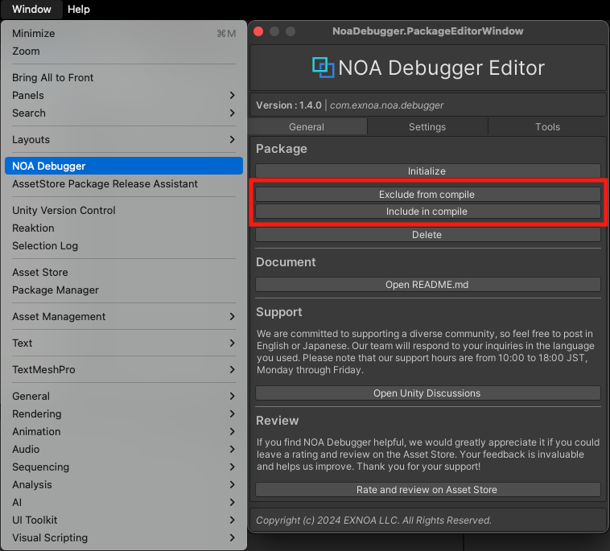

# ツールを取り除いてコンパイルする方法

特定の環境でツールを取り除いてコンパイルする方法を解説します。<br>
**リリース環境では、必ずNOA Debuggerを除外してアプリケーションをビルドしてください。**

## コマンドライン

アプリケーションのビルド前にコマンドラインから `NoaDebugger.NoaPackageManager.ExcludeFromCompile` を実行することで、<br>
NOA Debuggerをコンパイル対象から除外できます。<br>
Unityが提供するコマンドラインの詳細は、[公式ページ](https://docs.unity3d.com/Manual/CommandLineArguments.html)を参照してください。

```Bash
# Windowsの場合
"C:\Program Files\Unity\Hub\Editor\<unity-version>\Editor\Unity.exe" -quit -batchmode -nographics -projectPath <project-path> -executeMethod NoaDebugger.NoaPackageManager.ExcludeFromCompile

# Macの場合
/Applications/Unity/Hub/Editor/<unity-version>/Unity.app/Contents/MacOS/Unity -quit -batchmode -nographics -projectPath <project-path> -executeMethod NoaDebugger.NoaPackageManager.ExcludeFromCompile
```

### コンパイルから除外したNOA Debuggerを元に戻す方法

NOA Debuggerをコンパイル対象から除外した後にビルドを行い、元のNOA Debuggerを取り込んだ状態に戻す方法を解説します。

アプリケーションのビルド後にコマンドラインから `NoaDebugger.NoaPackageManager.IncludeInCompile` を実行することで、元に戻すことができます。

```Bash
# Windowsの場合
"C:\Program Files\Unity\Hub\Editor\<unity-version>\Editor\Unity.exe" -quit -batchmode -nographics -projectPath <project-path> -executeMethod NoaDebugger.NoaPackageManager.IncludeInCompile

# Macの場合
/Applications/Unity/Hub/Editor/<unity-version>/Unity.app/Contents/MacOS/Unity -quit -batchmode -nographics -projectPath <project-path> -executeMethod NoaDebugger.NoaPackageManager.IncludeInCompile
```

## NOA Debugger Editor

Unityメニューの `Window -> NOA Debugger` を選択して、NOA Debugger Editorを起動します。<br>
Window内の`Package`項目にある`[Exclude from compile]`ボタンを押下することで、コンパイル対象から除外できます。<br>
※CI/CD環境からコマンドラインで取り除く前に、コンパイルエラー等が発生しないかUnityEditor上で確認したい場合に利用できます。



### コンパイルから除外したNOA Debuggerを元に戻す方法

UnityメニューからNOA Debuggerをコンパイル対象から除外した後に、元のNOA Debuggerを取り込んだ状態に戻す方法を解説します。

Unityメニューの `Window -> NOA Debugger` を選択して、NOA Debugger Editorを起動します。<br>
Window内の`Package`項目にある`[Include in compile]`ボタンを押下することで、元に戻すことができます。

## その他注意事項

NOA Debugger導入時に Scripting Define Symbols に自動で設定した `NOA_DEBUGGER` のシンボル定義を取り除くだけでは、<br>
一部のリソースデータ等がアプリケーションに含まれてしまうため、必ず上述のコマンドを実行してコンパイル対象から除外してください。
