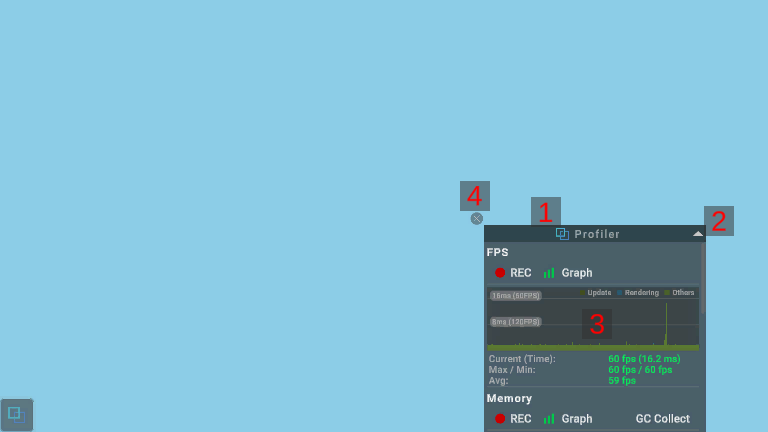

# 専用ウィンドウの構成と操作方法について

## 画面のUI構成と操作方法

### 1.機能名

対象機能の名称を表示します。 
機能名をドラッグすることで、専用ウィンドウの位置を調整することができます。 
専用ウィンドウの位置はアプリを再起動しても保持します。

### 2.画面切り替えボタン

[▲]ボタンあるいは[▼]ボタンを押下することで専用ウィンドウのサイズを大と小で切り替えます。

### 3.メインコンテンツ

対象機能の画面を表示します。

### 4.非表示ボタン

[×]ボタン押下で専用ウィンドウを非表示にします。
