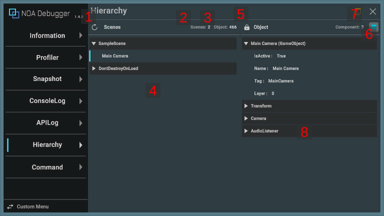

# Hierarchyについて

現在のシーン内のヒエラルキー構造とコンポーネントの状態を表示します。

## 画面のUI構成

### 1.更新ボタン

[]ボタンを押下したタイミングの情報を保持します。 
すでに情報を保持していた場合は、押下タイミングの情報で上書きします。

### 2.シーン数

ヒエラルキー上のシーン数を表示します。

### 3.オブジェクト数

ヒエラルキー上のオブジェクト数を表示します。

### 4.ヒエラルキー情報

取得したヒエラルキー構造を表示します。 
[]アイコンを押下することでツリーを展開できます。 
[]アイコンを押下することでツリーを閉じることができます。 
非アクティブのオブジェクトは灰色で表示します。 
オブジェクト名を選択することで、後述するオブジェクト情報内にコンポーネント情報を表示します。

### 5.固定ボタン

選択したオブジェクトの表示を固定します。

### 6.オブジェクトアクティブ/非アクティブボタン

選択したオブジェクトのアクティブ/非アクティブを切り替えます。

### 7.コンポーネント数

選択したオブジェクトが所有するコンポーネント数を表示します。

### 8.オブジェクト情報

選択したオブジェクトが所有するコンポーネント情報を表示します。 
[]アイコンを押下することでコンポーネントの情報を展開できます。 
コンポーネント情報として表示するのは、publicまたは、非publicかつSerializeField属性が付与されたフィールドです。 
※UnityEngineが提供するコンポーネントはフィールドとプロパティを表示します。 

配列やSerializable属性が付与された構造体・クラスのフィールドは[]
アイコンを押下することで更に展開ができます。 
※List以外のGeneric型の構造体・クラスは表示されません。 

[]アイコンを押下することで情報を表示できます。 
また、構造体の階層表示はデフォルトで3階層まで表示します。 
階層表示数を変更する場合は、[ツールの設定方法](./Settings.md)から変更してください。
