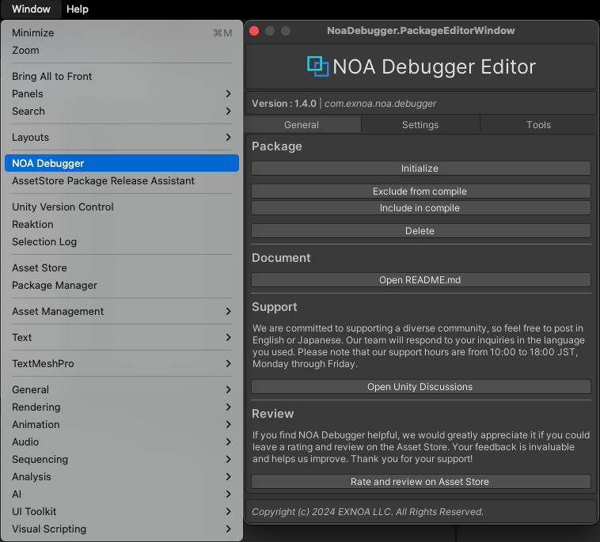
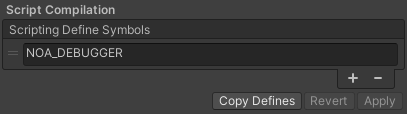

# ツールの導入方法

## パッケージのインポート

NOA Debuggerを [Unity Asset Store](https://u3d.as/3cCN) からダウンロードしてUnityプロジェクトにインポートします。 
※NOA DebuggerはUPMで提供しているため、Packagesのフォルダ配下にインポートされます。

## パッケージの初期化

パッケージの初期化は、NOA Debugger Editorを用いて行います。 
NOA Debugger Editorは、Unityメニューの `Window -> NOA Debugger`を選択することで起動できます。

NOA Debugger Editorが起動できたら、 Package 項目の Initialize を実行します。 

PlayerSettings の設定項目にある Scripting Define Symbols に NOA_DEBUGGER が追加されたことが確認できれば初期化は完了です。

補足：プロジェクト内の PlayerSettings をオーバーライドしている BuildProfile については、`ScriptingDefines` にシンボルの追加を行います。

UnityEditorを再生して、NOA Debuggerの起動ボタンが表示されていることを確認してください。

初期化しても正常に動作しない場合は、NOA Debugger Editor の Package 項目の Delete を実行して、パッケージのインポートからやり直してください。

## パッケージの更新

パッケージを最新版に更新する際は、再度上述のインポートと初期化の手順を行なってください。
