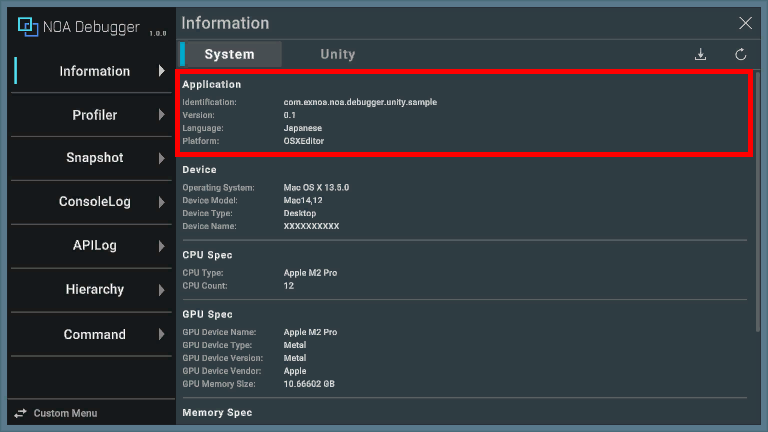
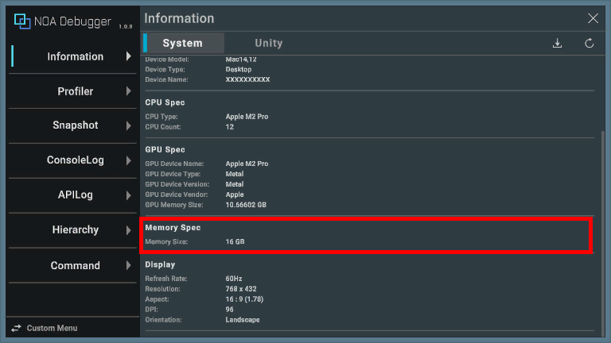
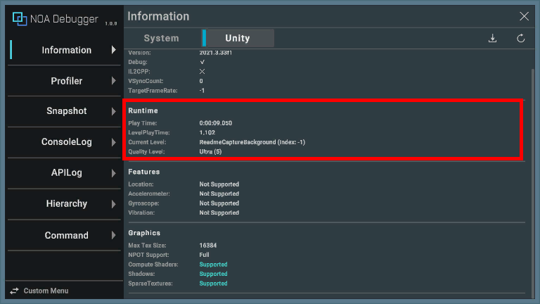

# Informationについて

動作環境についての情報を表示します。 
※アプリケーションの動作環境によって取得できない値については「Not Supported」を表示します。

### 共通機能について

#### 1.タブボタン

[System]タブと[Unity]タブを選択する事で画面表示が切り替わります。初期状態は[System]を表示します。 

#### 2.更新ボタン

[]ボタンを押下することで表示している情報を更新します。 

#### 3.ダウンロードボタン

[]ボタンを押下することで各タブの情報をローカルに保存します。 
ダウンロードダイアログについては[データのダウンロードについて](./Download.md)を参照してください。
 

## System

[System]タブを表示した際の情報について解説します。

### Application

| 要素名             | 表示情報                                                         |
|-----------------|--------------------------------------------------------------|
| Identification  | 実行中アプリのプロダクト名を表示します。                                         |
| Version         | 実行中アプリのバージョン番号を表示します。 これはUnityのProjectSettingsで設定された情報です。 |
| System Language | 実行中OSの言語情報を表示します。                                            |
| Platform        | 実行中アプリが何のプラットフォームで実行されているかを表示します。                            |

### Device

| 要素名              | 表示情報                                                                                                   |
|------------------|--------------------------------------------------------------------------------------------------------|
| Operating System | 端末のOS名とバージョンを表示します。                                                                                    |
| Device Model     | 端末のモデル名を表示します。 モデル名が利用できない端末の場合「PC」など一般的な名前が表示されます。                                                 |
| Device Type      | 端末のタイプを表示します。 デバイスタイプについては[こちら](https://docs.unity3d.com/ScriptReference/DeviceType.html)を参照してください。 |
| Device Name      | 端末のデバイス名を表示します。                                                                                        |

### CPU Spec

| 要素名       | 表示情報                                             |
|-----------|--------------------------------------------------|
| CPU Type  | 端末のCPUを表示します。                                    |
| CPU Count | 端末のCPUコア数を表示します。 これはOSによって報告される「論理プロセッサ」の数です。 |

### GPU Spec

| 要素名                | 表示情報                                           |
|--------------------|------------------------------------------------|
| GPU Device Name    | 端末のGPU名を表示します。                                 |
| GPU Device Type    | 端末のGPUがサポートしているグラフィックスAPIの種類を表示します。            |
| GPU Device Version | 端末のGPUがサポートしているグラフィックスAPIの種類とドライバーバージョンを表示します。 |
| GPU Device Vendor  | 端末のGPUのベンダーを表示します。                             |
| GPU Memory Size    | 端末のGPUのメモリ容量を表示します。                            |

### Memory Spec

| 要素名                | 表示情報            |
|--------------------|-----------------|
| System Memory Size | 端末のメモリ容量を表示します。 |

### Display

| 要素名         | 表示情報                                                                                                            |
|-------------|-----------------------------------------------------------------------------------------------------------------|
| RefreshRate | 端末のリフレッシュレートを表示します。                                                                                             |
| Resolution  | 端末の画面サイズを表示します。                                                                                                 |
| Aspect      | 端末の画面比率を表示します。                                                                                                  |
| DPI         | 端末のDPIを表示します。                                                                                                   |
| Orientation | 端末の画面向きを表示します。 画面向きのタイプについては[こちら](https://docs.unity3d.com/ScriptReference/ScreenOrientation.html)を参照してください。 |

## Unity

[Unity]タブを表示した際の情報について解説します。

### UnityInfo

| 要素名             | 表示情報                                                                                                      |
|-----------------|-----------------------------------------------------------------------------------------------------------|
| Version         | Unityのアプリケーションバージョンを表示します。                                                                                |
| Debug           | デバッグモードでビルドされているか表示します。 ※オンは「」、オフは「」と表示します。 |
| IL2CPP          | IL2CPPでビルドされているか表示します。 ※オンは「」、オフは「」と表示します。  |
| VSyncCount      | 描画フレームの間に垂直同期待ちを行う回数を表示します。 ※0の場合、垂直同期を待たずに描画を行います。                                                    |
| TargetFrameRate | 目標フレームレートを表示します。 ※-1の場合、Unityが指定するプラットフォーム別の既定値となります。                                                  |

### Runtime

| 要素名             | 表示情報                                            |
|-----------------|-------------------------------------------------|
| Play Time       | アプリ起動以降の経過時間を表示します。 ※経過時間は「時:分:秒.ミリ秒」で表示します。 |
| Level Play Time | シーン遷移後の時間を表示します。 ※経過時間は「秒.ミリ秒」で表示します。        |
| Current Level   | 現在のシーンとindexを表示します。                             |
| Quality Level   | グラフィックのクオリティレベルを表示します。                          |

### Features

| 要素名           | 表示情報                        |
|---------------|-----------------------------|
| Location      | GPSを利用できるか表示します。            |
| Accelerometer | 加速度センサーを利用できるか表示します。        |
| Gyroscope     | ジャイロスコープを利用できるか表示します。       |
| Vibration     | 振動による触覚フィードバックを利用できるか表示します。 |

### Graphics

| 要素名             | 表示情報                                                 |
|-----------------|------------------------------------------------------|
| Max Tex Size    | 端末のグラフィックスハードウェアがサポートするテクスチャの最大サイズを表示します。            |
| NPOT Support    | 端末のGPUはどのような NPOT (2の2乗でない) テクスチャのサポートを提供しているか表示します。 |
| Compute Shaders | 端末のGPUがコンピュートシェーダーに対応しているか表示します。                     |
| Shadows         | 端末のGPUがビルトインシャドウに対応しているか表示します。                       |
| Sparse Textures | 端末のGPUがスパーステクスチャに対応しているか表示します。                       |
