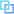
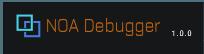

# ツールの起動方法

[]ボタンを押下することでツールが起動します。 
この起動ボタンはアプリケーション起動時には画面左下部に配置されており、ドラッグすることで位置を調整できます。 
起動ボタンの位置は縦画面・横画面で別に保存し、保存した値が画面外となる場合は左下部に再配置します。

※アプリケーション内のCanvasでSortOrderを1000以上に設定している場合、NOA DebuggerのUIが最前面に出ない場合があります。 
CanvasのSortOrderを変更したい場合は[ツールの設定方法](./Settings.md)からCanvas SortOrderを設定してください。

## UI一括非表示

起動ボタンを長押ししてから離すと専用ウィンドウと起動ボタンを非表示にし、元々起動ボタンが表示されていた位置を押下すると元に戻ります。 
専用ウィンドウについては[専用ウィンドウの構成と操作方法について](./FloatingWindow.md)を参照してください。

## アプリケーションでエラーが発生した場合の動作

UnityのエラーやAPIのエラーが発生した場合、その旨を知らせるためツールの起動ボタンが数秒間赤色に点滅します。 
その後、エラーを検知した機能を表示するまで赤色のまま点灯し続けます。 
ツールの起動ボタンを非表示にしていた場合、数秒間赤色に点滅した後に起動ボタンが非表示になります。 
エラー出力時の通知設定は、NOA Debugger Editorから変更できます。詳しくは[ツールの設定方法](./Settings.md)を参照してください。

## 動作保証環境を満たしていない場合の動作

動作保証環境を満たしていない場合は、ウィンドウ左上の **NOA Debugger** の文字がオレンジ色になります。

