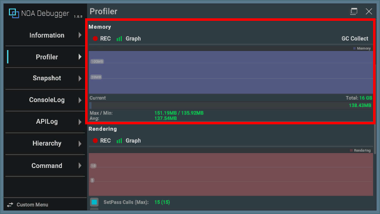
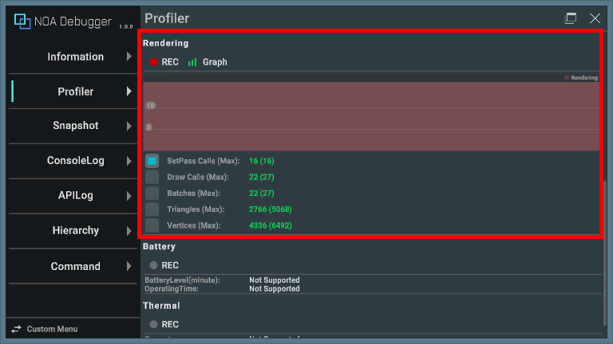
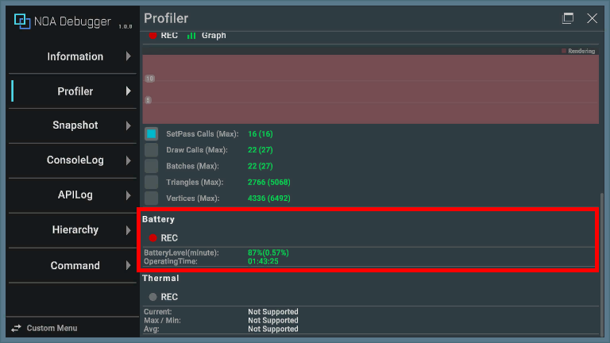
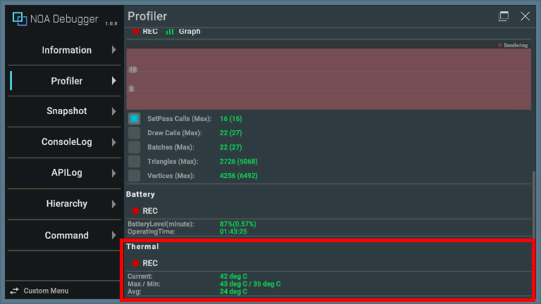
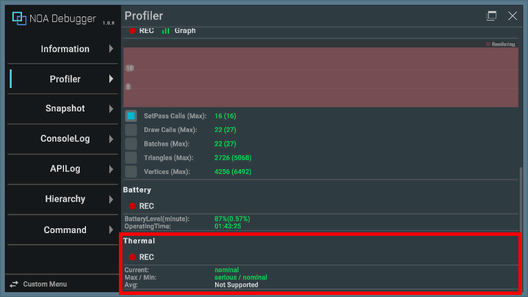
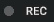
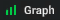
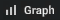

# Profilerについて

ProfilerはRuntimeのパフォーマンス計測の操作と計測情報を表示します。

# 表示項目についての説明

Profilerを表示した際の情報について解説します。

※アプリケーションの動作環境によって取得できない値については「Not Supported」を表示します。<br>
※アプリ起動後一度も計測されていない場合、値を「-」で表示します。

## FPS


グラフは毎フレームの処理にかかった時間を表します。

| 要素名       | 表示情報                        |
|-----------|-----------------------------|
| Update    | Update・LateUpdateにかかった時間です。 |
| Rendering | 描画にかかった時間です。                |
| Others    | 上記を除いた時間です。                 |

※UnityエディタのProfilerと同じ精度ではありません。CPU・GPUのボトルネックを特定するためにご利用ください。

グラフの下に表示する内容は以下のとおりです。

| 要素名           | 表示情報                         |
|---------------|------------------------------|
| Current(Time) | 現在のFPS値と前フレームから経過した時間を表示します。 |
| Max/Min       | 計測期間中の最大/最小FPS値を表示します。       |
| Avg           | 計測期間中の平均FPS値を表示します。          |

## Memory



グラフは一定時間ごとの計測値の履歴を表します。また [GC Collect] ボタンを押下することで `System.GC.Collect()` を実行します。

※[GC Collect]
ボタンは [GarbageCollector.GCMode](https://docs.unity3d.com/ScriptReference/Scripting.GarbageCollector.GCMode.html)
でガベージコレクションが無効化されている場合は、押下することができません。

グラフの下に表示する内容は以下のとおりです。

| 要素名     | 表示情報                                                                                |
|---------|-------------------------------------------------------------------------------------|
| Total   | 計測する最大メモリ容量を表示します。 [NoaProfiler.TotalMemoryMB](Apis.md) より変更が可能で、既定では端末のRAM容量となります。 |
| Current | 現在のメモリ量を表示します。                                                                      |
| Max/Min | 計測期間中の最大/最小メモリ量を表示します。                                                              |
| Avg     | 計測期間中の平均メモリ量を表示します。                                                                 |

### 動作環境について

- ブラウザアプリケーションでは動作しません。
- AndroidのOSバージョン10以上の端末では、OSの仕様により5分おきにメモリの計測結果を画面に反映します。

### AndroidのOSバージョン10以上の端末のメモリ計測時間の変更方法

AndroidのOSバージョン10以上の端末は処理コストの関係でデフォルトでは5分おきに最後に取得した値を反映します。<br>
メモリ計測時間の間隔はADBコマンドで変更をかけることができます。

```shell
adb shell settings put global activity_manager_constants memory_info_throttle_time=1000
```

末尾の1000はミリ秒単位を指すため、この設定だと1秒間隔で取得できます。

現在の設定は以下のADBコマンドで確認できます。

```shell
adb shell dumpsys activity settings | grep memory
```

## Rendering



グラフは以下のいずれかの項目の毎フレームの計測値の履歴を表します。

| 要素名                | 表示情報                                                                |
|--------------------|---------------------------------------------------------------------|
| SetPass Calls(Max) | 現在フレームでゲームオブジェクトのレンダリングに使用したシェーダーパスをUnityが切り替えた回数と、計測期間中の最大値を表示します。 |
| Draw Calls(Max)    | 現在フレームで送信されたドローコールの総数と、計測期間中の最大値を表示します。                             |
| Batches(Max)       | 現在フレームで処理されたバッチの数と、計測期間中の最大値を表示します。                                 |
| Triangles(Max)     | 現在フレームで処理された三角形の数と、計測期間中の最大値を表示します。                                 |
| Vertices(Max)      | 現在フレームで処理された頂点の数と、計測期間中の最大値を表示します。                                  |

## Battery



| 要素名                  | 表示情報                                                                                                                           |
|----------------------|--------------------------------------------------------------------------------------------------------------------------------|
| BatteryLevel(minute) | 現在のバッテリー残量と1分あたりのバッテリー消費量を表示します。<br>※計測データが揃っていない場合は「85%(InProgress...)」と表示します。<br>※端末が充電状態で正しく計測できない場合は「85%(Charging)」と表示します。 |
| Operating Time       | 継続プレイした場合の稼働予測時間を表示します。                                                                                                        |

## Thermal



| 要素名     | 表示情報                       |
|---------|----------------------------|
| Current | 現在の端末温度を表示します。             |
| Max/Min | 計測期間中の最大端末温度と最小端末温度を表示します。 |
| Avg     | 計測期間中の平均端末温度を表示します。        |

### iOSにおける端末温度の表示

iOS端末においては、端末温度ではなく温度ステータスを表示します。<br>
温度ステータスについては[こちら](https://developer.apple.com/documentation/foundation/processinfo/thermalstate)
を参照してください。



## 計測ボタン

[● REC]ボタンを押下することで計測のオン・オフを切り替えることができます。アプリ起動時は計測状態です。<br>
[● REC]ボタンが赤色の状態は計測中、白色は停止中を意味します。<br>
※値が取得できない環境では計測ボタンはグレーアウトします。




計測中に計測を停止すると、最後に計測した値を保持します。<br>
また計測状態はアプリを再起動しても保持します。

## グラフ表示ボタン

[Graph]ボタンを押下することでグラフ表示のオン・オフを切り替えることができます。アプリ起動時はグラフ表示状態です。<br>
[Graph]ボタンが緑色の状態はグラフ表示中、白色は非表示を意味します。




グラフ表示状態はアプリを再起動しても保持します。
