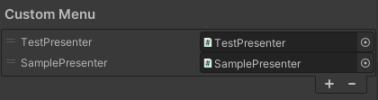

# ツールの設定方法

NOA Debuggerでは、ツールの設定を変更する方法を提供しています。 
主に以下の設定ができます。

* ツールの初期化を自動的に行うかを設定する
* NOA Debuggerの表示設定を変更する
* 使用フォントアセットを変更する
* メニューの表示順番と表示/非表示を変更する
* 独自メニューを追加/削除する
* ログの保持件数を変更する
* HierarchyのObject詳細の表示階層数を変更する
* デバッグコマンドの表示形式を設定する

ツールの設定変更は、NOA Debugger Editorを用いて行います。 
NOA Debugger Editorは、Unityメニューの `Window -> NOA Debugger` を選択することで起動できます。 
各種設定はEditorWindow内の[Settings]タブで変更できます。 
設定の保存については後述の**NOA Debuggerの設定を保存**を参照してください。

## 共通機能

### [Reset]ボタン

一部の機能では[Reset]ボタンを押下することで設定をNOA Debuggerが指定するデフォルト値に戻すことができます。

## ツールの初期化を自動的に行うかを設定する

ツールの初期化を自動的に行うかを設定します。

チェックボックスを操作することで、自動的に初期化を行うかを変更できます。 
※チェックが付いていない場合は、初期化を行いません。 
初期化を自動的に行わない場合は、以下のドキュメントを参考にAPIを使用した初期化を行なってください。 
[APIについて](./Apis.md)

## NOA Debuggerの表示設定を変更する

NOA Debuggerの表示に関係する設定を変更できます。

| 要素名                        | 表示情報                                                                                                                        |
|----------------------------|-----------------------------------------------------------------------------------------------------------------------------|
| Start button position      | NOA Debuggerの起動ボタンの位置を指定します。 オプションには、右上、左上、上中央、中右、中左、右下、左下、下中央があります。                                                     |
| Start button scale         | NOA Debuggerの起動ボタンのサイズを0.5 ~ 1の範囲で指定します。                                                                                    |
| Start button movement type | NOA Debuggerの起動ボタンがドラッグ可能か、固定位置にするかを指定します。 オプションには、Draggable（ドラッグ可能）、Fixed（固定位置）があります。                                   |
| Save start button position | NOA Debuggerの起動ボタンをドラッグで移動した際に、その位置を記憶するかどうかを指定します。 この設定を有効にすると、ボタンの位置が次回起動時にも維持されます。                                    |
| Start button opacity       | NOA Debuggerを起動するボタンの不透明度を0 ~ 1の範囲で指定します。                                                                                   |
| Background opacity         | NOA Debugger背景の不透明度を0.1 ~ 1の範囲で指定します。                                                                                       |
| Floating window opacity    | 専用ウィンドウの不透明度を0.1 ~ 1の範囲で指定します。推奨値は0.2 ~ 0.7です。                                                                              |
| Canvas sort order          | NOA DebuggerのCanvasのSortOrderを指定します。                                                                                        |
| Optimize UI for portrait   | 縦画面で表示する際のNOA DebuggerのUI要素の表示順序をモバイルデバイス向けに最適化します。 この設定を有効にすると、一部UIの要素が画面の下部から上部へと逆順に配置され、画面の最下部からアクセスしやすい順に操作が可能になります。 |

## 使用フォントアセットを変更する

ツールに使用するフォントアセットを設定できます。

| 要素名                          | 表示情報                                                      |
|------------------------------|-----------------------------------------------------------|
| Custom font settings enabled | 使用フォントアセットを変更するかを指定します。 その他のフォント設定はこのフラグがオンの時のみ表示します。  |
| Font asset                   | ツールに使用するフォントアセットを指定します。 ※アプリケーション内部に含まれるフォントを指定してください。 |
| Material preset              | 使用するマテリアルを指定します。                                          |
| Font size rate               | フォントサイズの倍率を指定します。                                         |

Font asset を指定している場合、NOA Debuggerに同梱したフォントアセットをビルド時に除外します。

フォントアセットによって文字サイズが変わりレイアウトが崩れる際は、Font size rate の値を調整してください。

アプリケーション内部に含まれないフォントを使用したい場合、ランタイムでフォントを適用することができます。 
ランタイムでのフォントの適用方法については[APIについて](./Apis.md)のSetFontSettingメソッドを参照してください。

## メニューの表示順番と表示/非表示を変更する

ツールの起動後に表示するメニューの順番や表示を設定できます。

メニュー要素の左にあるドラッグハンドルを操作することで、メニューの表示順番を変更できます。 
※要素の上から順番にメニューを表示します。要素の先頭が、ツール起動時の初回に表示するメニューです。

メニュー要素にあるチェックボックスを操作することで、メニューの表示/非表示を変更できます。 
※チェックが付いていない場合は、非表示です。

## 独自メニューを追加/削除する

独自メニューについて、詳しくは [独自のメニューを追加する方法](./CustomMenu.md) を参照してください。

独自メニューは以下の手順で追加します。

1. [+]ボタンを押下しリストを追加します。
2. Scriptフィールドに、`NoaCustomMenuBase`を継承して作成したクラスを設定します。

メニュー要素の左にあるドラッグハンドルを操作することで、メニューの表示順番を変更できます。 
※要素の上から順番にメニューを表示します。要素の先頭が、独自メニュー表示時の初回に表示するメニューです。

追加したメニューの削除は、以下の手順で行います。

1. 削除したいメニューを選択します。
2. 選択したリストが強調されていることを確認し、[-]ボタンを押下します。

## ログの保持件数を変更する

スライダーを左右にドラッグするか入力フィールドに直接数値を入力する事でログの保持件数を変更できます。

| 要素名               | 表示情報                                                        |
|-------------------|-------------------------------------------------------------|
| Console log count | ConsoleLogで保持するログの件数を99〜999の範囲で指定します。 ※保持するログは、ログタイプ毎です。 |
| API log count     | APILogで保持するログの件数を99〜999の範囲で指定します。 ※保持するログは、ログタイプ毎です。     |

## HierarchyのObject詳細の表示階層数を変更する

スライダーを左右にドラッグするか入力フィールドに直接数値を入力する事でObject詳細の表示階層数を変更できます。

| 要素名              | 表示情報                                                        |
|------------------|-------------------------------------------------------------|
| Hierarchy levels | 表示する階層数を1〜10の範囲で指定します。 階層が深くなるほど検索時の処理負荷が発生することにご注意ください。 |

## デバッグコマンドの表示形式を設定する

デバッグコマンドの表示形式を画面の向き毎に設定することができます。

| 要素名              | 表示情報             |
|------------------|------------------|
| Landscape format | 横画面での表示形式を指定します。 |
| Portrait format  | 縦画面での表示形式を指定します。 |

| 表示形式  | 説明                                    |
|-------|---------------------------------------|
| Panel | 画面の幅とコマンドで扱う値や名前の長さに応じてコマンドを表示する形式です。 |
| List  | 垂直にコマンドを表示する形式です。                     |

## NOA Debuggerのその他設定

NOA Debuggerのその他いくつかの設定を変更できます。

| 要素名                     | 表示情報                                                                                                                                                                              |
|-------------------------|-----------------------------------------------------------------------------------------------------------------------------------------------------------------------------------|
| Auto create EventSystem | 実行時にEventSystemが存在しない場合、自動で作成するか指定します。 このオプションをオフにすると、EventSystemを自動で作成しません。 EventSystemが存在しない場合NOA DebuggerのUIは動作しません。                                                     |
| Error notification      | エラー通知の表示形式を以下のオプションから選択できます。  - **Full**: エラー時に起動ボタンが点滅し、その後点灯します。この設定がデフォルトです。  - **Flashing**: エラー時に起動ボタンが点滅のみ行います。点灯はしません。  - **None**: エラー通知が無効になり、起動ボタンは点滅も点灯もしません。 |

## NOA Debuggerの設定を保存

NOA Debuggerの各種設定項目を自動で保存するかを設定できます。

| 要素名       | 表示情報                                                                          |
|-----------|-------------------------------------------------------------------------------|
| Auto save | 各種設定項目を変更した場合、自動で保存するか指定します。 デフォルトはオンになっているため、各種設定項目を変更した時点で自動的に保存します。     |
| Save      | Auto saveがオフの状態で各種設定項目を変更した場合、[Save]ボタンを表示します。 [Save]ボタンを押下することで設定を保存します。　 |
