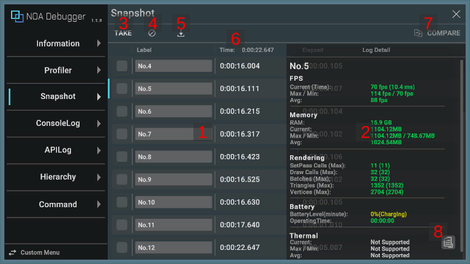
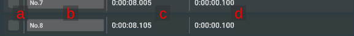

# Snapshotについて

キャプチャしたタイミングのログを保持します。

## 画面のUI構成と操作方法

### 1.ログ

[TAKE]ボタンを押下したタイミングの情報を保持します。

- 任意のログをタップすることでハイライト表示を行い、画面右側に選択されたログの詳細を表示します。 ※縦画面の場合は下部に表示します。
- 選択したログを再度タップすることで、詳細を非表示にします。
- 任意のログを長押しすることで、クリップボードにログの内容をコピーします。

| 要素名           | 表示情報                                      |
|---------------|-------------------------------------------|
| a.比較対象選択ボックス  | ログを比較する対象を選択できます。                         |
| b.ラベル         | 該当のログに対して任意の名前をつけることができます。最大30文字まで入力できます。 |
| c.経過時間        | ログを追加した際の経過時間を表示します。                      |
| d.前回ログからの経過時間 | 前回ログを追加した時間からの経過時間を表示します。                 |

### 2.計測情報

選択したログのProfilerの情報とAPIで追加した情報を表示します。 
どちらの情報も存在しないログの場合は空の状態で表示します。 
情報の詳細については[Profiler](./Profiler.md)を参照してください。

### 3.キャプチャボタン

[TAKE]ボタンを押下したタイミングでログを保持します。

### 4.一括削除ボタン

[]ボタンを押下することで、保持している全てのログの削除と、経過時間をリセットします。

### 5.ダウンロードボタン

[]
ボタンを押下することで保持している情報をダウンロードするダイアログを表示します。 
キャプチャ情報がない場合は、[]ボタンを押下できません。 
ダウンロードダイアログについては[データのダウンロードについて](./Download.md)を参照してください。

### 6.経過時間

アプリを起動してからの経過時間を表示します。

### 7.ログ比較ボタン

比較対象選択ボックスで選択した2つのログを比較出来ます。 

### 8.ログコピーボタン

[]ボタンを押下することで、クリップボードにログの内容をコピーします。 
※ログ長押しと同じ挙動です。

## 提供APIについて

Snapshotが提供するAPIについては[API一覧](./Apis.md)を参照してください。
