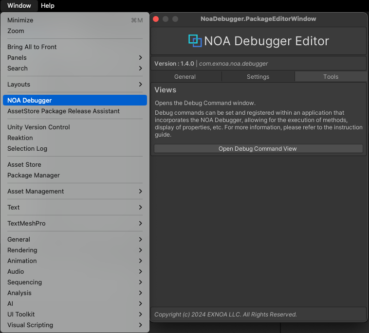

# NOA Debugger Editorからの各種ツールの起動

Unityメニューの `Window -> NOA Debugger` を選択することで起動できるNOA Debugger Editorから各種ツールを起動することができます。

## DebugCommand

[Open Debug Command View] ボタンを押下することで、設定したデバッグコマンドを実行するためのウィンドウを開きます。

DebugCommandの詳細についての詳細は [こちら](./DebugCommand/DebugCommand.md) をご参照ください。
